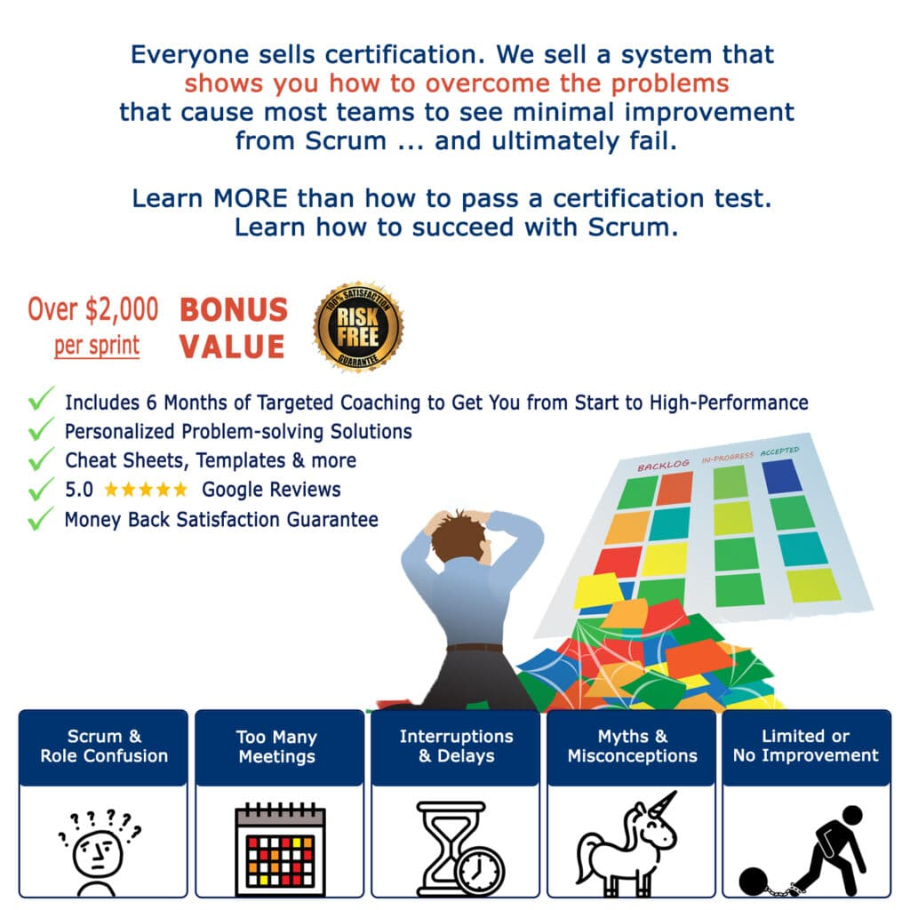

## **YOU’LL LEARN HOW TO FIX & AVOID SCRUM PROBLEMS**

## You’re one workshop away from successfully elevating your team and career to new success…

<iframe src="https://player.vimeo.com/video/930788565?badge=0&amp;autopause=0&amp;player_id=0&amp;app_id=58479" frameborder="0" allow="autoplay; fullscreen; picture-in-picture; clipboard-write" style="position:absolute;top:0;left:0;width:100%;height:100%;" title="Top Scrum Problems"></iframe>

- Paying your own way with no company reimbursement? **$795 CAD** ($995) + HST
- Regular business **$995** ($1295) + HST
- 5 or more people attending our training within 3 months? – [email for special pricing](mailto: contact@agilepainrelief.com)
- Non-profit or unemployed – [email and we’ll help you](mailto: contact@agilepainrelief.com)

 **Discount training gets you discount results. Yes, our prices are higher than standard trainers.** **Because quality costs more than bare bones minimum. Cheaper training is a lot of DIY with expensive trial and error.**

### EXCLUSIVE BONUSES WE INCLUDE

- 6 MONTHS of targeted coaching
- Exclusive cheat sheets, templates and exercises designed by experts to get the results you want
- Guaranteed problem-solving solutions
- Sample scripts and communication strategies

**Do you want to buy cheap training just so you can put the letters "CSM" after your name?** **Or do you want to invest to gain skills that will actually advance your team and career?**

You know the difference in quality and price with fast food vs. fine dining, so consider it with your education and career as well.

[

REGISTER NOW

](#register)

### What makes us different than others?

**Most Scrum trainers treat you as a once and done. We’re here to help you do Scrum and enjoy the results, not just give you a certification.** There's quite a lot that makes us different from other training providers. But don’t take our word for it. Take a minute to consider the following….

"_My first Scrum training ever was with Mark for CSM. Sadly, my company at the time sent me elsewhere for A-CSM. **Nearly everything the other trainer taught in A-CSM had already been covered in Mark's CSM course or his follow-up material (which I still refer to to this day)**. Mark offers way more depth than anyone else in his training. I will definitely be going back to him for my CSP-SM!_" ~ Josh N.

## 100% Satisfaction Guaranteed

**Individual support** - Small class size – no more than 15 people. (Be aware that some trainers put 50 people in a class.) Answers to your “Yes, but in real life…” questions and concerns to solve your problems.

[

REGISTER NOW

](#register)

* * *

### Testimonials

"_I had the freedom to just listen and retain, understand and ask questions. I expected more lecture style and that wasn't the case which was awesome. **This Scrum master course was exactly what I needed to feel supported and reassured that I can do this!** The teaching style, the small groups and the activities made a huge difference in making me feel supported and empowered to become a scrum master. I am so grateful for this course._" ~ Nicole G.

"_One of the best on-line courses I have taken. This course was REALLY good (I don't often say that!). **It could have easily have been death-by-powerpoint, but instead the course was engaging and fun!** Using a variety of online tools, we explored Scrum both on a broad surface level, then with deep dives into particular areas as voted for by the class. Mark made sure that everyone was satisfied with their own personal understanding before closing a particular topic. Thank you, Mark! I am very excited to take Scrum to my organization and create a high performance team!_" ~ Ross H.

"_Anyone looking to do this course...do it with Mark! His passion for all things Scrum and Agile shines through and excites his students. He’s a scrum realist with a fantastic sense of humour! The material is relevant today and Mark gives us a glimpse of what we can expect 5 years from now. **The post class support is fantastic** and shows how passionate and knowledgeable Mark is about learning! A true educator!_" ~ Roberta P.

**We have _thousands_ of quotes and testimonials from people who have enjoyed and benefited from our training.** [Let us know](/contact-us "Contact Us") if you would like to read even more.

* * *

 **Everything you need** - Exam prep, certification exam fee, and Scrum Alliance membership - all included. Also qualifies for PDUs.

**Risk-free** - Scrum Alliance exam rewrites / 100% Pass Rate. Unlimited attendance to the online class again if you want a refresher.

**Training runs each day from 9:00 am to 5:00 pm Eastern Time** Requirements: a webcam and microphone, a browser that isn’t Internet Explorer, and a system that can run the free apps of Google docs, Zoom, and Mural all at the same time.

[FAQs, Refunds and Cancellations](/faqs-and-policies)

Questions? Email: contact@agilepainrelief.com | Phone: 1-877-248-8277

## All upcoming Certified ScrumMaster workshops:

\[do\_widget id=custom-ee-upcoming-events-widget-14\]
