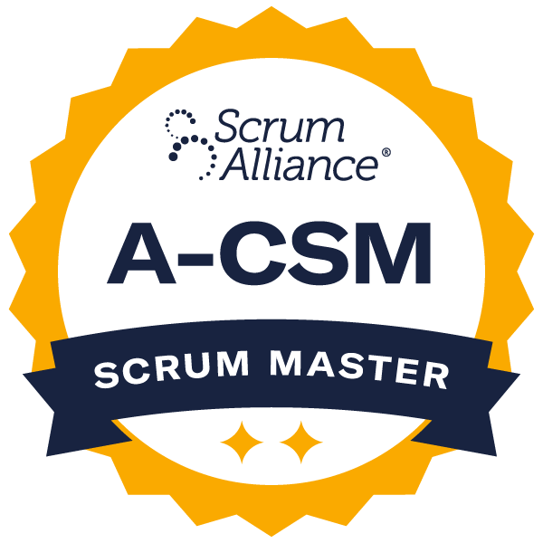

This isn't your typical Advanced Certified ScrumMaster course. Experience and research taught us that two or three-day workshops aren't adequate for the depth of knowledge that people want at this level, to help their team become more effective. So we have developed a self-paced program that will lead you through: 

- scenarios that will challenge your understanding of the Scrum Master role and all that you can achieve – from initial expansion beyond the basics, right through to advanced achievements and building high-performing teams,
- invaluable coaching sessions to help you put your new skills and understanding into practice, and
- exercises that focus on the challenges that real teams face, designed to give you tools to dig deeper.

_All of this will meet and exceed the ScrumAlliance Learning Objectives for Advanced Certified ScrumMaster training._

**Optional Premium Registration** **Choose the greatest return for your training investment with six one-hour private coaching sessions with Certified Scrum Trainer Mark Levison, where you will work together in the six months following your training to tackle any problems you come up against.**

All registrations include the cost of certification and two years of Scrum Alliance membership. It also provides ongoing access to all course material and support resources, including ongoing coaching sessions and support forum.

**Scrum Alliance requirements for Certification:**

- You’re already a Certified ScrumMaster
- You have at least 12 months of experience as a ScrumMaster in the last five years
- You demonstrate understanding of the Advanced ScrumMaster course material

**Join ANYTIME!**

Our group coaching sessions are currently every Monday at 10:00 AM Eastern.  At least one – and often more - of the program’s three Certified Scrum Trainers are always available. If needed, we schedule additional sessions during the week.

You will need an internet connection and computer system that can handle video conferencing (currently Zoom), a webcam, a microphone (your computer mic is fine), and a browser that is \*not\* I.E.  Browsers such as Chrome (and Chrome-based browsers)/Firefox/Safari should be fine.  If your company firewall will not allow access to Zoom, you will need to make arrangements for access to a system that can (e.g. personal computer and network). We sometimes use Mural or Miro in a coaching session to illustrate an idea, but free accounts work fine for this and these tools are not mandatory.

If you’re unemployed, contact [Heather](mailto:heather.uhl@agilepainrelief.com) to learn about available discounts.

[FAQs, Refunds and Cancellations](/faqs-and-policies)

Questions?  Email: contact@agilepainrelief.com | Phone: 1-877-248-8277

## All upcoming Advanced Certified ScrumMaster workshops:

\[do\_widget id=custom-ee-upcoming-events-widget-4\]
