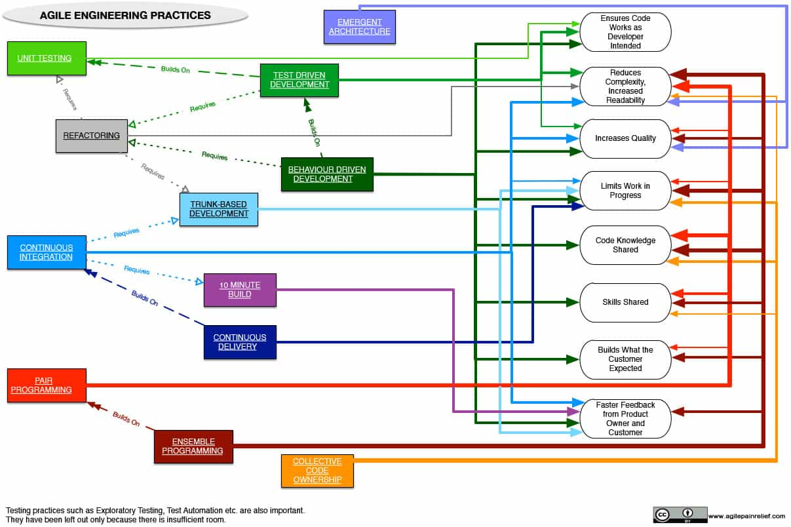

In my [workshops](/certified-scrum-agile-training), I often have people who are focused on the question: “How can I help my team go faster?”, or “How can we deliver this Product sooner?” Whenever anyone asks, my answer is always the same: “You must slow down to go fast.” I then often get some puzzled looks.

In software development, the single best way to improve quality, and eventually speed, is writing less code. Most of the time spent writing code should be to understand the problem and then find the simplest solution to it. The practices used to facilitate this in Agile software development are popularly known as **Agile Engineering Practices**.

[Engineering Adoption Strategy](https://www.infoq.com/articles/levison-TDD-adoption-strategy/)

 

[Subscribe to receive your free copy of the Agile Engineering Practices and Their Effects Cheat Sheet.](https://www.getdrip.com/forms/194541779/submissions/new)

#### See Also:

- [Behaviour Driven Development](/glossary/behaviour-driven-development)
- [Collective Code Ownership](/glossary/collective-code-ownership)
- [Continuous Delivery](/glossary/continuous-delivery)
- [Continuous Integration](/glossary/continuous-integration)
- [Emergent/Evolutionary Architecture](/glossary/agile-architecture)
- [Ensemble (formerly Mob) Programming](/glossary/ensemble-programming)
- [Pair Programming](/glossary/pair-programming)
- [Refactoring](/glossary/refactoring)
- [10 Minute Build](/glossary/10-minute-build)
- [Test Driven Development](/glossary/test-driven-development)
- [Trunk-Based Development](/glossary/branching-strategies)
- [Unit Testing](/glossary/unit-testing)

#### Resource Book Link:

- [_Agile Technical Practices Distilled_](https://leanpub.com/agiletechnicalpracticesdistilled) - Pedro Moreira Santos, Marco Consolaro, and Alessandro Di Gioia
- [_Software Engineering at Google_](https://abseil.io/resources/swe-book) - Titus Winters, Tom Manshreck and Hyrum Wright (Caveat: we think Pair Programming and Ensemble Programming trump Code Reviews)
