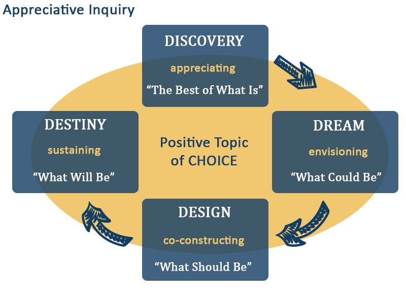

**Appreciative Inquiry** is an approach to team development and organizational change that works by focusing on the strengths and positive aspects of the current system. This is in contrast to most approaches for improvement which get you to find out what is wrong with a system and then fix it. This can create ongoing negative mindset, with all of the problems the team or organization has. In addition, we can end up with a system full of band-aid fixes.

So Appreciative Inquiry takes the inverse approach and focuses on what we have happening that we can celebrate. Team members are asked to participate in four sections:

1. **Discovery – Appreciating.** Tell stories that illustrate what is best about us and/or our system. Sample questions: What do you remember most about our work? Where did we collaborate best? What strengths did you and others bring to our work?
2. **Dream – Envisioning.** (See: [Future Perspective for Change: Why Backcasting Helps Get You Where You Want to Be](/blog/future-perspective-for-organizational-change.html)). Dream about positive things that could happen. Sample questions: What would make you talk about our team to other people? How can we grow our team’s skills to take our next challenge? What will we do to celebrate when we succeed?
3. **Design - Co-constructing.** Discuss actions that we need to take to build the desired future system. Sample questions: What have you learned that could help us on the journey? What steps could you take to get us started?
4. **Destiny – Sustaining.** Consider what we need to do to build a learning culture. Sample questions: What mindset do we need to make this work? What new things will we try to make this work? What would you like to learn to be able to achieve our dream?

## Strengths:

- Collective visioning promotes alignment and common understanding
- Focus on learning and adaption fits well with being Agile
- Positive focus finds the good in situations
- Emphasis on sustainability

### **Appreciative Inquiry can overlook some problems, so watch out for:**

- If people aren’t invested enough in wanting a change, this might be a positive, but ultimately unproductive, experience where nothing happens.
- If there are challenging personality differences, they will get buried or ignored if the focus is solely on positive things.
- Truly dis-engaged people might just disconnect from the process and tune out.

[_The Guide to Effective Agile Retrospectives_](/guide-to-effective-agile-retrospectives)

[Collaboration, Over Work in Isolation](/blog/collaboration-over-work-in-isolation.html)

#### Resource Links:

- [Appreciative Inquiry](http://innovativeteams.net/appreciative-inquiry/)
- [Appreciative Inquiry: Lift everyone's spirit with positive questions](https://retromat.org/en/?id=65)
- [Discovering and Building on the Root Causes of Success with Appreciative Interviews](https://medium.com/the-liberators/use-appreciative-interviews-to-reveal-conditions-for-successful-scrum-fd82e20fce03)
- [Good/Bad vs. Appreciative Inquiry Retrospective](http://testersthoughtsuncombed.blogspot.com/2013/12/goodbad-vs-appreciative-inquiry.html)
- [Powerful Appreciative Inquiry Questions For Positive Change](https://www.mtdtraining.com/blog/appreciative-inquiry-model-questions.htm)
- [What is Appreciative Inquiry?](https://agilecoffee.com/toolkit/appreciative-inquiry/) (Agile Coffee)
- [What is Appreciative Inquiry?](https://www.davidcooperrider.com/ai-process/) (David Cooperrider)
- [What is Appreciative Inquiry?](https://jdmeier.com/appreciative-inquiry/) (JD Meier)
- [When Is Appreciative Inquiry Transformational? A Meta-Case Analysis](https://www.researchgate.net/publication/228658802_When_Is_Appreciative_Inquiry_Transformational_A_Meta-Case_Analysis)
