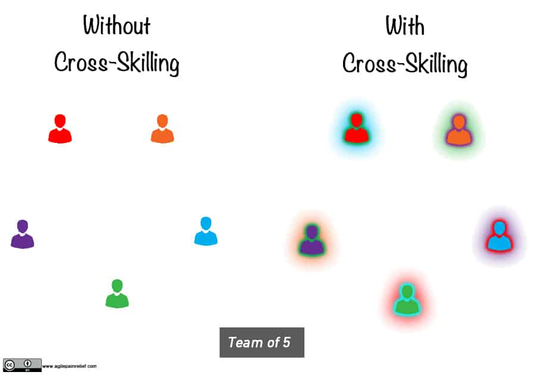

**Cross-skilling** is where a team member decides (without being pushed) to learn a new skill area. This learning will, of course, take time and in the short term slow the team down. In the long run, the team benefits from the shared knowledge with increased quality, fewer bottlenecks, etc. All of this of course will eventually lead to greater speed.

Teams that do not encourage cross-skilling and who have only person who perform a certain activity (e.g. Analysis, Database work, Testing) will suffer a variety of problems:

- **Bottlenecks** - when there is more work for that skill area than the person can handle
- **Quality** - there will be no one else to crosscheck that person's work
- **Stuck** - if a team member goes on vacation or, worse, leaves the team maybe unable to finish some work items
- ...

[How to Cross-Skill and Grow T-shaped Team Members](/blog/how-to-cross-skill-and-grow-t-shaped-team-members.html)

[Scrum By Example – The Team Gets Bottlenecked](/blog/scrummaster-tales-the-team-gets-bottlenecked.html)

[Specialists Are Overrated](/blog/specialists-are-overrated.html)

#### Resource Links:

- [10 Quick Tips To Improve Cross-Functionality Within Your Scrum Team](https://medium.com/the-liberators/10-quick-tips-to-improve-cross-functionality-within-your-scrum-team-6c6822f5e371)
- [Breaking Silos within Cross-Functional Teams](https://www.infoq.com/presentations/spreading-skills-scrum/)
- [Clarify team skills with the Balanced Team Pie](https://intelleto.com/2013/11/12/balanced-team-pie/)
- [Do Skills Matter? Understanding Key Person Dependencies…](https://rgalen.com/agile-training-news/2018/12/11/do-skills-matter-understanding-key-person-dependencies)
- [Pairing for Learning](https://www.infoq.com/news/2018/02/pairing-learning/)
- [Senior Software Developers as Mentors](https://www.leadingagile.com/2018/02/senior-software-developers-mentors/)
- [Stress Testing Skills Liquidity](https://theitriskmanager.com/2020/03/)
- [Using a Skill Matrix for Growth and Learning](https://www.infoq.com/news/2016/12/skill-matrix-teams/)

#### See Also:

[Cross-functional Teams](/glossary/cross-functional-teams) [Ensemble Programming](/glossary/ensemble-programming) [Pair Programming](/glossary/pair-programming) [Work In Progress](/glossary/work-in-progress)
