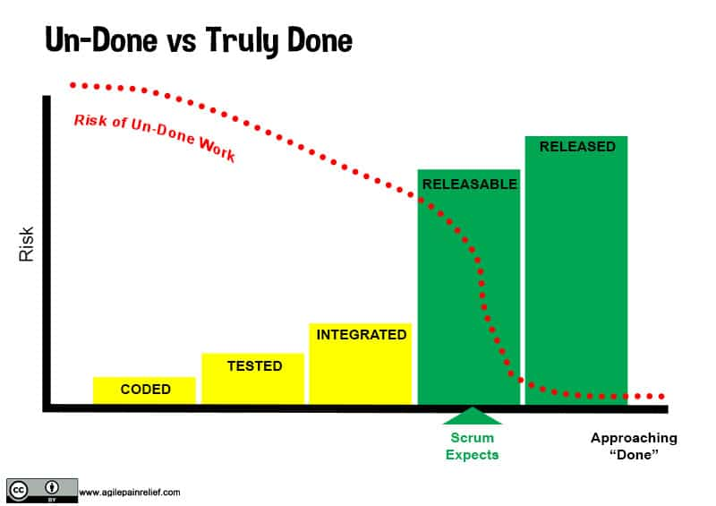
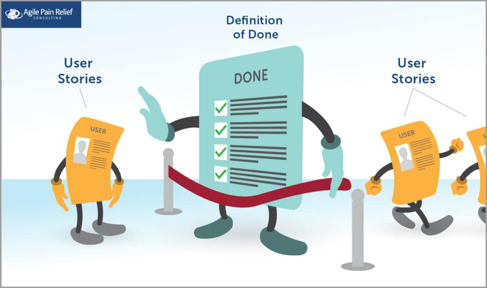

**Definition of Done** is the official checklist that Scrum Teams maintain of the qualities they intend their work to achieve. It helps the team assess whether their work is truly completed and deliverable to the client as having added value. It also helps them in Sprint Planning by reminding them of the quality they have committed to achieving, ensuring they only commit to Product Backlog Items (PBIs) that they can get to truly “Done.”

The Definition of Done serves as a common understanding with the whole Scrum team (including the Product Owner) about the quality of the product. When a team has a rigorous Definition of Done, the Product Owner should be able to release a new version of the product at the end of every Sprint.

## How is Definition of Done different from Acceptance Criteria?

Definition of Done is the universal checklist that all product backlog items are checked against. Being universal also makes it more generic. Acceptance Criteria are the specific details that are unique to that individual Product Backlog Item. An example will make this easier to understand. With a software development team, Done might include:

- Unit test written for new code
- All Code Peer reviewed or Pair Programmed
- Acceptance Tests automated
- Usability Tests run
- Security Review complete
- …

For a marketing team creating a website, Done might include:

- Page has one H1 tag and three to four H2 tags
- Two pictures in the webp format and the pictures smaller than 50kb each
- Pictures have alt text
- All links on the page have been tested and link to the intended pages
- …

## Key Characteristics of the Definition of Done

- **Clear and Specific** – any team member can read the list and understand what they mean. _Not every team member will be able to do all the work promised by Done._
- **Created by the whole Scrum Team** – all teams including the Product Owner and the ScrumMaster are involved in creating Done. _Hint: people won’t commit to something if they didn’t have a role in defining it._
- **Testable** – the team should understand how to test or prove each item
- **Minimum Quality** – Done sets the level of quality the team is promising to meet or exceed.

## Steps to Defining "Done"

This is just one exercise you can use to come up with an initial definition of “Done”. It is structured to ensure that the voices of all team members are heard.

1. The Product Owner lays out their high-level needs. Remember, focus on qualities (e.g. no memory leaks) and not business needs.
2. Working in small groups, (e.g. 2-3) team members brainstorm the individual elements required to meet those needs, (e.g. Load Tests run) and other things they judge necessary, (e.g. Unit Testing).
3. Combine the exact matches and similar items. Find the outliers. Group work/Silent sort – best done with the most senior people going last and not first.
4. Eliminate suggestions that the group feels don’t make sense.
5. Team members decide on their own how frequently each element of “Done” can be met per: Story, Sprint or Release – as it stands today. There is a strong preference to get truly “Done” every Sprint. However at first some teams won’t.
6. Team members vote/agree on where items fit today, (e.g. Story/Sprint/Release).

At this stage we post the list on the Task/Story wall. Often the team adjust their columns on the wall to match the “Done” criteria.

If the team decided on “Undone” work (e.g. work delayed until Hardening Sprint), then they need to make that clear as well. They then need to clear a plan to ensure that they eliminate the Hardening Sprint over time.

## Improving the Definition of Done Over Time

One area of misunderstanding is that some team members expect that Done changes every Sprint. If that happened, the product’s quality would be very inconsistent. Imagine if one Sprint the team released features with Automated Acceptance tests, and the next Sprint they don’t even have Unit Tests. Scrum Teams should have the same Definition of Done, Sprint over Sprint. This gives the Product Owner consistent expectations around quality. As a team becomes more skilled and automates some steps in Done, then they should make their Done stronger or more rigorous. While this takes time, the increase in rigour will reduce the number of defects in the long run.

## Impediments or Problems in Achieving Done

When a team is new, they find it hard to achieve Done. As a result, the Product Owner can’t be sure if it is okay to ship the product. Many of these problems are from lack of skill or knowledge in something that affects Done. In our software team example, the team might have limited knowledge around Automating Acceptance Tests. Our marketing team might lack the graphics design skill to produce their own images. Cross-skilling and pairing (with someone outside the team) are going to be the approaches that help the team grow until they always produce a releasable product.

The other problem to achieving Done is pressure to deliver more features (or User Stories). As the pressure builds, the team may respond by compromising on Done. In the short term this appears to be fine, as they appear to get more work finished. In the long run, the increase in bugs inevitably offsets the value of the added work.

Trying to stuff more work into the pipeline always fails. Instead of more work, the organization needs to a better job deciding which Product Backlog Items will deliver the most value and prioritize those. The Team themselves need to start Sprint Planning with a clear understanding of their own Definition of Done. During Sprint Planning, they only take on work that they can bring to truly Done.

## Undone Work

When a product is not truly releasable at the end of Sprint, the difference is often referred to as Undone work. Why is this a problem? It’s a problem because it reduced transparency. The Product Owner and clients think the team have completed work on those User Stories. Yet the work isn’t complete. Here are a few examples of how the work that looks finished, but doesn’t meet the Definition of Done, becomes a problem later:

- A bug is found several Sprints after the code is written and now new code relies on the defective behaviour.
- Missing a security audit, the application is susceptible to a SQL injection attack.
- Missing a usability review, the new User stories are difficult for the client to use (e.g. colour blindness, …)
- The Application is deployed and doesn’t work with the current firewall configuration.

**Non-Software Examples:**

- Lacking alt text, pictures displayed on a page are undetectable to blind users.
- Large pictures mean the page takes longer to load and clients abandon the site because they’re bored of waiting.

Scrum expects that, at a minimum, the product be “Potentially Releasable” at the end of Sprint. This reduces risk and allows the Product Owner and the client to have confidence that  User Stories the team claim to have Done, are truly Done.

## Limitations of Done

The team need to be honest about what is Done and what is not really done. The bigger challenge is for teams that work on a variety of Products. For example, a non-software team that is doing marketing work might have a number of different work products: a website; videos; artwork; Google ads; Facebook ads; … . In this case, the Done will become very fragmented and will be harder to use. But Done is perhaps even more important in these cases because it acts as a reminder for someone who less familiar with the work of all the things that need to be completed to deliver high quality.

### Can Done be used as an auditable checklist for reporting?

_Eewww._ This sounds very traditional. I only include this because I’ve seen this with clients and we need to stamp it out. Definition of Done is for the Scrum Team to understand the quality of the product they’re creating. It’s not a reporting standard. From the teams I’ve heard from, using it as a reporting standard leads to micro management. Someone reads or hears a report related to Done and asks the team to stop doing some aspect of Done, so they can produce more User Stories. As shown above, this always leads to an increase in defects weeks or months after the initial decision was made.

#### 

[Definition of Done vs. User Stories vs. Acceptance Criteria](/blog/definition-of-done-user-stories-acceptance-criteria.html)

#### Resource Links:

- [Definition of Done](https://www.agilealliance.org/glossary/definition-of-done)
- [The Definition Of Done Canvas](https://www.kaizenko.com/the-definition-of-done-canvas-template/)
- [Definition of done examples and tips](https://www.boost.co.nz/blog/2019/05/definition-of-done-examples-and-tips)
- [Enhancing Your "Definition of Done" Can Improve Your Minimum Viable Architecture](https://www.infoq.com/articles/definition-of-done-mva/)
- [How To Create A Definition Of Done](https://agilelearninglabs.com/2021/04/how-to-create-a-definition-of-done/)
- [Multiple Levels of Done](https://www.mountaingoatsoftware.com/blog/multiple-levels-of-done)
- [Take Your Definition Of Done To The Next Level](https://medium.com/the-liberators/take-your-definition-of-done-to-the-next-level-ec5e20e7ea4a)
- [Understanding the Definition of Done for Scrum and Agile Teams](https://www.mitchlacey.com/learn-scrum/definition-of-done/)
- [What is Definition of Done (DoD)?](https://www.scrumalliance.org/agilematters/articles/begin-with-the-end-in-mind-defining-done-in-every-coaching-engagement)
- [Why Scrum requires completely “Done” software every Sprint](https://medium.com/the-liberators/why-scrum-requires-completely-done-software-every-sprint-f7fa3ca33286)
