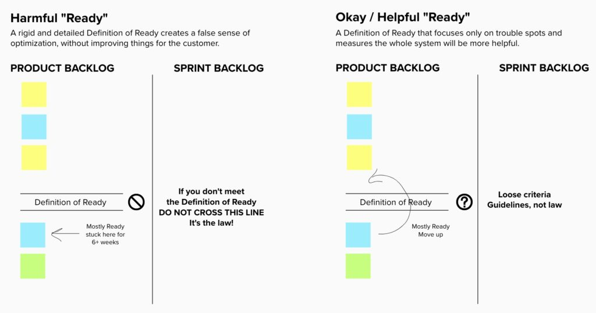
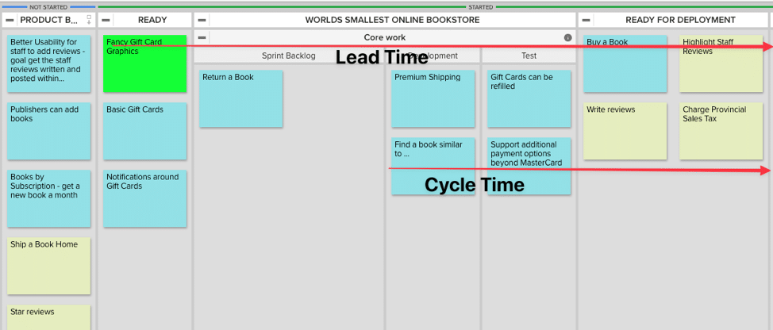

**Definition of Ready** is an agreement between the Product Owner and the team that describes what state Product Backlog Items (or User Stories) need to be in before the Sprint. Another way of describing “ready” is how prepared Stories are to be worked on.

A Definition of Ready helps a Scrum (or Kanban) team to ensure that their Product Backlog Items are well thought out, so nothing is considered for Sprint work if it has a high risk of getting stuck because some part of the work was ill-understood.

Here are some elements commonly found in a Definition of Ready:

- Clear Understanding. Everyone agrees on what each Backlog Item represents.
- Estimated and Small. The item has an estimate and it is, at most, a Small or 1, 2, 3 Story Points.
- Acceptance Criteria. All acceptance criteria has been defined.
- Dependencies. All dependencies have been discovered.
- User Interface. A feature requires a mockup.

This list has strong parallels to the INVEST criteria and, as long as it remains a lightweight check, Definition of Ready can be a tool for good.

A team with a Definition of Ready isn’t optimizing for getting an idea from entering the Product Backlog to Deployed. Instead, they’re optimizing for Sprint Backlog to Deployed. The Definition of Ready acts a gate between the Product Backlog and the Sprint Backlog. Items can be held up at the gate for trivial reasons (e.g. incomplete Acceptance Criteria, missing user interface mockup, etc).

A rigid Definition of Ready encourages local optimization for the throughput of just the Scrum Team. This sounds like a more positive thing than it really is. The problem is that we should be optimizing for the whole system from the moment the customer places asks for their feature, until it is delivered. A rigid “Ready”, makes the Scrum Team look better by improving their cycle time, without necessarily improving things for the client. Imagine an example where a Definition of Ready holds up a feature for 6+ weeks while requirements are being gathered (perhaps the User Interface details, or final Acceptance criteria). Sure, once the work starts, it proceeds at a normal pace, but now the Scrum Team can say that they’ve reduced their cycle time, when all that really happened is the delay was pushed to early in the system. The team feels good but the customer isn't any happier. The customer's item still spent a long time sitting in a queue, and it doesn't matter what the queue was.

For teams that use a Definition of Ready, they should consider measuring Lead Time and not Cycle Time. By measuring Lead Time, any time spent waiting at the Ready gate is accounted for, making it harder to sub-optimize. This also leads to a general principle that says, when measuring, prefer measurements that observe the whole system.

My own preference is that, if your team has items that are frequently getting stuck in Sprint, consider a Definition of Ready but only cover the details that are currently causing problems. Hold on to the definition lightly - it shouldn't be rigid, and everything must 100% compliance check. Instead of making statements like "all acceptance criteria", consider "some or enough acceptance criteria have been found". Instead of a "requires a mockup" element, try "features that require large UI changes check to see if a mockup would help, preferring pencil sketches". Finally, as the team matures, check to see if the Definition of Ready can be made thinner by reducing the number of elements in it. Be careful that this doesn’t become a dumping ground  for every little problem the team ever had.

#### Resource Links:

- [Definition of Ready](https://blog.gdinwiddie.com/2014/03/27/definition-of-ready/) (by George Dinwiddie)
- [Definition of Ready](https://sites.google.com/a/scrumplop.org/published-patterns/value-stream/product-backlog/definition-of-ready) (by Published Patterns)
- [Definition of Ready: A double edged sword](https://stefanroock.wordpress.com/2012/08/04/definition-of-ready-a-double-edged-sword/)
- [Definition of Ready — Dangerous or Necessary?](https://medium.com/serious-scrum/definition-of-ready-dangerous-or-necessary-891e586efd0d)
- [Definition of Ready is Evil](https://mike-brewer.medium.com/definition-of-ready-is-evil-3aa50bb29ca5)
- [Definition of Ready: What It Is and Why It's Dangerous](https://www.mountaingoatsoftware.com/blog/the-dangers-of-a-definition-of-ready)
- [Is “Definition of Ready” part of Scrum?](https://collaborativeleadershipteam.com/blog/is-definition-of-ready-part-of-scrum)
- [A Question of Handoffs & Queues](https://www.agilemagic.ca/blog/handoffs-and-queues)
