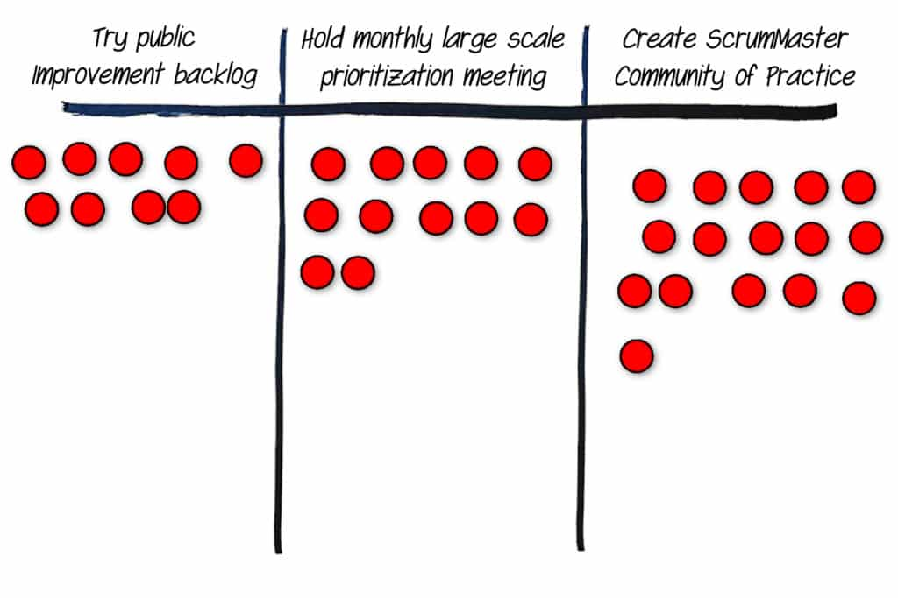

**Dot voting** is a mechanism to help an Agile team select a single item from many or prioritize among a number of options. It's a remarkably simple tool. We give the players an equal number of votes or dots. They place their dots on the item or items that are most important to them. It differs from straight up majority voting in that people can split their votes across multiple items. To avoid vote splitting across similar items, the team should do a round of grouping before voting.

The above example was used by a group at an organizational retrospective to decide what items they should address.

Dot voting is the Agile community’s poster child for decision-making techniques that have some kind of weakness. Since dot voting is usually done with people walking up to a poster or wall to place their votes, everyone can see which items you voted for. Seeing other people’s votes will influence you and, of course, seeing a leader’s vote will influence everyone. This weakness can be overcome if all the votes are placed blindly. In the virtual world many tools like Mural, Miro and Stormboard build in a dot voting mechanism and make it blind to everyone including the facilitator.

The other challenge is that you can see that people voted for an item, but not why they voted against another, missing an opportunity to improve it.

