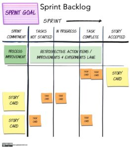

**Kanban** isn't just a board that you find in JIRA or Trello. It is a method to help improve the flow of work through a system. A kanban board is one way to visualize the work in your system, but use of a board alone will not improve things. Kanban, done as intended, requires discipline and the habit of continuous experimental improvement of the system. (Strangely, it has this in common with all Agile approaches.)

In a kanban approach, the team visualize their work and then improve the flow with attention to:

- Limiting Work In Progress (aka WIP),
- Unblocking work
- Ensuring older items are addressed first
- ...

Kanban is process agnostic. You can use it with Agile or Scrum Teams, but also in traditional teams. The more you look into kanban, the more you will see that it has much in common with every other Agile approach.

[Don’t Inflict Scrum or Kanban on Teams](/blog/dont-inflict-scrum-or-kanban-on-teams.html) [Kanban Portfolio View](/blog/kanban-portfolio-view.html) [Kanban Portfolio View - Continued](/blog/kanban-portfolio-view-continued.html) [Does Your Grocery Store Limit Work in Progress?](/blog/does-your-grocery-store-limit-work-in-progress.html)

#### Resource Links:

- [Kanban Guide](https://kanbanguides.org/html-kanban-guide/)
- [10 kanban boards and their context – version 1.2](https://blog.crisp.se/2011/12/05/mattiasskarin/10-kanban-boards-and-their-context-version-1-2)
- [Blocking and Tackling – Managing Blocked Work](http://spitzercoaching.com/2017/10/17/blocking-and-tackling-managing-blocked-work/)
- [Collaborating with specialized roles using kanban classes of service](https://yuvalyeret.com/blog/agile-4/agile-testing/collaborating-with-specialized-roles-using-kanban-classes-of-service/)
- [Don’t Panic – How to ensure you limit your WIP](https://thought-bubble.co.uk/blog/2013/11/11/wip-limit-panic-sheet-what-to-do-when-you-feel-tempted-to-break-the-limit/)
- [Elements of an Effective Scrum Task Board](https://agilecomplexificationinverter.blogspot.com/2013/11/elements-of-effective-scrum-task-board.html)
- [Encouraging Feature-level progress tracking in Kanban](https://yuvalyeret.com/blog/kanban/encouraging-feature-level-progress/)
- [5 Kanban Myths You Should Stop Believing](https://getnave.com/blog/kanban-myths/)
- [Queuing and Limiting Work In Progress in Stores](https://opexlearning.com/resources/retail-checkout-counter-waiting-line-management/10165/)
- [Tracking Schedule Progress in Agile](https://www.infoq.com/articles/tracking-schedule-agile/)
- [It’s Time to Deprecate Your Expedite Swimlane and Here Is Why](https://getnave.com/blog/expedite-swimlane/)
- [Value really does trump flow – even really bad flow](https://www.leadingagile.com/2014/08/flow-is-for-sissies/)
- [Visualizing Agile Projects using Kanban Boards](https://www.infoq.com/articles/agile-kanban-boards/)
- [What is Kanban?](https://www.everydaykanban.com/what-is-kanban/)

##### KANBAN CASE STUDY

- [Large-Scale Kanban at Bosch Automotive Electronics](https://www.leanability.com/de/blog/2017/06/kanban-im-grossen-interview-mit-bosch-automotive-electronics/)

##### GAMES TO LEARN KANBAN

- [Flowana's Kanban Pizza Game template](https://miro.com/miroverse/kanban-pizza-game/)
- [Kanban Pizza Game](https://www.agile42.com/en/agile-teams/kanban-pizza-game)

##### KANBAN BOOKS

- [_Real-World Kanban: Do Less, Accomplish More with Lean Thinking_](https://www.amazon.com/Real-World-Kanban-Less-Accomplish-Thinking/dp/1680500775/&tag=notesfromatoo-20) – Mattias Skarin
- _[Kanban from the Inside: Understand the Kanban Method](https://www.amazon.com/Kanban-Inside-Understand-connect-introduce/dp/0985305193/&tag=notesfromatoo-20)_ – Mike Burrows
- [_Making Work Visible: Exposing Time Theft to Optimize Work & Flow_](https://www.amazon.ca/gp/product/B076BYZ6VN/&tag=notesfromatoo-20) - Dominica DeGrandis
- _[Priming Kanban](https://www.infoq.com/minibooks/priming-kanban-jesper-boeg/)_ – Jesper Boeg - _This mini-book offers an easy to follow 10 step guide to taking the initial plunge and start using Lean Principles to optimizing value and flow in your system. Each step consists of a section explaining “why” followed by examples of specific tools, practices and rules that have helped other teams better understand and optimize their system._

