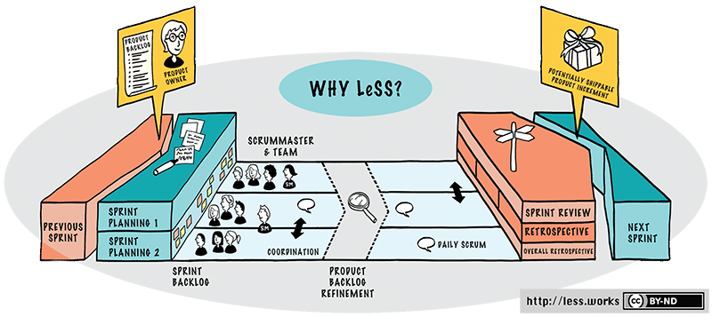
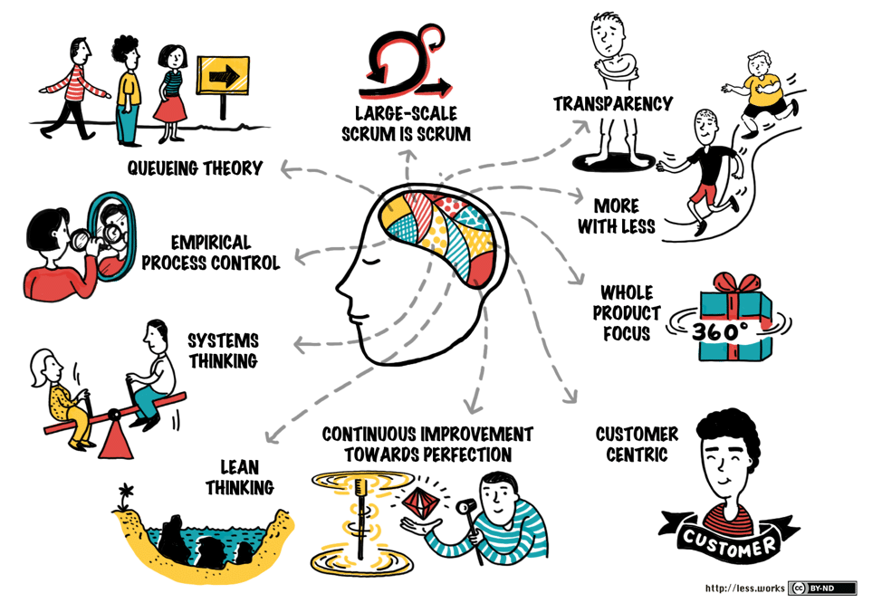

**LeSS, aka Large Scale Scrum.** The abbreviation leads to some good puns (do more with LeSS). There isn’t a one-size-fits-all solution to scaling. When the topic comes up, I recommend starting with LeSS because it was derived from running experiments, and it adds the minimum additional overhead to one team Scrum.

LeSS has been used to help groups of over 1000 people build products together, using LeSS Huge. To keep things manageable, we will focus on vanilla LeSS, which is intended for up to eight teams of eight people each.

A key LeSS lens is focusing the teams on the whole product as opposed to a single part. So instead of teams being focused on a single feature or area, they work across the product. It takes time to grow, but this flexibility means teams are always focused on building the highest value work vs. being pigeon-holed in a specific area.

A core concept and building block of LeSS is that we have multiple independent Scrum Teams. Each able to deliver value without expecting help from other teams.

As much as possible, LeSS attempts to be like one team Scrum:

- Single Product Backlog for all teams and therefore one Product Owner
- Single Definition of Team for all teams (ensuring even quality)
- Single Product Increment at the end of the Sprint

All teams have the same Sprint start and end, meaning they can then do coordinated Planning, Review and Retrospective. This leads to a few changes from single team Scrum.

- Sprint Planning becomes two parts. Part One, teams agree on which items each will work on that Sprint and they identify cross-team collaboration opportunities. Part Two, each team decides how they will do the items they have selected, leading them to create their own Sprint Backlog.
- Common Sprint Review - since the teams are working from the same Product Backlog, creating a common Product Increment at the end of the Sprint, it makes sense that Sprint Review is held in common.
- Retrospectives - each team holds their own team-level retrospective and then, separately, an overall retrospective is held with the Product Owner, ScrumMasters, Team representatives and other interested players.

LeSS also provides guidance on multi-team Product Backlog Refinement, however the details are more involved than we can cover in a glossary entry.

LeSS has a few other rules that are important to mention here:

- Teams should be organized to focus on value for a customer, aka Feature Teams
- Managers shift their focus from day-to-day team/product focus, to improving the system of work so that teams are able to deliver better value with fewer impediments. Managers should encourage experimentation to build a system that learns.

## LeSS Principles

The principles exist in place of hard and fast rules to aid in guiding decisions.

- **Large-Scale Scrum is Scrum** – just because there are some minor adaptations, it doesn’t change the core values
- **Transparency** – be clear about what is done, use common definitions
- **More with Less** – reduced defined processes, waste, overhead, roles, etc.
- **Whole-product focus** – one Product Backlog, one Product Owner, and one Shippable Increment at the end of every Sprint
- **Customer-centric** – focus on value from the customer perspective. Get feedback from real customers. Reduce Cycle Time because it gets value to the customer sooner. Help all team members see how their work delivers value to the customer.
- **Continuous improvement towards perfection** – focus on delivering defect free products, that delight the customer. Every Sprint run experiments towards
- **Lean thinking** – adopted from Toyota Lean Production System - seek to improve the flow of work, including eliminating waste. This includes the concept of Go See.
- **Systems thinking** – see the whole system and work so that changes improve the whole system and aren’t just local or sub-optimizations. Do this by measuring the whole system (e.g. Cycle Time) and not the parts (Individual or Team Productivity).
- **Empirical process control** – is fancy-pants language for Inspect and Adapt
- **Queuing theory** – teaches us that reducing batch size and creating work in progress limits improve flow.

#### Resource Links:

- [First Steps in a Large-Scale Scrum Adoption at Agfa Healthcare: Case Study](https://less.works/case-studies/agfa-healthcare.html)
- [Descaling Organizations with LeSS](https://less.works/blog/2015/05/08/less-scaling-descaling-organizations-with-less.html)
- [Developing a High Capacity Network Gateway with LeSS](https://www.infoq.com/articles/network-gateway-less)
- [Huawei – LeSS without Scrum](https://less.works/case-studies/huawei)
- [Less – Large Scale Scrum (less is more)](https://less.works/)
- [LeSS (Large Scale Scrum) Reference Card](https://less.works/resources/LeSS-rules-cards.pdf) 
- [LeSS Case Studies](https://less.works/case-studies/index.html)
- [LeSS is More – Prescription & Large-Scale Scrum](https://www.agilecentre.com/less-is-more/)
- [Merkur and LeSS – A Success Story](https://less.works/case-studies/merkur.html)
- [Q&A with Bas Vodde on the LeSS Framework](https://www.infoq.com/articles/less-framework)
- [Thales Surface Radar](https://less.works/case-studies/thales-surface-radar.html)

#### See Also:

[Causal Loop Diagrams](/glossary/causal-loop-diagram) [Scaling and Large Teams](/glossary/scaling)
