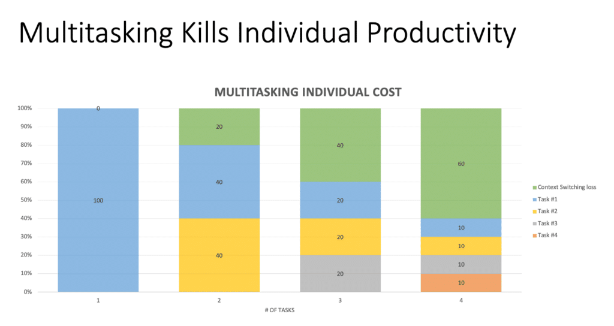
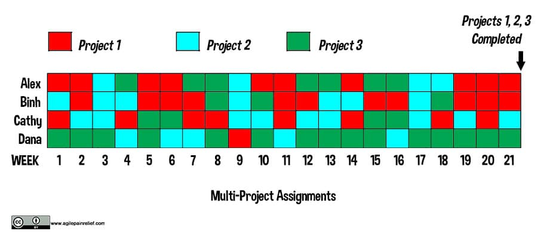
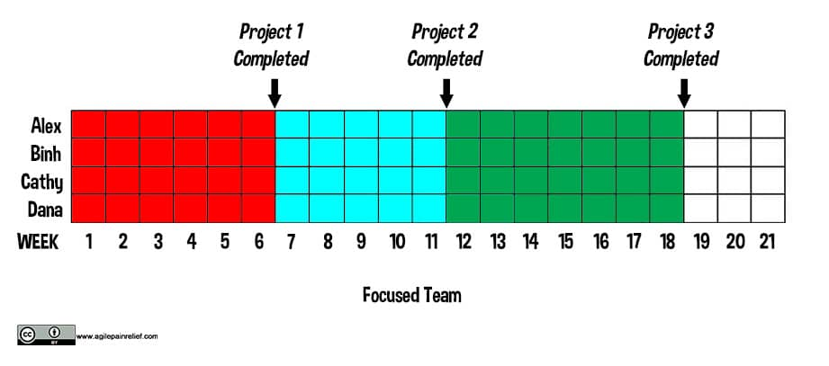

Buried in most job ads is the phrase "Looking for a great multitasker". Too bad they don't exist. Contrary to what some books would have you believe, **multitasking** effectively is not an actual thing. As humans, we suffer from the problem of dual task interference. When we're already doing one thing, splitting our focus with an additional item causes us to make mistakes with both.

This topic is insanely deep and much larger than we can cover in a short glossary entry. This is only a short summary of the problems and how they affect us.

**Effects of multi-tasking on an individual:**

- Increase in errors
- Time spent task switching
- Tasks or work gets lost
- Degrades short-term memory (which is probably part of the source of errors)

 **Effects of multi-tasking when individuals are members of multiple teams:**

- Work items are often stuck waiting for a team who is currently switched to another project
- Coordination overhead is increased

 Teams working on multiple projects in parallel ensure that all projects get done later.

Key takeaways: Don't split people over multiple teams. Where humanly possible, get teams to focus on one major item at a time.

#### Resource Links:

- [Multitasking Gets You There Later](https://www.infoq.com/articles/multitasking-problems/)
- [The Multi-Tasking Myth](https://blog.codinghorror.com/the-multi-tasking-myth/)
- [This is What Heavy Multitasking Could Be Doing To Your Brain](https://www.spring.org.uk/2014/09/this-is-what-heavy-multitasking-could-be-doing-to-your-brain.php)
- [What Multitasking Does to Your Brain](https://lifehacker.com/what-multitasking-does-to-our-brains-5922453)
- [Why Multitasking Doesn’t Work](https://www.forbes.com/sites/douglasmerrill/2012/08/17/why-multitasking-doesnt-work/)

#### Academic sources

_This just a sampling_

- [Impact of task switching and work interruptions on software development processes](https://www.researchgate.net/publication/317989659_Impact_of_task_switching_and_work_interruptions_on_software_development_processes)
- "[Constant, constant, multi-tasking craziness](https://www.researchgate.net/publication/221518315_Constant_constant_multi-tasking_craziness_Managing_multiple_working_spheres)": Managing multiple working spheres
- [Academic Publications on Multi-tasking](https://www.ics.uci.edu/~gmark/pub2.html)
- [Mutltitasking Hurts Performance but Makes You Feel Better](https://www.sciencedaily.com/releases/2012/04/120430124618.htm)
- [No Task Left Behind? Examining the Nature of Fragmented Work](https://www.researchgate.net/publication/221516226_No_Task_Left_Behind_Examining_the_Nature_of_Fragmented_Work)
- [A Diary Study of Task Switching and Interruptions](https://dl.acm.org/doi/10.1145/985692.985715) PDF of the [paper](https://www.microsoft.com/en-us/research/wp-content/uploads/2004/01/chi2004diarystudyfinal.pdf)

#### Learning Games:

- [The Name Game: A Multitasking Game for Agile Teams](https://www.crisp.se/gratis-material-och-guider/multitasking-name-game)

#### Multitasking Books:

- [_The Myth of Multitasking: How “Doing It All” Gets Nothing Done_ – Dave Crenshaw](https://www.amazon.com/The-Myth-Multitasking-Doing-Nothing/dp/0470372257/&tag=notesfromatoo-20)
- [_Slack: Getting Past Burnout, Busywork and the Myth of Total Efficiency_ - Tom DeMarco](https://www.amazon.com/Slack-Getting-Burnout-Busywork-Efficiency/dp/0932633617/&tag=notesfromatoo-20)

