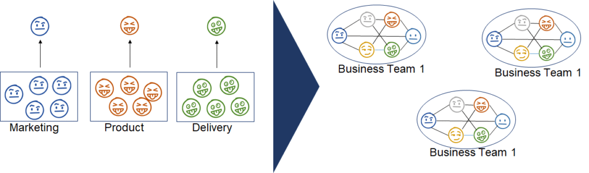

It's strange to start becoming Agile and assume that **Organizational Structure** won't change. As Agile steers an organization to focus on Product and improving effectiveness, the structure must change too.

We can't prescribe a specific structure, since each organization is unique. However, we can see general trends. Agile approaches push decision-making power closer to the people doing the work. Systems are decentralized and coordination is done as close to the work as possible. This leads to:

- Teams often work across old departmental boundaries
- Teams focus on delivering value to the customer
- The system adapts as business needs change over time
- A flatter organization, fewer layers of management

\[caption id="attachment\_14150" align="aligncenter" width="1024"\] From _[Organizing Toward Agility](https://leanpub.com/agileorganizationdesign)_ by Jeff Anderson, used with permission\[/caption\]

 

There is a famous set of videos showing how Spotify organized nearly ten years ago, however many viewers misunderstand the lessons from those videos: Aligned Autonomy; Trust at Scale and Decoupling (see: [The top 3 points you should have paid attention to in the Spotify Engineering Culture videos that aren’t Squads, Chapters, Tribes, Guilds](https://jchyip.medium.com/the-top-3-points-you-should-have-paid-attention-to-in-the-spotify-engineering-culture-videos-that-f936a512fb3b)). I won't link to the videos themselves since too many organizations have attempted to copy and paste the Spotify model onto their existing organization. Since your organization doesn't have the same history and culture, you can't copy their structure and expect the same results. The only effective approach is to evolve your own structure.

Warning: many articles in this area are written by the same companies that were providing advice on Org Structure before Agile showed up. Take their advice with a grain of salt. Also, if someone recommends using the Spotify model, run screaming from the room.

#### Resources:

- [Don’t Reorganize: Run Your Firm As An Agile Network](https://www.forbes.com/sites/stevedenning/2020/06/07/dont-reorganize-run-your-firm-as-an-agile-network/?sh=1f4d6d441ff6)
- [Principles To Guide Your Agile Organizational Design](https://agilebydesign.com/blog/design-principles-to-guide-your-agile-organizational-design/)
- [Organizational Structure](https://www.informit.com/articles/article.aspx?p=2931568&seqNum=2) - a book chapter with an emphasis on the Spotify Model - it shows a positive use of that model
- [Agile organization structures. Organization structures to work…](https://medium.com/the-i-in-agile-part-i-the-individual-contribution/agile-organization-structures-c87c8afae478) - describes the use of Holocracy
- [Organizational Structure - Large Scale Scrum](https://less.works/less/structure/organizational-structure)
- [What is an Agile Organization?](https://www.agileleadershipjourney.com/faqs/what-is-an-agile-organization)
- [The Agile Organisation A case study on creating a more nimble organisation](https://www.researchgate.net/publication/286921189_The_Agile_Organisation_A_case_study_on_creating_a_more_nimble_organisation) PDF Warning

#### BOOKS

- [_Organizing Toward Agility_](https://leanpub.com/agileorganizationdesign) - by Jeff Anderson
- _[Organization Design: Simplifying complex systems](https://www.amazon.ca/Organization-Design-Simplifying-complex-systems/dp/1138502863/&tag=notesfromatoo-20)_ - by Worren, Nicolay

#### See Also:

Culture Change Managers in Scrum Scaled Agile Framework Scaling and Large Teams
