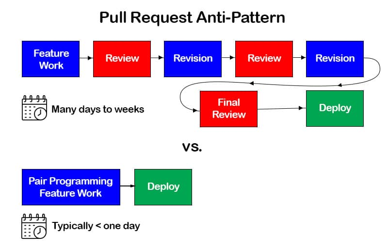

Pull Requests are a proposal to merge a set of changes from one branch to another. They emerged from the world of open source and are optimized for low-trust, low-communication environments.

__If worker busyness were the measure of software productivity, then pull requests would be well__ __suited to the task.__ But we know that's not how quality and productivity are formed.

****Weaknesses to Pull Requests include:****

- Typically only spot surface level problems, missing structural level issues.
- Lead to a false sense of security and reduced sense of accountability
- Increases the effort per developer as they carefully wordsmith feedback
- Changes often require 2-3 rounds of feedback and change, which increases the time to production
- Can erode culture by discouraging live interactions and conversations
- Inherently ineffective and inefficient due to emphasis on minimizing human interaction
- Back and forth interruptions slow both the code author and the reviewer
- Delay the improvement process to the end instead of building it in from the beginning
- Represent Work in Progress, and we know that increases cycle time and reduces throughput in the system

****What to do instead:****

- Pair programming: active review that builds quality into the product from the start
- Ensemble programming: collaborative development with an effective work-in-progress of one, eliminates need for post-facto reviews and rework
- If pull requests must be used, reduce the size of the average change; prioritize finishing other people's pull requests before doing your own work; prefer conversations over written feedback.

[Scrum Anti-Patterns – How We Hold Back Our Scrum Teams](/blog/scrum-anti-patterns.html)

#### Resource Links:

- [Are Pull Requests Holding Back Your Team?](https://betterprogramming.pub/are-pull-requests-holding-back-your-team-e8aec48986c2)
- [From Async Code Reviews to Co-Creation Patterns](https://www.infoq.com/articles/co-creation-patterns-software-development/)
- [How to Measure DORA Lead Time for Changes](https://shipyard.build/blog/measure-dora-change-lead-time/)
- [PRs: Shift Left, Please (Part One)](https://medium.com/pragmatic-programmers/prs-shift-left-please-part-one-b0f8bb79ef2b)
- [The Snail Pace of Pull Requests](https://franciscomt.medium.com/the-snail-pace-of-pull-requests-67eec5131b11)

#### Broken by Pull Requests:

[Trunk Based Development](/glossary/branching-strategies) [Continuous Integration](/glossary/continuous-integration)
