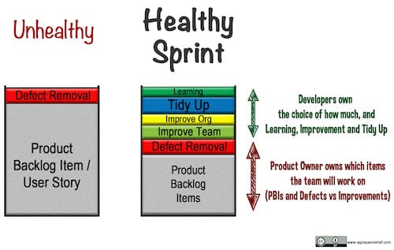

**Slack**, in the context of Agile/Scrum, is when the time isn't solely focused on delivering. _(It's important not to confuse this with Slack, a popular electronic communication tool, or the general vocabulary word defined as "a spell of inactivity or laziness".)_ 

Slack time can be used as buffer to deal with unexpected problems, issues, etc (see: Production Support) and Slack time is also for learning. Problems ensue when the Slack time for learning gets taken over by issues and problems.

In the Agile world, some approaches, like Scaled Agile, conflate both kinds of slack by lumping unexpected problems and learning time into the same bucket. This means Learning Time gets the short end of the stick.

Show me the rate at which your team is Learning (and adapting) and I will predict where they will be in a year's time.

[Cross-Skilling](/blog/how-to-cross-skill-and-grow-t-shaped-team-members.html) requires Learning Time [Scrum by Example – How to Handle Production Support Issues in Scrum](/blog/scrum-production-support.html) - One common approach to Production Support uses slack time.

#### Resource Links:

- [AoAD2 Practice: Slack](https://www.jamesshore.com/v2/books/aoad2/slack)
- [Collaborative Learning](https://www.gdrc.org/kmgmt/c-learn/index.html) (an index) and [Collaborative Learning Structures and Techniques](https://www.gdrc.org/kmgmt/c-learn/methods.html)
- [Cultivate Team Learning with Xtrem Reading](https://www.infoq.com/articles/learning-xtrem-reading/)
- [Good Housekeeping](https://sites.google.com/a/scrumplop.org/published-patterns/value-stream/good-housekeeping)
- [Group work: Using cooperative learning groups effectively](https://cft.vanderbilt.edu/guides-sub-pages/setting-up-and-facilitating-group-work-using-cooperative-learning-groups-effectively/)
- [Grow a culture of innovation and learning with frequent Developer Huddles](https://medium.com/the-liberators/grow-a-culture-of-innovation-and-learning-with-developer-huddles-8cc3a0f88c1a)
- [How to Spread Technical Practices Like TDD in an Organization](https://www.infoq.com/articles/spread-technical-practices-organization/)
- [Increase Learning with 10% Autonomy Time](https://www.infoq.com/news/2016/10/learning-autonomy-time)
- [Increasing Learning in an Agile Environment: Lessons Learned in an Agile Team](https://www.researchgate.net/publication/261317493_Increasing_Learning_in_an_Agile_Environment_Lessons_Learned_in_an_Agile_Team)
- [Long Term Learning of Agile Teams](https://www.researchgate.net/publication/321674505_Long_Term_Learning_of_Agile_Teams)
- [Slack](https://martinfowler.com/bliki/Slack.html), by Martin Fowler
- [What is Learning Agility and Why Organizations Need to Focus on It](https://disprz.ai/blog/learning-agility-everything-you-need-to-know-about-it)

#### Books:

- [_The Fifth Discipline: The Art & Practice of The Learning Organization_](https://www.amazon.ca/Fifth-Discipline-Practice-Learning-Organization-ebook/dp/B000SEIFKK/&tag=notesfromatoo-20) - Peter Senge
- [_Slack: Getting Past Burnout, Busywork, and the Myth of Total Efficiency_](https://www.amazon.ca/Slack-Getting-Burnout-Busywork-Efficiency-ebook/dp/B004SOVC2Y/&tag=notesfromatoo-20) - Tom DeMarco

