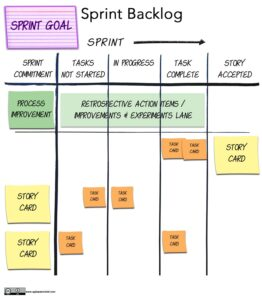

](/wp-content/uploads/2021/05/2017CSM-Sample-Scrum-Task-Board-v2.jpg)The **Sprint Backlog** is a list of [Product Backlog Items (PBIs) the Team has committed to for the next Sprint. It is the Scrum Team’s plan for how to achieve the Sprint Goal. Since the Sprint Backlog is solely for the use of the Team to organize their own work, they are the only ones who create, change, and manage it — not a tool, and not an outsider. Since Teams are unique, there is no single correct practice that they all should follow. Teams choose and experiment with whatever helps them most to stay focused and self-organize, creating the Sprint Backlog with whatever methods work best for them, such as index cards, whiteboards, or, yes, even electronic tools.

[The Sprint Backlog: A Truly Complete Guide with Examples](/blog/the-humble-sprint-backlog.html)

#### Resource Links:

- [Elements of an Effective Scrum Task Board](https://agilecomplexificationinverter.blogspot.com/2013/11/elements-of-effective-scrum-task-board.html)
- [A Highly Evolved Card Wall](https://blog.gdinwiddie.com/2023/12/24/a-highly-evolved-card-wall/)
- [Myth: The Sprint Backlog can’t change during the Sprint](https://medium.com/the-liberators/myth-the-sprint-backlog-cant-change-during-the-sprint-e1a10f735c67)
- [Sprint Backlog](https://sites.google.com/a/scrumplop.org/published-patterns/value-stream/sprint-backlog) - Pattern
- [Your Scrum Sprint Backlog](https://www.dummies.com/category/articles/project-management-34249/) _Caveat it recommends the use of burndown charts - I don't anymore_
- [What is Sprint Backlog in Scrum Framework](https://medium.com/agilemania/what-is-sprint-backlog-in-scrum-framework-4d4dcf245ce9)
