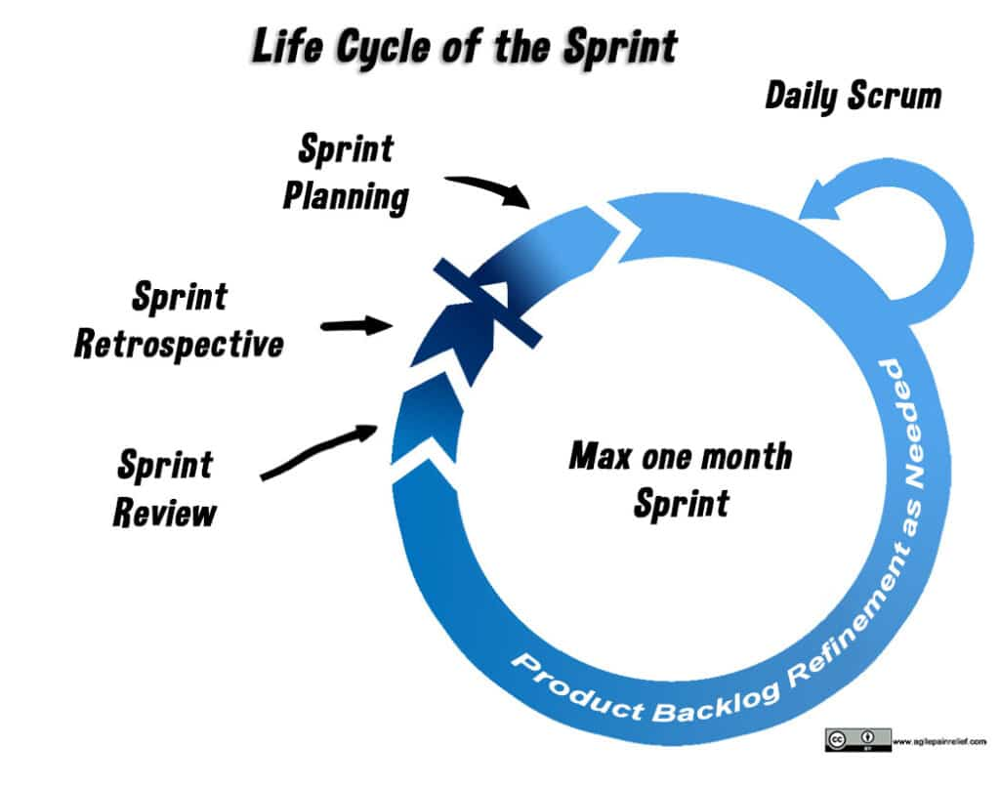

A **Sprint** is a fixed period, ranging from one week to one month in length, during which the Scrum Team works to meet specific customer needs. As one Sprint ends, the next Sprint begins. The purpose of defining the work period is that it enables the Team to focus on a limited and prioritized number of features, and it encourages the delivery of at least some completed work to the customer each Sprint.

[The Story of a Sprint](/the-story-of-a-sprint) - video and transcript

 [Is There a Best Day to Start and Finish a Sprint?](/blog/is-there-a-best-day-to-start-and-finish-a-sprint.html)

