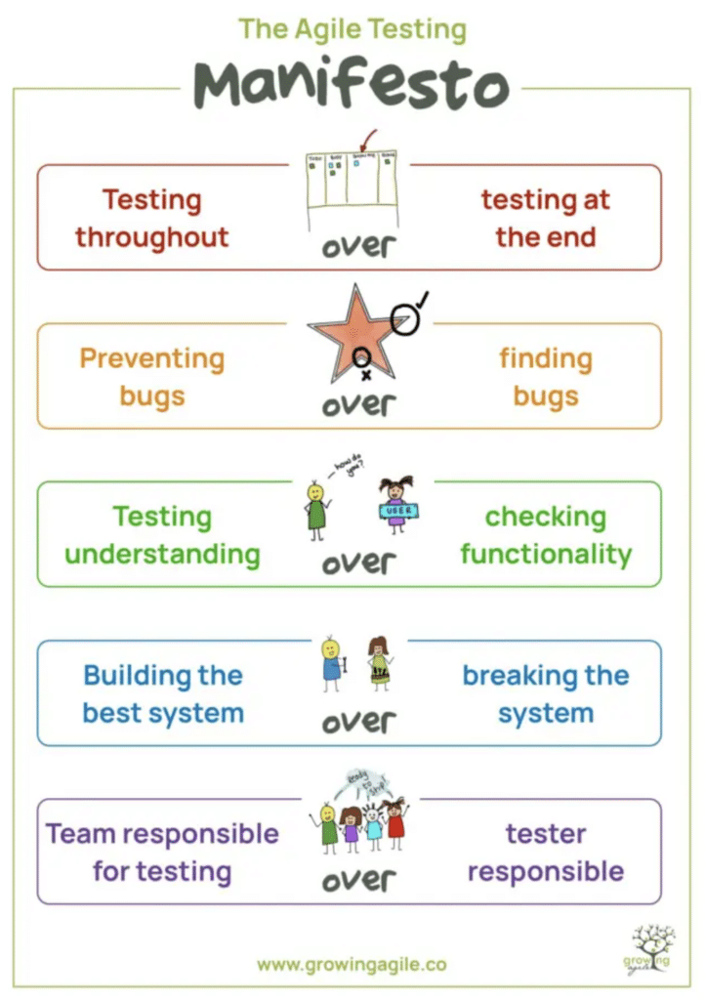
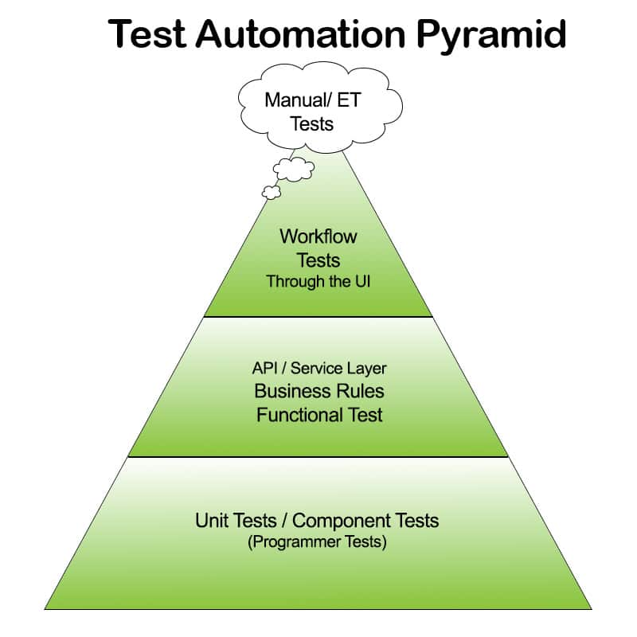

**Agile Testing** is "collaborative testing practices that occur continuously, from inception to delivery and beyond, supporting frequent delivery of value for our customers. Testing activities focus on building quality into the product, using fast feedback loops to validate our understanding. The practices strengthen and support the idea of whole-team responsibility for quality." - Lisa Crispin and Janet Gregory in _Agile Testing Condensed_.

## Role

_No separate role - rather a need that a self organizing team needs to fulfill. Requires true collaboration._

- Participate in backlog refinement and sprint planning to understand user stories, acceptance criteria.
- Collaborate on creating acceptance criteria with other team members.
- Continuous Testing - start testing before development starts on PBI/User Stories.
- Help automate tests of Acceptance Criteria (i.e. Example Mapping).
- Provide Product Owner feedback during Sprint itself and also in Sprint Review.
- Help the Product Owner and whole Scrum Team understand where the product quality is, especially with respect to the Definition of Done.
- Mentor and coach other team members to raise quality, especially through cross-skilling.
- Ask questions about usability, accessibility and security. Highlight risks found in these areas.
- Ask questions about the business domain.
- Exploratory testing - in addition to automating acceptance tests, exploratory work takes perspectives that haven't already considered.
- Testing isn't checking to see if the product works.
- Work in the language of the customer.

## Key Ingredients for Success

- Whole Team Approach
- Agile Testing Mindset
- Automate Regression Tests
- Automated Acceptance Tests as Living Documentation
- Continuous Feedback
- Collaborate with Customers
- See the Big Picture

#### Resource Links:

- [Design for Testability](https://blog.gdinwiddie.com/2012/05/16/design-for-testability/)
- [Do You Need a Test Column?…. Let’s Talk](https://janetgregory.ca/do-you-need-a-test-column-lets-talk/) - title should be: "Does Your Sprint Backlog Need a Test Column?"
- [Just Say No to More End-to-End Tests](https://testing.googleblog.com/2015/04/just-say-no-to-more-end-to-end-tests.html)
- [QA to AQ: Patterns about transitioning from Quality Assurance to Agile Quality](https://wirfs-brock.com/rebecca/papers/qa2aq-part-one/) - This paper outlines core patterns for transitioning from a traditional QA practice to a more agile one, where quality is addressed earlier in the process and QA plays a more integral role.
- [Test Planning Cheat Sheet](https://agiletester.ca/test-planning-cheat-sheet/)
- [Testing is a Team Problem](https://janetgregory.ca/testing-is-a-team-problem/)

##### Layers of Test Automation

- [Introducing the Software Testing Cupcake (Anti-Pattern)](https://www.thoughtworks.com/insights/blog/introducing-software-testing-cupcake-anti-pattern)
- [Layers of Test Automation](https://qa-matters.com/2014/12/28/layers-of-test-automation/)
- [The Practical Test Pyramid](https://martinfowler.com/articles/practical-test-pyramid.html)

##### Test Automation

- [Functional GUI Testing Automation Patterns](https://www.infoq.com/articles/gui-automation-patterns/)
- [Playwright](https://playwright.dev/)

##### Mind mapping

- [Enhance Your Testing Strategy with Mind Map-Driven Testing](https://www.infoq.com/articles/mindmap-driven-testing/)
- [Mind mapping as a productivity hack for testers](https://medium.com/qualityworks-blog/mind-mapping-as-a-productivity-hack-for-testers-3-ways-to-improve-your-testing-process-94104fa1022d)

##### Chaos Engineering

- [Principles of Chaos Engineering](https://principlesofchaos.org/)
- [Chaos Engineering Upgraded](https://netflixtechblog.com/chaos-engineering-upgraded-878d341f15fa)

##### TESTING BOOKS

- [_Agile Testing Condensed_](https://leanpub.com/agiletesting-condensed) by Janet Gregory and Lisa Crispin - Summarizes their first two books in a way that makes Agile Testing accessible to all team members.
- [_Explore It! Reduce Risk and Increase Confidence with Exploratory Testing_](https://pragprog.com/titles/ehxta/explore-it/) by Elisabeth Hendrickson - Provides depth on the oft-ignored subject of testing beyond the automation.

