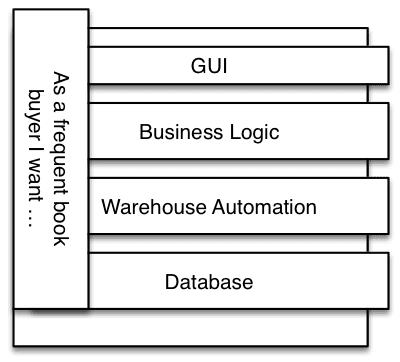
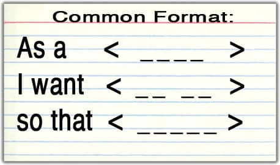
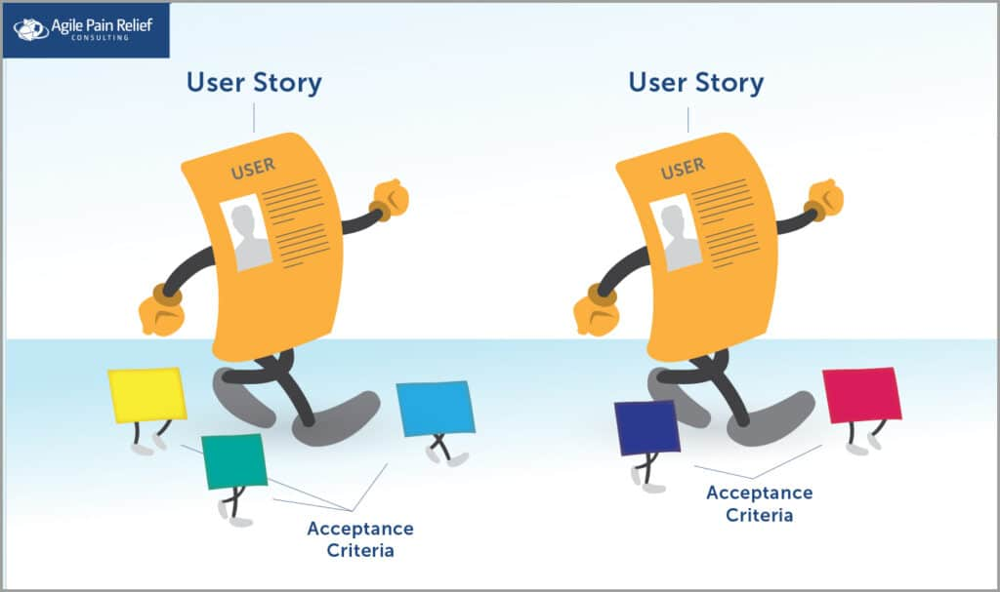
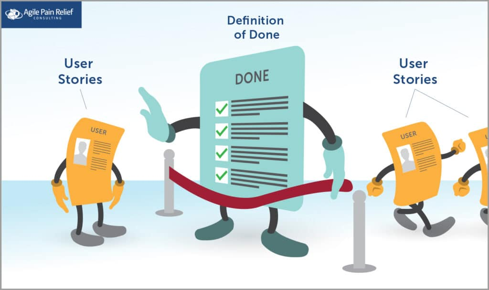

In Scrum, a **User Story** is a tool used to provoke, and then summarize, a conversation between the Development Team and their Product Owner, for a better understanding of an item on the Product Backlog. The User Story provides context regarding who a Product Backlog Item is being developed for, and why it is of value.

## Are User Stories Part of Scrum?

**It’s important to note that a user story isn’t part of Scrum** per se, but is a tool that grew up beside Scrum and is often used in tandem. User stories can be helpful but aren’t required as part of the practice of Scrum. When used by Scrum Teams, user stories are placed in the Product Backlog along with anything else that affects the Product.

## User Stories Capture Product Feature Requirements in Story Form

User stories replace traditional written requirements. The often-used language of a “Use Case” is stilted and hard to read. A user story acts a reminder of the conversations that created it, to move the focus from What we’re building (what often happens with traditional requirements) to Why and Who. As humans, we’re very good at remembering stories and conversations, but we’re not good at remembering a list of facts. User stories leverage this principle by capturing the main points in the form of a natural conversation.

## Thin Vertical Slice

A user story is said to be a “thin vertical slice” – a pithy statement that is hard to digest. “Thin” is just a funny way of saying they’re small. Small enough that a couple of team members could finish one in a few days of work. “Vertical Slice” – imagine software to be composed of layers, for example: User Interface, Business Logic, and Backend systems. So an item that goes through all the layers is a vertical slice. A horizontal slice would focus only on a single layer or components.

## How to Format a User Story

Everyone who has seen a user story before can rhyme this format off:

“As a <User/Role>, I want <to do something> so that <value>”

This is so popular that many people think this is a User Story itself. (It’s not.) The original user stories (going back to 1996/7) had no predetermined format. The above format is just one of several that is popular today. Here are two more:

“As a <role> I want <business value> by <method/requirement>”

“In order to <achieve some value> as a <type of user> I want <some functionality>”

If whatever user story format you’re using isn’t helping the Scrum team have a good conversation around what the end user wants and why they want it, then abandon it and create a new format. The exact user story format isn’t important – the goal is simply to be clear on who wants what and why. Present it in the form of natural language, rather than technical jargon, to make it easier to understand and remember. It also makes it more human-oriented, which helps a ton with motivation.

## Typical components of user stories, often referred to as the three C’s:

1. **Conversations**: discussion of the details. Results in creating the acceptance criteria.
2. **Confirmations**: Acceptance criteria that, in software, can be turned into automated acceptance tests.
3. **Card**: A physical token (with a story title/description) traditionally written on a small paper card or sticky note to aid in planning. Acts as a reminder to have conversations.

## Need, But Not a Solution

User Stories explain the need behind a product or feature, but not the solution. Traditional requirements often didn’t state the need, and instead they worked through the fine-grained details of what to implement without showing the team why it mattered. It is difficult to do a good job building a feature when it’s not clear why it’s needed. Worse, it’s demotivating. We need to see that our work has meaning and purpose. A user story is intended to state the business need in addition to what the story will accomplish.

## Are Stakeholders involved in User Stories?

Some Scrum teams invite interested stakeholders (e.g. Marketing or Sales Manager, a real live end user) to the Sprint Review when they’re working on features that are especially important to the stakeholders. In these cases, the User Story facilitates the conversation between the people who want the feature (the Stakeholders) and the people building it (Scrum Team), and the team and Product Owner get to hear firsthand about the underlying need or rationale behind the product request. Once the Developers understand the intention behind the feature, and what the end user wants to achieve, they can get to work and figure out best possible solutions for how to build it.

## A User Story is Different From Definition of Done or Acceptance Criteria

"Where do the details go?" is a question I often hear in Product Owner workshops. The original user stories had the text of the story on the front and the detailed acceptance criteria on the back. Specific details about what a story allows and disallows become the acceptance criteria, that are effectively the children of the user story.

Confusion over what is a user story vs. definition of done vs. acceptance criteria is one of the most common problems in Scrum, and [we cover it in detail here](/blog/definition-of-done-user-stories-acceptance-criteria.html). But, in a nutshell, Definition of “Done” is the global quality checklist for all user stories. Acceptance criteria are the specific details needed to complete a user story. A user story is a placeholder for a conversation about meeting a User need.

## Goals of a User Story

- focus on the problem that needs solved, not the solution to the problem
- start a conversation about what problem to solve, why it needs solving, and who needs it
- demonstrate a need as concisely and simply as possible
- be a small, vertical slice of functionality

[Life Cycle of a User Story](/blog/lifecycle-of-a-user-story.html) [Story Slicing, How Small is Enough?](/blog/story-slicing-how-small-is-enough.html) [More Notes on Story Splitting](/blog/more-notes-on-story-splitting.html) [Vision to User Stories – What is the Best Flow?](/blog/vision-to-user-stories-what-is-the-best-flow.html) [Scrum By Example – The Team Collaborate on Acceptance Criteria](/blog/scrummaster-tales-team-collaborate-acceptance-criteria.html) [Scrum by Example – How to Deal with Bad User Stories as a ScrumMaster](/blog/deal-with-bad-scrum-user-stories-as-a-scrummaster.html)

#### Resource Links:

- [Alternative formats for User Stories](https://blog.crisp.se/2014/09/25/david-evans/as-a-i-want-so-that-considered-harmful)
- [Another Alternative User Story Format](https://jkwerner2.wordpress.com/2010/03/23/so-that-so-what/)
- [Conversational Stories](https://martinfowler.com/bliki/ConversationalStories.html)
- [Examples of User Stories](https://xp123.com/articles/example-user-stories-2020/)
- [How to Break a User Story into Tasks](http://www.softwareandi.com/2011/11/how-to-break-user-story-into-tasks.html)
- [Introduction to User Stories Presentation](https://www.mountaingoatsoftware.com/presentations/introduction-to-user-stories)
- [Make Your User Stories Riveting](https://www.infoq.com/presentations/user-stories-invest/)
- [Not Everything Needs to Be a User Story: Using FDD Features](https://www.mountaingoatsoftware.com/blog/not-everything-needs-to-be-a-user-story-using-fdd-features)
- [Slicing Epics](https://improvingflow.com/2024/02/21/slicing-epics.html)
- [Sprint Tasking Tips: Sticky Note Strategies](https://scrumcrazy.wordpress.com/2011/05/19/sprint-tasking-tips-sticky-note-strategies/)
- [Sprint Tasking Tips: Team tasking strategies](https://scrumcrazy.wordpress.com/2011/05/18/sprint-tasking-tips-team-tasking-strategies/)
- [User Story: a Placeholder for a Conversation](https://www.infoq.com/articles/user-story-conversation/)
- [User stories: from good intentions to bad advice - Lean Agile Scotland 2019](https://www.slideshare.net/slideshow/user-stories-from-good-intentions-to-bad-advice-lean-agile-scotland-2019/182397996)
- [User Stories and FDD](https://technicaldebt.com/user-stories-and-fdd/)
- [Vertical Slices and Scale](https://www.humanizingwork.com/vertical-slices-and-scale/)

##### INVEST

- [Demonstrating the INVEST Criteria](https://paulmboos.com/2015/09/17/demonstrating-the-invest-criteria/)

##### USER STORIES BOOKS

- [_User Stories Applied: For Agile Software Development_](https://www.amazon.com/User-Stories-Applied-Software-Development/dp/0321205685/&tag=notesfromatoo-20/&tag=notesfromatoo-20) – Mike Cohn

 

(Updated: November 2023)
