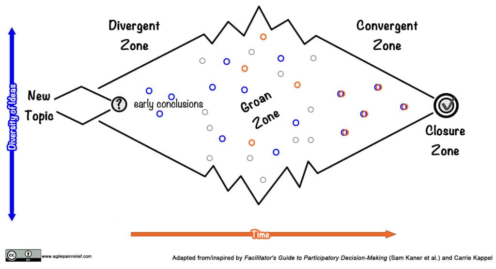

The **Product Vision** is a shared understanding of the overall goal and purpose for creating a product. Your vision describes the motivation behind creating the product, it is not the product itself.

The Product Vision provides purpose and direction for the team. Without a vision, a group of people have little reason to move beyond individual work silos and become a true collaborative team. In addition, without a vision the team will flounder their way through the product delivery process making best guesses instead of informed choices.

For this reason, one of the first things I ask all new teams that I meet is, “Please tell me what your Product Vision is.” To ensure that it’s really the team’s own understanding, I ask the Product Owner to leave the room first. Most teams can’t answer the question because they don’t understand the vision.

### Product Vision is Shared Understanding

In too many cases, Product Vision is decided by a central group and then handed out to the team. You can’t magically take something created by one group and expect other people to understand it. The least effective model I have seen is when the Product Owner shares a PowerPoint of the vision with the victims. They will learn little and retain less. It is far more effective to invite the people who are building the product to be in the room and participating in co-creating the vision.

### Vision vs Strategy vs Tactics

Vision is where you’re going, strategy is how you’re getting there. Vision is focused on the longer term (in 3–4 years, where do you want to be) while Product Strategy is focused on the medium term (what are our options in the next 6–8 months). When it comes to strategy in the Agile world, look for tools that are focused on allowing you to explore options, instead of a fixed roadmap of what will happen. Examples include: Impact Map, Story Map, Opportunity Solution Tree.

### Vision Tools

If you ask most team members what they expect from a vision, they will suggest that it is a short, meaningless statement, written with nice sounding words. This type of vision has only limited value.

There are a number of effective tools and exercises, but please remember that much of their value comes from the fact that the vision is co-created. The people who will build the product were present in the room when the vision was defined and so they understand why it is valuable and what it represents. If they’re not present, then all of the tools below become fancy versions of a PowerPoint presentation containing a short, meaningless statement.

- [Product Box](https://reqtest.com/en/knowledgebase/how-to-build-a-product-vision-box-and-clarify-your-software-goals/) – You create a physical box that would market the product in the real world. In the virtual world, you give people a fixed surface area in a virtual space like Mural/Miro - this is exactly what we do in our  [Certified Scrum Product Owner workshop](/certified-scrum-product-owner-cspo-training). _This is a powerful tool because we’re challenged to draw and, since we don’t that very often, it sparks creativity (laughter, too)._
- [Vision Board](https://www.romanpichler.com/blog/the-product-vision-board/) – A one-page board that gets you to answer the following key questions/prompts: State your overarching goal; Who will benefit from the product; Needs or Pains these people have; … - We also practice with this tool in the CSPO workshop.
- [Pixar Pitch](https://prettyagile.com/2014/06/pitching-pixar-pitch/) – _Trigger warning: this will ruin all Pixar movies for you_ - Storytelling is one of the most effective ways to communicating an idea. A former Pixar editor (Emma Coates) noticed that Pixar movies follow a similar pattern: Once Upon a Time There Was \_\_\_. Every Day, \_\_\_. One Day\_\_\_. Because of That,\_\_\_. Because of That, \_\_\_. Until Finally \_\_\_.
- [Remember the future](https://spin.atomicobject.com/2017/11/30/design-thinking-remember-future/) – Imagine that it is 5 years in the future and your company has just released a milestone version of the product. Then imagine several months later, when your customers are overjoyed. Why are they delighted? The customers have been talking so much, there is a headline in the New York Times/Globe And Mail. What does it say? The exercise works because it is easier for our brains to look back on something, than it is to look forward.

### Vision Creation Workshop

We offer Vision Creation Workshops in our [private training](/private-scrum-agile-training), but you can also run one yourself.

**Preparation:** Before the workshop, do some customer research by interviewing 10–20 customers and finding out what pain they’re suffering from. Ask open-ended questions and keep interviewing until you can predict what the next person will say. From past experience, that often happens after 12–15 people.

**Who should participate in the workshop:** End Users, Stakeholders (not as a replacement for the end users), Development Team, Product Owner. If there are more than 7 people, consider splitting them into groups. Each group needs a mix of all the roles. If you split into groups, the PO won’t participate in any single group and will instead move from group to group, listening and occasionally asking clarifying questions.

Why include Development Team? When they’re not included, then we spend 2–4 sprints getting them to redo completely misunderstood work in the product. Although it might be expensive to involve the team in creating the vision (1/2 day of work x the number of team members), the cost of building the wrong product is much greater.

**Length:** Most of these activities can be done in 2–4 hours, with group size having the largest effect.

**Mechanics:**

All of these tools are trying to foster divergence to generate good ideas, then cross-pollinate and, finally, convergence select the winner(s).

- Explain the tool they are using
- PO outlines the core thinking for the product and shares information from customer interviews, often in the form of an Empathy Map
- PO shares a couple of examples of a completed product vision from the tool in question
- Groups split up to work on their tool (e.g. building a Product Box or writing a Pixar Pitch)
- Groups present what they built and the PO provides feedback
- Groups return to building their product using feedback from the PO and inspiration from other teams to update their Vision
-  …sometimes a third round of building is necessary
- The PO then selects which vision is closest to their understanding of the customer needs.

I like approaches like this because it gets doers and end users to start talking, all team members feel they had a say in the vision, and it’s motivating. The PO maintains a sense of overall control but provides enough autonomy that the team feel like they have a sense of ownership.

### Attributes of a Good Vision

- Emergent, not a compiled list of features
- Focused on the customer problem, not the solution (LeanStartup, “Love the Problem, not the Solution”  (Ash Maurya, _Running Lean_)
- Vision provides focus
- Inspiring, shared, ethical (will create a product that helps people and doesn’t cause harm), concise, ambitious
- Looks far enough into the future that it won’t be completed soon Typically 4–5 years out, although others suggest as far as 10 years out.
- Meaningful target group - Saying “Windows Users” or “Android Smart Phone Users” is meaningless. For example, for a budgeting app, consider something like “Female between the ages of 30–45, uses an Android phone, with income between $50K - $150K/yr”

[Future Perspective for Change: Why Backcasting Helps Get You Where You Want to Be](https://agilepainrelief.com/blog/future-perspective-for-organizational-change.html) - this tool can be used for setting a vision for organizational change, in addition to creating a vision for a product.

#### Resource Links:

- [8 Tips for Creating a Compelling Product Vision](https://www.romanpichler.com/blog/tips-for-writing-compelling-product-vision/)
- [Agile Product Planning: Vision, Strategy, and Tactics](https://www.romanpichler.com/blog/agile-product-planning-vision-strategy-tactics/)
- [All-hands Team Memo March 2024](https://missiveapp.com/blog/memo-1)
- [Celebration-5W](https://www.agendashift.com/resources/celebration-5w) - Agendashift Discovery exercise
- [Common Product Vision Board Mistakes](https://www.romanpichler.com/blog/common-product-vision-board-mistakes/)
- [Design The Box](https://gamestorming.com/design-the-box/)
- [How to Build a Product Vision Box and Clarify Your Software Goals](https://reqtest.com/agile-blog/how-to-build-a-product-vision-box-and-clarify-your-software-goals/)
- [How to Create a Future Focused Vision in 5 Steps](https://spitzercoaching.com/how-to-create-a-future-focused-vision-in-5-steps/)
- [How to get your project started on the right foot](https://www.kbp.media/portfolio/start-a-project/)
- [My Innovation Games Project Box experience](https://agilepmo.ca/tag/product-box/)
- [Product Canvas – beyond the Product Backlog](https://www.romanpichler.com/blog/the-product-canvas/)
- [Product Vision Canvas](https://www.5dvision.com/agile-product-frameworks/product-vision-canvas/)
- [Product Vision FAQ](https://www.svpg.com/product-vision-faq/)
- [Product Vision FAQs](https://www.romanpichler.com/blog/product-vision-faqs/) - Roman Pichler
- [The Product Vision Board](https://www.romanpichler.com/blog/the-product-vision-board/)
- Remember the Future - from [Design Thinking Toolkit](https://spin.atomicobject.com/2017/11/30/design-thinking-remember-future/) and (originally from the book Innovation Games) - good for creating vision for teams that are involved in doing organizational change work as well
- [Remembering the Future](https://medium.com/frameplay/remembering-the-future-5894d0d11082)
- [Remote creation of an Agile vision](https://blog.crisp.se/2020/03/20/mattiasskarin/remote-creation-of-an-agile-vision-for-the-future)
- [Strategy and the Importance of Vision](https://www.designative.info/2021/05/09/strategy-importance-of-vision/)
