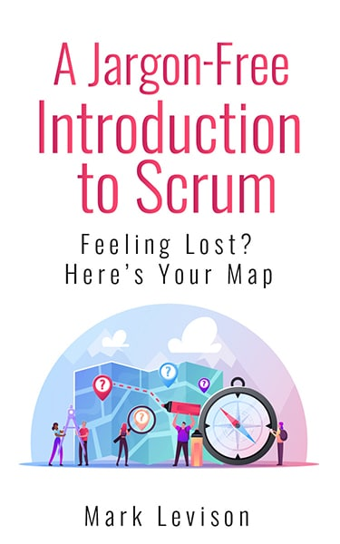

.page-id-14725 .content { padding: 30px 0 10px; position: relative; } .page-id-14725 .entry-title { display: none; } #jfsSplash { overflow: hidden; } .bookCover { width: 35%; filter: drop-shadow(5px 5px 5px #444444); padding: 0 70px 0 10px; float: left;} .dripForm { width: 65%; float: left; padding-right: 20px; } .dripForm h1 { font-weight: normal; font-size: 7rem; } .dripForm .heading { font-size: 3.5rem; font-weight: bold; margin-bottom: 0; } #jfsIntro { padding: 15px; margin-bottom: 10px; overflow: hidden; } #jfsIntro h2 { text-align: center; font-size: 3.5rem; } #jfsIntro ul { float: left; width: 50%; } #jfsIntro ul > li { list-style-type: none; margin-left: 20px; } #jfsIntro ul li:before { content: '✓'; font-size: 2rem; font-weight: bold; color: #228b22; margin-right: 8px; } #leadin { padding-top: 15px; margin: 0 60px 30px; border: 2px solid #000000; } #leadin p { font-size: 2.5rem; text-align: center; } #notConvinced { clear: both; overflow: hidden; padding: 0 30px; max-width: 1120px; margin: 0 auto; } .ncItems { float: left; width: 33%; text-align: center; padding: 65px 72px 5px 72px; background-image: url(/wp-content/uploads/2023/02/gradient-semicircle.png); background-size: contain; background-position: center bottom; background-repeat: no-repeat; font-size: 1.5rem; } .dlButtonFrame { text-align: center; padding-top: 10px; } #bookHighlights{ overflow: hidden; margin: 25px auto; max-width: 1120px; } .bookHighlight { width: 360px; display: inline-block; border-radius: 6px; border: 2px solid #02365e; margin-right: 8px; } .bookHighlight h5 { test-align: center; color: #f2f2f2; background-color: #02365e; font-size: 15px; padding: 8px 20px; } .bookHighlight div { padding: 8px 20px; } .reviewBlock { background-color: #cccccc; overflow: hidden; margin-bottom: 20px; } .secondReviewBlock { margin: 30px auto 0; } .reviewBlock p { display: none; } .reviewBlock h3 { padding: 35px 0 0; font-weight: normal; text-align: center; } .reviewBlock h4 { padding: 0 30px; font-weight: normal; text-align: center; } .reviewItem { width: 100%; padding: 12px 25px; } .reviewItemImage { height: 100px; } .reviewItemImageSmall { height: 70px; } #ata { clear: both; background-color: #1f64a4; color: #fafafa; padding-top: 50px; position: relative; overflow: hidden; } #ata h4 { color: #fff; } #ataImg { width: 30%; float: left; } #ataImg img { width: 225px; position: absolute; bottom: 0; } #ataContent { width: 70%; float: left; padding-right: 40px; } #ataContent p { font-size: 1.2rem; } #lastAsk { background-color: #02365e; overflow: hidden; } #lastAsk h4 { color: #fff; margin: 10px auto 0; } #lastAsk .dlButtonFrame { padding-top: 0; } .lastAskBlock { float: left; width: 50%; text-align: center; padding: 20px 0 20px 40px; } .content { padding-bottom: 0; } #privacyLink { padding: 5px 0 10px; } #drip-ef-665122385 input\[type="submit"\]:hover, #jumpToForm:hover { color: #fff; } @media screen and (max-width: 1023px) { .ncItems { padding: 65px 50px 5px 50px; font-size: 1.2rem; } .bookHighlight { width: 250px; } .bookHighlight div { padding: 8px 10px; } } @media screen and (max-width: 800px) { .heading { margin-top: 15px; } .bookCover { width: 100%; float: unset; padding: 0; text-align: center; } .dripForm { width: 100%; float: unset; padding: 0; } .dripForm h1 { font-size: 4rem; } .lastAskBlock { float: unset; width: 100%; } .bookHighlight { width: 100%; margin: 0 0 15px; } .bookHighlight p { margin: 0; } #jfsIntro ul { float: unset; width: 100%; } .firstThree { margin-bottom: 0!important; } .ncItems { font-size: 1.8rem; float: unset; width: 100%; padding: 25px 0; margin-bottom: 15px; border-radius: 10px; background-image: linear-gradient(to right, lightblue , lightpink); } } @media screen and (max-width: 500px) { .dripForm .heading { font-size: 2rem; } .dripForm h1 { font-size: 2rem; margin-bottom: 20px; } #jfsIntro ul { padding-left: 0!important; } #jfsIntro h2 { font-size: 2.5rem; } #leadin { margin: 0 10px 30px; } .reviewItem { margin-bottom: 10px; } #ataImg { width: 100%; } #ataImg img { width: auto; position: unset; margin-left: 15px; } #ataContent { width: 100%; margin-left: 15px; } } #drip-ef-665122385 { font: 1.4rem/1.5rem sans-serif; } #drip-ef-665122385 h3 { font-size: 2rem; margin: 0 0 .5rem; } #drip-ef-665122385 > div { margin-bottom: 1.5rem; } #drip-ef-665122385 fieldset { border: none; margin: 0; padding: 0; } #drip-ef-665122385 legend { margin: 0; padding: 0; } #drip-ef-665122385 input\[type="email"\], #drip-ef-665122385 input\[type="number"\], #drip-ef-665122385 input\[type="tel"\], #drip-ef-665122385 input\[type="text"\] { margin: 0; padding: .375rem .5625rem; width: 100%; } #drip-ef-665122385 input\[type="checkbox"\], #drip-ef-665122385 input\[type="radio"\] { margin: .1875rem .1875rem 0 0; padding: 0; } #drip-ef-665122385 input\[type="submit"\], #jumpToForm { margin: 0; padding: 1.5rem 2rem; color: #000; font-size: 2rem; line-height: normal; }

DOWNLOAD YOUR FREE GUIDE!

# A Jargon-Free Introduction to Scrum

\* Email Address (required)  

\* First Name (required)  

Last Name (optional)  

Website  

[Privacy Policy](/privacy-policy)

## SCRUM MADE SIMPLE

- what Scrum methodology is and why it's valuable
- everyday explanations and examples, not boring and confusing theory
- easy to learn, even if you're not in software development

- understand how to make Scrum work for you in the real world
- free subscription includes follow-up learning emails to go deeper
- Mark shares and guides using his 30+ years of IT experience

Stop being intimidated by what you don't know

Develop skills and understanding that will help  
advance your career and make work suck less.

Create a more enjoyable and rewarding work place, happier customers

Scrum is in demand, $90K average salaries (Glassdoor Canada)

8,000+ certified by Mark, coast to coast, in countless industries

### What People Are Saying

"I read your jargon-free introduction to scrum yesterday and it is awesome - it is written in simple terms, clear examples easy to follow even for a 5 year old."

— C.O.

“Mark makes accessible that which is seemingly vague. He energizes and encourages discourse and embodies what I believe Agile means.”

— Eban T., British Columbia

“Amazing and inspiring. I am ready to go change my working life.”

— Thomas W., Quebec

“Mark provides clarity into the mystical world of Agile and Scrum with practical examples and Jedi wisdom. Add some psychosocial games into the batch and you’re in for an adventure. Training will leave you pondering the cavernous opportunities to be an agent of organizational change.”

— Petrus B., Manitoba

“Mark is the real s\*\*t. He's lived through the pain points and knows where the bodies are buried. ”

— Christian F., Quebec

#### HIGHLIGHTS OF THE BOOK

##### Scrum for beginners

An easy to understand introduction to basic Scrum methodology and how it helps teams and organizations.

##### Case study included

Visualize Scrum at work in a marketing company and how its structure leads to many benefits.

##### Learn the terminology

Scrum terms explained simply, so you can get in on the conversation from the beginning.  

“Mark was very approachable, friendly, and knowledgeable. He has done a great job in helping someone like me who doesn't belong to a corporate world learn so much about scrum in 2 days!”

— Mashiat F., Ontario

“Mark rocks! His extensive real world experience combined with his depth of knowledge of Scrum processes and tools made for a superior learning opportunity with lots of fun along the way. Highly recommend!”

— Steven C., Nova Scotia

“Mark's ability to adapt to the background of students and relate to their organization's characteristics adds exceptional value. This course isn't just for software development!”

— Paul A., Ontario

“Excellent, fun, and very thought-provoking. I see this course as an impetus for change for our organization. Highly recommended.”

— Jack H., British Columbia

“Empowers you to grow both as a manager and an effective team member. Will be useful to any company which wants to build highly effective teams.”

— Pavel B., Alberta

#### ABOUT THE AUTHOR

Mark Levison is the Certified Scrum Trainer and Agile Coach behind Agile Pain Relief Consulting. With over 30 years of experience in the IT industry, he has been learning and teaching Agile since 2001, when Scrum began. Introducing Scrum, Lean, and Agile methodology to a large variety of organizations —government departments, banks, insurance, healthcare, education, software, logistics and non-profits, to name only a few— Mark has brought Scrum to thousands of professionals and helped launch the practice throughout Canada.

Audiences benefit from Mark’s voracious study and writing on the neuroscience of learning. A respected international speaker at Agile Alliance conferences and Scrum Gatherings, Mark is also a published author on the subject including The Guide to Effective Agile Retrospectives, Five Steps Towards Creating High-Performance Teams, the blog “Notes from a Tool User”, “Beyond Scrum”, and multiple articles for InfoQ and the Scrum Alliance.

#### Learn Scrum the simple, jargon-free way.
