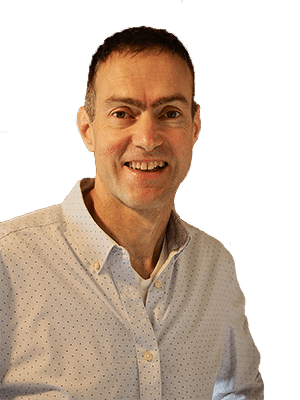

## You Can Take Your Team to the Next Level with Advanced Scrum Certification

## Learn How to Make Scrum Coaching and Team Facilitation Work in the Real World

Have you ever found yourself thinking:

- My team keeps taking multiple sprints to deliver a working product feature. How can I get my team to be more effective without resorting to bribery or threats? Oh, and don’t even get me started on product quality issues.
- In our organization, stakeholders want everything, all at once. Even worse, when we ask clarifying questions, they just don’t answer. Since cattle prods are frowned on, what can I do?
- Some team members are expressing dissatisfaction with Scrum, and frequently skip Retrospectives claiming they’re boring and ineffective. How can I make them attend Scrum team events?
- Is there any way to convince stubborn executives and stakeholders to support adopting Scrum? Asking for a friend.

If any of these Scrum challenges sound familiar, we've got your back and will help you find the fix. A-CSM training is the solution.

[

Get Certified

](#upcomingCourses)

**Any certified Scrum Trainer can help you get a CSM certificate that you can frame for your wall. But do they help you know how to work through the hard parts of Scrum and teach you the right skills to be effective?**

Doing Scrum with your team in real life isn’t easy. We equip you with the tools, Agile foundations and principles, and support to make the difficult achievable, so you can do Scrum well.

Using 20+ years of experience teaching Scrum and the science of learning, we infuse our Advanced Certified ScrumMaster training program with humor and wit to make the course fun and engaging. Plus, we back up our claims with hard evidence, so you can trust that you're getting the real deal with your Advanced Scrum Master certification. As a Scrum course provider, we ensure that our online certification training program is a safe place for you to learn.

**This course ISN’T the same as other Advanced Certified ScrumMaster classes. Not by a long shot. Some notable course differences that should matter to you:**

- You won’t sit around for two long days listening to boring PowerPoint and lectures that you’ll forget after you leave the Advanced CSM certification. This Advanced Certified ScrumMaster course is an immersive learning experience, self-paced so you have time to actually practice the skills that you learn and get follow-up support as needed. Instead of cheap, fast-food learning that leaves you hungry soon after, it’s a relaxed-paced, fine dining, nutritional experience for your ScrumMaster mind that leaves you full AND sends you home with the recipes so you can recreate it on your own. (Did we take that metaphor too far? Fair enough, but you get the point.)
- The advanced certification course material is designed to help you start the improvement with your real team, right now. Since we have regular Scrum Master coaching calls, when you get stuck you’re not left on your own.
- Our A-CSM experience. I’ve been doing/coaching/teaching Scrum since 2001 – longer than most people have known that it even exists. My co-trainers, Bernie and Anil, add their Scrum extensive experience to the mix, and you get access and support from all three of us. Why listen to one person’s opinion on A-CSM topics, when you can benefit from a hearty stew of collective expertise and experience to find something that hits the spot for you? (Okay, we’ll quit with the food analogies.)
- Why rely on opinions at all? Seems risky. We share our real life Scrum experiences, but we also back up what we say with published research and evidence. If you’re comparing to other A-CSM certification courses, see if they offer anything like that!
- Sure, we still include all the same stuff that other A-CSM courses include for certification, but we’d die if we had to slog through that, over and over again, so we make sure the course is at least fun and interesting, for all involved.

[

Get Certified

](#upcomingCourses)

Move beyond being a ScrumMaster who is just trying to figure out how to go through the motions and hopefully be effective with your team. Invest in a deeper understanding by learning and practicing new skills, principles, and tools that will help you confidently sell scrum to leadership and management, work with stakeholders to resolve impediments, and coach the product owner to create quality products. The A-CSM certification course can help you accomplish all your Scrum goals.

- Team challenges where your co-participants become your accountability partners. Easier to stay on track and motivated with product development.
- Self-paced program allows us to deliver far more material than a traditional in-person workshop since we’re not constrained by two days of learning time.
- We host regular Scrum Master coaching calls, so challenging problems can be worked through live with your peer group.
- Our active Scrum community forum is a safe place to ask follow-up questions and clarify course material.
- Long after you have earned the Advanced Certified Scrum Master certification (A-CSM), you will have access to the forum, course materials, and additional valuable resources.
- Hands-on practice and useful help. You don’t need any more boring Scrum theory. You need something that you can sink your teeth into and see immediate results. Learn on-the-job application of key Scrum concepts, skills, principles, and practical solutions for difficult, real-life scenarios that you can apply the next day.

### Upcoming Advanced Certified ScrumMaster Workshops

\[do\_widget id=custom-ee-upcoming-events-widget-4\]

* * *

## Meet Your Certified Scrum Trainers for Advanced Certified ScrumMaster training:

### Mark Levison

Mark Levison is the Certified Scrum Trainer and Agile Coach behind Agile Pain Relief Consulting.

With over 30 years of experience in the IT industry, he has been learning and teaching Agile since 2001. Introducing Scrum, Lean, and Agile methodology to a large variety of organizations —government departments, banks, insurance, healthcare, education, software, logistics, and non-profits, to name only a few— Mark has brought Scrum to thousands of professionals and helped launch the practice throughout Canada.

Participants benefit from Mark’s voracious study and writing on the neuroscience of learning. A respected international speaker at Agile Alliance conferences and Scrum Gatherings, Mark is also a published author on the subject, including The Guide to Effective Agile Retrospectives, Five Steps Towards Creating High-Performance Teams, blog “Notes from a Tool User”, “Beyond Scrum”, various guides and handbooks, and multiple articles for InfoQ and the Scrum Alliance.

### Bernie Maloney

Bernie's career started with a flash and a bang. Literally. His first position was designing devices that protect telephone networks from lightning strikes. A few career pivots later, he had a flash of insight: it was possible to tap into latent potential in every person, every team, and every organization.

The teams he’s worked with have grown businesses to beyond $100 million, delivering products from consumer electronics to network infrastructure to services & payments at firms including TiVo, Cisco, Wells Fargo and more. He consults and teaches workshops including Agile Product Development and Agile Leadership at Stanford Continuing Studies.

As an Agile Leadership Coach, Bernie helps clients achieve performance breakthroughs with their teams, their organizations and themselves. More, he believes that Accelerating Genius℠ is possible in every person and business, and leads both to outrageous effectiveness, and a whole lot more fun.

### Anil Jaising

Anil’s career had an explosive start in the early 1990s, he worked on a messaging product that sent messages across the world in 3 seconds with a team that aligned with the Values and Principles of Agile. The product won the best Open Systems Award in 1994. From the beginning of his career, he has been tinkering with code, infrastructure, product development, and consulting in various industries.

His deep expertise in financial services and startups in developing business models has resulted in multiplying revenue and avoiding risk. He recently led a cloud transformation program for 250 application teams that saved one of the world’s largest bank over $25 million. His deep Agile, DevOps, and leadership experience have guided multiple organizations to achieve high throughput, market focus, productivity, and quality in building products. He has a deep interest in instructional design and is a certified Trainer from the BACK of the Room Training.

He is a Certified Scrum Trainer with Scrum Alliance and a Certified DevOps Trainer with DevOps Institute. Anil is also adjunct faculty teaching “transforming organizations” in the project management graduate program at New York University. Anil is well regarded in the industry as an Agile, Executive, and Technical Coach. He has helped several organizations successfully implement continuous integration, continuous testing, continuous delivery, and SRE practices. He is currently guiding the product marketing and development of a telemetry dashboard for Atlassian products.

* * *

## Frequently Asked Questions about Advanced Certified ScrumMaster

### What is an advanced certified Scrum Master?

A ScrumMaster is responsible for ensuring that the Scrum principles and values are understood and practiced within the Scrum Team and their organization as a whole. They facilitate Scrum events, and help to identify and eliminate impediments. Their role is to also safeguard the team from external challenges, and coach the Scrum team by encouraging continuous improvement and collaboration. And, finally, a Scrum Master facilitates effective communication between Scrum Developers, Product Owners, stakeholder, management, and all involved.

An Advanced Certified ScrumMaster is one who has fulfilled the [A-CSM Certification Requirements](/a-csm-certification-requirements-requirements-for-advanced-certified-scrum-masters "A-CSM Certification Requirements: Requirements for Advanced Certified Scrum Masters"), and has completed Scrum Alliance Advanced Certified ScrumMaster training from an accredited Certified Scrum Trainer to deepen their understanding of the Scrum Master role and their effectiveness with their team.

### Is Advanced certified Scrum Master worth it?

If you or your organization are struggling to implement Scrum effectively, or you are not seeing the results you expected or hoped for with the adoption of Agile and Scrum, Advanced Certified ScrumMaster training will be a valuable investment. By having a deeper understanding of the how and why of Scrum, and not just the what, an Advanced Certified Scrum Master will be able to help keep your organization on track, reduce conflicts and challenges, and coach your Scrum team to higher performance and effectiveness.

On a more personal level, Scrum Masters with Advanced Certified ScrumMaster (A-CSM) certification typically have significantly better employment opportunities and higher wage ranges.

### What is the difference between Scrum Master and advanced Scrum Master?

Certified ScrumMaster (CSM) certification® is the first step in the Scrum Alliance® Learning Journey: Scrum Master Track. The initial CSM certification training teaches the basics of the Scrum framework and Agile methodology, but it is limited in scope and does not dig deep into practical methods to apply the principles and be effective in the Scrum Master role.

Advanced Certified ScrumMaster (A-CSM) certification® is the second step in the Scrum Master Track. (Certified Scrum Professional® – ScrumMaster (CSP – SM) is the third step.) A-CSMs learn and develop broader skills and experience with facilitation, conflict resolution, and coaching teams to greater improvement and performance. Lean software development, collaboration, cross-skilling, and scaling Scrum in organizations, as well as overall organization change, are just some of the areas that an Advanced Scrum Master has more knowledge and tools to help their team.

### How much does an advanced certified Scrum Master earn?

Indeed.com lists the average salary of an Advanced Certified Scrum Master in the ballpark of $110,000 and $130,000 annually\*, which works out to around $60 per hour on average. Reportedly, Canadian A-CSMs receive slightly higher earnings than their American counterparts. **_\*As of late 2023 there are only a few thousand Advanced Certified Scrum Masters world-wide. I would make the guess that data found in a few other sources was generated by an LLM and so has no basis in fact._**

### What is the highest level of Scrum Master?

Certified Scrum Professional® – ScrumMaster (CSP – SM) is currently the highest level of Scrum Master certification offered by the Scrum Alliance®, the globally-recognized licensing body for Scrum. After becoming a CSP-SM, the path continues to Certified Team Coach (CTC) and Certified Enterprise Coach (CEC).
