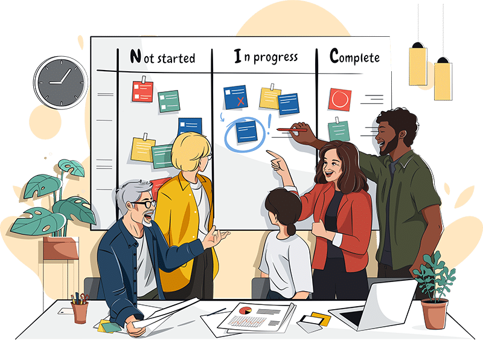
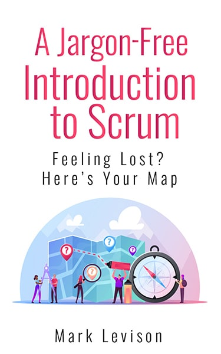
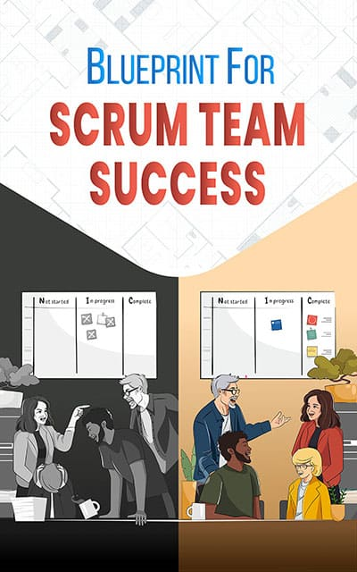
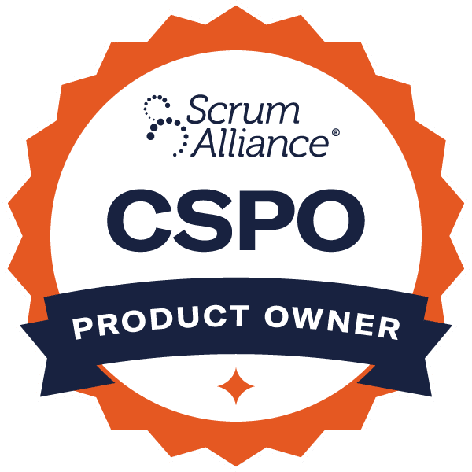

.page-id-15703 p:empty { display:none; } .logoContainer { float: left; width: 25%; text-align: center; } .industryBlurb { color: #1f64a4; font-size: 2.3rem; text-align: center; line-height: 1.2em; padding: 15px 55px; clear: both; } .lightBluePoint { border-top: 1px solid #0e90d2; border-bottom: 1px solid #0e90d2; color: #0e90d2; margin: 10px 100px 30px; text-align: center; padding: 10px 0; } .lightBluePoint div { font-style: italic; } .industryBlock { overflow: hidden; border: 2px solid #1f64a4; padding: 20px; margin: 0 150px 25px; } #FAQ-Section p { margin-bottom: 15px; } .FAQ-Unit { margin: 20px 0; } .arrow-right { float: left; margin: 5px 15px 0 0; width: 0; height: 0; border-top: 15px solid transparent; border-bottom: 15px solid transparent; border-left: 40px solid #1f64a4; border-top-left-radius: 18px; border-bottom-left-radius: 18px; } /\*.userLeveLHeader { float: left; margin-left: 30px; }\*/ .newToScrum { font-weight: bold; background: #e0e0e0; padding: 20px 150px; text-align: center; } .csmLogo { float: left; width: 150px; } .cspoLogo { float: right; width: 150px; margin-top: -27px; } .bookCover { width: 300px; } .heroImage { max-width: 650px; } @media screen and (max-width: 1023px) { .logoDisclaimer { padding: 20px 24px!important; } .lightBluePoint { margin: 10px 50px 30px; } .industryBlock { margin: 0 0 25px; } .newToScrum { padding: 12px; } } @media screen and (max-width: 800px) { .logoDisclaimer { padding: 10px 2px!important; } .lightBluePoint { margin: 10px 0 30px; } .cspoLogo { float: left; margin-right: 10px; } } @media screen and (max-width: 700px) { .saBlurb { float: left; margin-bottom: 15px; } .cspoLogo { float: right; margin-right: unset; } } @media screen and (max-width: 500px) { h1.entry-title { font-size: 30px; } .logoContainer { width: 50%; } .industryBlurb { padding: 15px 10px; } .csmLogo { width: 125px; } .cspoLogo { width: 125px; } .guideTitle { clear: both; } .site-inner .content-sidebar-wrap .content { padding: 40px 10px 10px; } .site-inner { padding-top: 10px; } .bookCover { width: 100%; } }

**Become an effective team that delivers the right value with high quality,**

**without feeling micromanaged, killing morale, or wasting time in pointless meetings.**

**Transform your team and its results with our Blueprint for Scrum Team Success.**

5000+ reviews 

"Definitely the Yoda of the Scrum universe"

## Do any of these sound familiar for you or your Scrum Team?

- Our team is struggling to deliver high quality products on time.
- We're suffering from low morale and have disengaged team members.
- "Agile" is a dirty word with management because they've seen it done wrong and don't think it works.
- Scrum is confusing. We're not sure who does what in which role.

We get it. We've experienced these things too.

**It's not your fault.**

Scrum is simultaneously very simple and very complex. The idea is straightforward; the execution is not. Which is why it can be so frustrating to try to learn Scrum on your own. And reading more books won't help, because the advice is often contradictory.

The promise of Scrum was that you were going to get more done, in less time.

The reality is that hasn't happened.

Work life keeps on intruding and messing with plans. Instead of building a great product, your Scrum team is:

- Juggling stakeholders, leaving them all dissatisfied.
- Interrupted so frequently, they forget key details.
- Spending so much time in meetings, they resent Scrum.
- Working hard but the product never meets the customer needs.
- Spending more time on defects than they do on new work.
- Seeing your manager at your desk nearly every day, despite Scrum's promise of autonomy.

The problem isn't you, it isn't the team, and it's not even Scrum.

Scrum is simple and it is incomplete. However, that incomplete part is killing you. But don't worry. In the decades since Scrum was created, it's been implemented enough times that there is a science (yes, real science with data) to doing it well.

Scrum has taken over the world of work.

Many workplaces now demand Scrum and Agile knowledge as a requirement for getting a job interview.

## Where to start with Scrum if you're brand new to it

Clearly, having Scrum knowledge and experience will be a huge benefit to your career and job prospects. But it's the  age-old problem: how do you learn and gain experience to start with?

If you’re new to Agile and Scrum methodology, start with the basics of what Scrum is, and get your complimentary copy of [A Jargon-Free Introduction to Scrum.](/a-jargon-free-introduction-to-scrum)

The language and concepts of Scrum can seem strange. There are words like:

- Scrum (stolen from rugby)
- Sprint (must go fast)
- Retrospective (that sounds good)
- Definition of Done (what the heck is that)
- Scrum Framework (is it structure or rules)

Even when the words make sense, there is still a long list of questions, like: How is Daily Scrum different from Scrum? What is a Product Backlog? What is a Sprint? Who does what, and when, in Scrum? How is this different from the way I currently work? Will this even work for my business?

In our _Jargon-Free Introduction to Scrum_ we use simple, clear language to answer those questions, and lay out Scrum in a simple, easy to understand way. You will learn how Scrum can help a team:

- create and maintain focus
- produce a valuable product and deliver frequently
- adapt to business change and course correct as needed
- use feedback for continuous refinement and improvement
- have the power to create the work environment they need and not be micromanaged
- feel seen and respected as people, not business resources

By the time you're finished the Jargon-Free Introduction, you'll have a good foundational understanding of Scrum. With this knowledge in hand, you'll be ready to deliver a high quality product frequently.

Start with the basics and, as you get going, move on to the next phase of learning, which is dealing with the real world. As a practitioner with some experience under your belt, you'll have discovered that Scrum is powerful.

## Once you have some Scrum experience

Real change and improvement is hard. Even in a dream world —where your stakeholders were always aligned and your team was never interrupted, etc— Scrum would be a lot of work to implement.

No workplace is perfect. Having a blueprint for what steps to take, and how to deal with "yes, but in real life…" questions and challenges, will make all the difference.

We have that Blueprint and the real world experience to help you and your business through this.

### Why You Need a Blueprint for Your Scrum Team

To help your team get to the next level of Scrum with learning instead of guesswork, use our [**_Blueprint for Scrum Team Success_**](/blueprint-for-scrum-team-success).

Because here's a common scenario. A team has been working together using Scrum for a few months and they've stalled. They've got the basic mechanics of the Scrum Framework in place for their business, but:

- The Product Backlog is a mess and there is no vision.
- There's a Definition of Done but it lives in a desk drawer.
- The team is frequently bottlenecked and, when that happens, team members see it as "not my problem".
- The team dynamics are not healthy, and fighting in team events is a real worry.
- Developers groan and complain about boring, useless meetings.
- The team feels like Scrum is being forced on them and there's no real point to it.
- There's talk of returning to traditional business project management.

If that sounds familiar for your team, you don't need to stumble around in the dark. Mark Levison has spent more than 20 years studying Scrum and Agile. As a practitioner he has experimented with countless teams to find what works and, more importantly, what doesn't.

First, by being a practicing ScrumMaster, Agile coach, and Certified Scrum Trainer. With that extensive hands-on experience, Mark has also read hundreds of the best (and worst) Scrum and Agile books, thousands of academic papers, and countless articles.

But Mark has also learned by listening… _really_ listening … to the thousands of businesses and clients who have shared their pain with him so he could help them find improvements. They are the true inspiration for the creation of the **_Blueprint for Scrum Team Success_**.

Mark doesn't claim to have a single true path for all teams - that would be the opposite of Agile. Instead, he shows you the minimum conditions to start. (Hint: listen to your customers,  focus on delivering Value and not just building more stuff, faster.) You'll learn how to help your team level up in the game of Scrum. In many cases you can use more than one tool, so Mark makes it easy for your team to experiment and pick for themselves what they feel works best.

Building a successful Scrum Team is a long learning journey and the key is turning the improvement process into a science. It starts with acknowledging that this stuff is hard! **There are no shortcuts or cheat codes**.

No team reaches top level performance without first setting it in their sights, then investing in high-quality education with proven practices to get them there.

If you're ready to start that journey with your team, get the [**_Blueprint for Scrum Team Success_** here](/blueprint-for-scrum-team-success). It's in regular language, making it easy learning and accessible for everyone (business buzzwords cause brain cramps). And to make it even easier for you, if you decide to join Mark in a [certified scrum training](/certified-scrum-agile-training) workshop in the future, the price of the Premium Blueprint will be credited towards your purchase.

## "I've been doing Scrum for a while and it's still hard"

It sure is. The good news is that's normal, and you're not alone. It's one thing to land in a job and start practicing the basic theory of what to do in Scrum. But understanding what being Agile really means – why Scrum is structured that way and how to reap the most benefits – is a completely different thing. More theory isn't going to help there, but hands-on learning will.

As a Scrum practitioner you need to practice techniques for how to guide teams, and manage projects and organizations, all while using Agile and Scrum principles to improve teamwork, deliver quick feedback, and achieve better quality products and results in real life. Yes, even the stressful or awkward work scenarios that you think nobody else can relate to. Chances are very high that Mark has lived through them himself, or at least knows how they can be overcome.

### Learn about using Scrum and Agile in the real world

 

Our [Certified Scrum Master and Scrum Product Owner Training workshops](/certified-scrum-agile-training) will do so much more than just give you a highly respected certification to help your career. Our Scrum training will answer those "Yes, but in real life…" questions that people have, and that workbook + PowerPoint courses don't answer.

No boring business classes here. You'll experience many of the most common pitfalls and complaints, and learn Agile strategies for how to deal with them. As part of our Certified Scrum training courses you will also get the "Blueprint for Scrum Team Success" to help you after the workshop with your professional Scrum journey.

Professional level Scrum training fills in the gaps where confusion about Scrum lives and grows. It makes sense of the nonsensical, and helps you easily imagine ways to use Scrum to make work not suck. (Or at least less painful.)

## Your Guide on the Side

Hello, I'm Mark, and I've been a Scrum practitioner for a long time - since 2001, long before Scrum was popular.

With over 20 years of working with teams through Agile training and Agile consulting, I've made lots of mistakes, run many experiments, and seen most of the problems that businesses experience in the real world. It's so rewarding when I can share that earned knowledge with teams to help them relieve their pain points and be more Agile.

You don't need to make the same mistakes as I did, you don't need to struggle, and you certainly don't need to spend time reading dry academic articles.

Through extensive experience and research, I can now share a blueprint for Scrum team success that is based on evidence and results. It will still require hard work from you, but the work will be with your team and management, making small, steady improvements to your business system, and not work slogging through false promises and confounding instructions.

## What haven't we answered yet?

If you've read this far on the page and you're still not sure which of our offers is best for you, we've failed. We're human (no AI here). Contact us and let us know what you want help with. In the meantime, know these three things:

- If you're new to Scrum and it's confusing as all get-out, we have a free e-book for you, the _Jargon-Free Introduction to Scrum,_ that makes it easy to sort through the confusion and understand the basics.
- If you've got the basics but you don't know where to go from there, or your efforts haven't gotten good results, we've got the _Blueprint for Scrum Success_ that lays it all out clearly but still gives you plenty of ideas of how to make it work for your unique needs.
- And if you want to take the obvious next step with Scrum, your team, and your career, we offer top-rated Scrum training courses that have helped thousands of businesses and individuals with their Scrum and Agile goals and certification, including many major organizations and industries such as government, software, banking, finance and education, to name only a few.

Mark Levison has helped over 8000 people find success using Scrum, and is the trusted training provider for major Canadian banks, insurance companies, federal and municipal government, and more.

\*Generic images used to honour trademark laws and NDAs.

You can learn from our mistakes and extensive experience, or you can take the harder road of figuring it out on your own and making costly and frustrating mistakes of your own. Which will you choose?

#moreAnswers li:before { content:"\\00BB"; font-size:35px; color: green; vertical-align:sub; line-height:30px; margin-right: 10px; } #blueprint li { list-style: none; } #blueprint li:before { content:"•"; color: red; font-size:22px; vertical-align:sub; line-height:20px; margin-right: 10px; } #moreAnswers li { margin-bottom: 10px; list-style-type: none!important; } .testimonialBlock { display: table; table-layout: fixed; width: 100%; margin: 20px 0; } .speechBubble { display: table-cell; height: 60px; width: 60px; background: url('/wp-content/uploads/2024/01/speech-bubble-clipart.png') no-repeat left top; } .testimonialText { display: table-cell; width: 100%; vertical-align: middle; padding-left: 20px;}

As a self-employed business owner with a small team, this course was helpful in understanding how to improve my company's value to clients. ~ Murtada Shah

Insanely terrific. I have been bored silly at some Agile training classes. This was 100% interesting… okay, 98%. Very clear, Exceptional memory! I get it now - the value of a \*real\* pro scrum master. Simon Crum

Mark is incredibly well prepared and professional. Best instructor I've ever had, period. ~ Kevin Dutour

I've been to a few Scrum courses for the past year and I must say that this was the best course I have attended. Gracefully covered the entire subject with the right depth. ~ Rafael Santos

Great to get this training from the subject matter expert. ~ Nisha Agsawal

Mark has an effective approach at coaching us through the course in an "agile" way. Would recommend the course to those who are experienced scrum masters and especially to those who are new to the agile world. ~ Caia Ross

The simulations and exercises were extremely useful in the understanding of the concept. Mark made the course thoroughly enjoyable. Extremely pleased by the techniques used and the content of the course. ~ Dhaval Shah

Amazing and inspiring. I am ready to go change my working life. ~ Thomas Waine

Mark is the real s\*\*t. He's lived through the pain points and knows where the bodies are buried. ~ Christian Farley

This course was REALLY good (I don't often say that!). It's probably become my benchmark for how online courses should be run. It could have easily have been death-by-powerpoint, but instead the course was engaging and fun! ~ Ross Harper

\[do\_widget id=srpw\_widget-2\]

## Agile and Scrum FAQs

### How quickly can I learn Agile?

We've used this analogy before, but it works well: how quickly can you dig a hole?

It depends on a lot of things, doesn't it? Including how wide and deep you want to go.

You can read our "What Is Scrum? – In a Nutshell" page in just 20 minutes and have a decent understanding of foundational Scrum. Or go a little bit deeper with "A Jargon-Free Introduction to Scrum". And if you don't want to learn the basics all in one chunk, you can pace yourself, with the Foundational Scrum email series that has you practicing as you learn, so it's easier to understand and retain. If there are any Scrum and Agile terms you don't understand, you can learn more in our Agile Glossary and Reference Library.

But Agile is far more than only Scrum, so there are many paths to explore to see what's most important for you. If you're coaching a team, you will need to understand more about: the flow of work, lean think, systems thinking, appropriate measurements, etc. As a facilitator, you will want to learn how to engage team members, how to get quieter people involved, and how to ensure decisions involve the entire team. We're dealing with real people, so insights from behavioural psychology will help, and we also want to understand human motivation. You could spend years getting to this sentence and we still haven't covered Product Ownership or Agile Engineering Practices. There has to be a better way of learning what you, and your team, need to be successful.

It's easy to get sidetracked or lost in the forest of theory if you don't also have a plan for how to apply it effectively. Our certified scrum training workshops get you pointed in the right direction with certification, and our blueprint for success helps you achieve landmarks and get you where you want to be.  If you're wondering **what is Agile training and why is it important**, exploring the different certification training options will give you an overview of the underlying principles and applications, so you can choose which one(s) to pursue in greater depth for your needs.

### How difficult is Agile?

To do at all? Or to do well? Because those are very different things. Some say that doing Agile or Scrum poorly is actually far more work than if you do it correctly – the trick is knowing the difference.

Often the hardest part of practicing Agile is changing deeply ingrained habits and mindsets. Others find the lack of specific direction in Scrum, for example, to be just as overwhelming as it is freeing, at least to start. But the freedom that Agile and Scrum afford is the key to adapting to your unique circumstances so you can achieve the best possible outcome. So starting with foundational training to give you the shared understanding and language, then getting your feet wet with certified training to take you the next step and see how to apply the principles, and following the blueprint further with more advanced learning to deal with the challenges that inevitably happen in real life, all make it possible.

### What are key components of Agile?

The Agile Manifesto outlines twelve brief principles that encourage welcoming change, delivering value frequently, and valuing people and relationships. "We are uncovering better ways of developing software by doing it and helping others do it."

### Is Agile the same thing as Scrum?

No. Agile comes from the Agile Manifesto, which was an event where 17 people got together at the bottom of a ski hill in Snowbird Utah in January 2001. Between them, they had created Scrum, eXtreme Programming (aka XP), Crystal, FDD and DSDM, which are all lightweight methods . Over the course of two days, they discussed what they agreed on and, in the end, it was four value statements and twelve principles. It is a testament to their efforts that over 20 years later these continue to be our guiding values and principles for the Scrum Framework.

_(It is also ironic that they didn't invite any women, people of color, or any Canadians to participate. The latter can be explained by the fact that we would have gone skiing.)_

### Wait, I took an online course and it didn't cover any Scrum Principles or Values…

We wish we were surprised but, sadly, we're not. Discount certification training gets you discount results. Or worse, bad Scrum that causes damage. Scrum Principles and Values are critical, and are what makes Scrum different from traditional project management. Scrum is focused on delivering the highest product _value_ to the customer, not the largest number of widgets as fast as possible. Memorizing basic Scrum theory (as is taught in Professional Scrum Master I or PSM I training) only covers the mechanics of Scrum. Effectively practicing Scrum in the real world requires a much deeper understanding of the _how_ and _why_, which is far more than just plodding through a set of prescribed Scrum events or passing a certification exam.

### What does Scrum stand for?

What is scrum and why is it called scrum? Many assume that SCRUM is an acronym for something, but it's not. You may have heard the word before in reference to rugby, where it refers to a formation of players - a team that works together to move a ball toward a common goal. Without full collaborative effort from all team members, they will fail. Don't overthink it. If you've played rugby - and I have (Kingston Panthers) - you will know that the analogy is weak.

### What is the job of Scrum?

Scrum is a way of organizing a team of people to deliver incremental parts or features of a product over a short, fixed time period. Scrum grew up in the world of software development, but it can be used anywhere that individuals need to collaborate as a team to deliver something of value to a customer. It's equally important to distinguish what Scrum is not. Scrum is not a problem-solver. It is a problem-finder.

### What is Agile Project Management?

An oxymoron. Okay, that's a bit harsh. Let's split this into parts – Agile + Project Management – and start by defining Project Management. For even more fun, let's ask ChatGPT\* to give us an answer: "Project management is the discipline of planning, organizing, securing, managing, leading, and **controlling resources** to achieve specific goals within a project's time, budget, and quality constraints".

Traditional approaches put all the focus on the project itself and treat the people as chess pieces to be moved around from project to project. Even ChatGPT (which is notoriously wrong about Scrum and Agile) knows that Project Management calls people _resources_.

All Agile approaches put the focus back on _people._ Human beings. With all their quirks and quarks. Agile organizes them into teams and brings the work to teams, rather than the teams to the work.

So Agile, done correctly, eliminates the need for project management.

**_\*All content on this site is written by humans_**_, typos and all**.** Wherever we use AI, it's to make a point about its shortcomings, and we make it very clear that it's LLM-generated._

### What's the Difference Between Project vs Product?

So, if not Project Management, then what? Scrum places the focus on the Product that the team is building and maximizing the value delivered to the business or customer. How is Product different than Project?

Projects typically have a distinct start and finish, with phases in between. When a Project is finished, that's the end. Full stop.

The Product mindset that Scrum teams adopt is, instead, focused on early delivery of value. We use the delivery to get feedback from the customer/business, that learning then improves the Product as it evolves. Furthermore, the Product mindset implies long-term ownership of the work product. You build it and it breaks, you fix it.

### What is Scrum for beginners?

If you've ever typed "what is scrum", or "difference between scrum master and product owner", or any number of other common search phrases, scrum for beginners is what you're looking for. The basics. The foundations that give you a rough idea of what scrum is meant to do, how it's meant to work, and who it's meant to help. What beginner resources don't tell you, though, is how to apply that theory effectively to get the results you want. Certification training courses are good, but quality learning and understanding is the true goal.

### What major businesses use Scrum?

Scrum is a popular framework for agile project management (see above for how we feel about that term) and is used by many major companies across various industries. You might be surprised by some of the names. While the specific organizations using Scrum may change over time, here are some well-known companies that have publicly adopted Scrum: Microsoft, Google, Amazon, Facebook, Spotify, IBM, Salesforce, Adobe, Netflix, Toyota, John Deere.  You can read more via our Case Studies and, quite interestingly, Agile Outside of Software pages in our Agile Glossary and Library.

Closer to home, we personally know that the following also use Scrum: Federal Government of Canada, Government of Alberta, Province of Nova Scotia, Bank of Canada, TD Bank, Royal Bank of Canada, Intact Insurance, Economical, Manulife, Sunlife, Co-operators, National Research Council, AIMCo, Shopify, Netsuite, Telus, Blackberry, Oracle, Farm Credit Canada… and many, many more.

### What does Scrum mean for your business?

Many a business is organized into silos, like the development department, QA department, the Business Analyst group. People are recruited from these departments to staff a project. This leads to a management nightmare. Everyone still reports to their traditional manager, and they have an additional responsibility to the project they're assigned to. Even worse, some projects only require a fraction of one role (often the Business Analyst), so these people are reporting into multiple projects _and_ their normal management structure. Traditional models of Project Management attempt to make this juggling process work through the use of Gantt charts and related tools. The Agile world requires a mindset shift from your business. Instead of staffing short-lived projects, Agile approaches get your business to create long-lived Product Teams. These teams stay together over the long term working on a single product. In some organizations the products need to change more frequently. In that case, keep the team intact and just ask them to focus on the next product. Some teams may continue to support one or two older products while creating the new product at the same time.

### What Scrum certification training courses are available?

Most often, when people aren't sure what type of Scrum certification courses to take, they choose the Certified Scrum Master course. It‘s the most popular Scrum training, by far. In the course you will learn everything you need to earn your Scrum Master certification as it gives a solid foundational understanding of the Scrum framework, roles, and events. Other certification course options in the Scrum Master career track include Advanced Certified Scrum Master and Certified Scrum Professional Scrum Master courses.

Learning in the Scrum Product Owner track starts with a Certified Scrum Product Owner training course that focuses on the Product Owner role. Additional certification training course options are Advanced Certified Scrum Product Owner training and Certified Scrum Professional Product Owner courses.

The Scrum Developer track offers certification via the Certified Scrum Developer course, followed by Advanced Certified Scrum Developer and Certified Scrum Professional for Developers certification.
