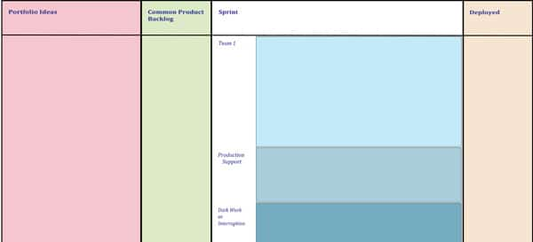

"Beyond Scrum: Building High-Performance Organizations – a game for Managers, ScrumMasters and Product Owners" v1.2 is a board game that builds on the success of the previous "[Building High-Performance Teams Game.](/blog/welcome-to-the-high-performance-teams-game.html)"

\[embed\]https://www.slideshare.net/mlevison/building-high-performance-organizations-92180159\[/embed\]

Where the previous game focused on building high-performance Teams and the tradeoffs between delivering value and improving productivity, this new game focuses on building high-performance Organizations, and explores options for an Organization to understand itself and the current state of the work, and then bring about real, ongoing change.

### Game Style:

Board Game with a simple Portfolio Kanban board as our playing surface. The playing cards are Kanban cards that represent our Product Backlog, as well as other cards that represent personalities and challenges that Organizations must navigate.

### Game Tables:

Each table represents one Organization that is trying to improve.

The players on each team take on the roles of Senior Management, the ScrumMaster, and Product Owner. Each table starts off with one Scrum team represented and several Managers, and may expect through game play to add additional teams. Anywhere from 4-9 players. Effectively they compose an Organizational Improvement Team.

Each player receives a role description that explains the character that they should play. Real companies have politics, and people often have competing agendas – the player Personas will help simulate that.

Play focuses on the challenges faced in any modern mid to large-sized company attempting to be Agile, such as:

- Short-term client demands and weathervaning executives
- Belief that if we just demand that the teams work harder, they can and will
- Production support issues
- Regression problems
- Fundamental misunderstandings of Agile by the executives
- Features delivered that don’t satisfy customers

The game is won, not by producing the most features, but by delighting customers. In this case customer happiness is determined by whether or not they pay you for the features you produce. Oh, and try not to go bankrupt.

Players learn much about [Portfolio Kanban](/blog/kanban-portfolio-view.html) and [Portfolio Management](/blog/portfolio-management.html). They also get an introduction to Systems Thinking, and [Organizational Improvement](/blog/taking-organizational-improvement-with-scrum-seriously.html). As a result, they have an introduction as to what it will take to grow their Organization’s performance. The game is backed by the series of blog posts Mark has been writing: [Scrum Alone is Not Enough](/blog/scrum-alone-is-not-enough.html).

### Mechanics:

This is a budget-based game – in any round the players can invest in Stories, Improvements for their team, or Improvements for all teams. In each round, the Organizational Improvement team will gain access to a growing list of tools (some good, some bad) to help ‘fix’ the problems that come up.

### The Results:

This game has been played at ScrumGathering.ca 2018, GOAT15, ScrumGathering Orlando 2016, and numerous private client events. Along with a lot of laughter from all participants, several discoveries and feedback comments have been made:

- One team went bankrupt, and others saw the importance of building things to build resilience early (e.g. cross-skilling, walking the Portfolio Kanban with the team).
- It was noted that personalities have a huge effect on the productivity of meetings!
- The initial rule of rolling dice for how much work your team achieved in a round added complication without a lot of extra value. We've revised the game to have a simpler version, and moved this feature to an advanced section.
- It was suggested that we make it more clear in the rules sheet that you only start the game with one team - which we've now done.
- Some suggested that the game cards should show only the mechanical effects and not explain the why, instead leaving that to the accompanying notes and game discussion. We'll consider this for future versions.
- In the presentation, showing the areas of the Kanban board being used would have helped make clear which part was being referred to.

Thanks to everyone who has played the game and given feedback so far. Your input will influence the game's future.

### We'd Love Your Feedback

We invite you to **[download the game materials here](https://www.dropbox.com/sh/tix67rrzry8mqek/AACAZ_DdsiR4eTZVRmPHhDMpa?dl=0)** and try it with your own team.

Please let us know your comments and suggestions, so we can consider them for future improvements. And send us a photo of your team playing the game!

### Related Reference Links

Map your Kanban wall - Mark hinted during the game that it would take some time and effort to map your wall. This video and accompanying text explain how:

- [Map Your Current process with Kanban](https://blog.planview.com/6-benefits-of-kanban-for-project-management/)

Prosocial bonuses - the alternative to team bonuses that we tried in the game:

- A summary of Prosocial Bonuses - [The Best Bonus Is One You Can't Spend on Yourself](https://www.bloomberg.com/news/articles/2013-05-15/the-best-bonus-is-one-you-cant-spend-on-yourself)
- The original paper - [Prosocial Bonuses Increase Employee Satisfaction and Team Performance](https://www.hbs.edu/faculty/Pages/item.aspx?num=44800)

More reference material from discussions during game play:

- [How Rally Does Strategy Deployment](https://www.broadcom.com/products/software/value-stream-management/rally)
- [Agile at Scale with Hoshin Kanri](https://www.infoq.com/news/2014/11/agile-hoshin-kanri/)
- [Strategy Deployment: the Secret Sauce for Enterprise Agility](https://www.slideshare.net/kjscotland/strategy-deployment-the-secret-sauce-for-enterprise-agility-50316137?qid=6ac018d8-b135-45fa-b4b0-b7fd73819830&v=default&b=&from_search=1)
- [Kanban Deployment with the X-Matrix](https://availagility.co.uk/2015/07/31/kanban-deployment-with-the-x-matrix/)
- [How Rally Does Annual and Quarterly Planning](https://www.broadcom.com/products/software/value-stream-management/rally)

Additional References:

- Lean UX: [https://agilepainrelief.com/product-owner-resources-and-references#usability](/product-owner-resources-and-references#usability)
- Kanban: [https://agilepainrelief.com/scrummaster-resources-and-references#kanban](/scrummaster-resources-and-references#kanban)
- Prosocial Bonuses: [https://agilepainrelief.com/scrummaster-resources-and-references#pay-for-performance](/scrummaster-resources-and-references#pay-for-performance)
- Portfolio Management: [https://agilepainrelief.com/scrummaster-resources-and-references#portfolio-management](/scrummaster-resources-and-references#portfolio-management)

First two images by Agile Pain Relief Consulting. Third image [designed by Freepik](https://www.freepik.com/premium-vector/business-group-meeting_723250.htm).
