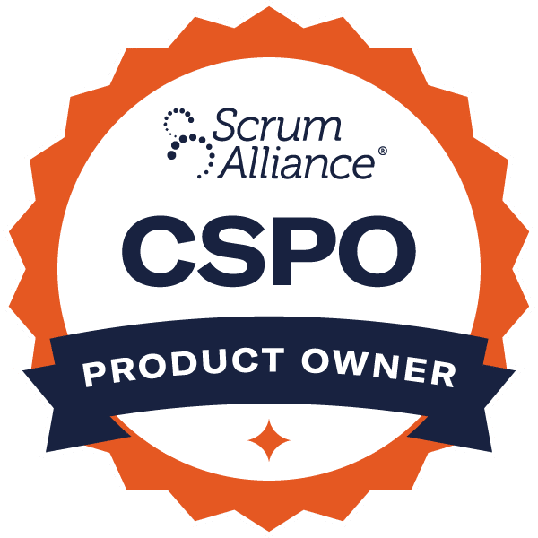

#### Explore what Scrum is and how to make it work for you in our Scrum Certification training

Hands on learning for how to guide teams, projects, and organizations, using Agile and Scrum techniques to improve teamwork, deliver quick feedback, and achieve better products and results.

Click to register for your preference of training dates, or on the course headings for more details about what each workshop offers.

### [Certified ScrumMaster (CSM)](/certified-scrummaster-csm-training)

Often the best fit for anyone new to Scrum. Focuses on the role of the team and the ScrumMaster. Get the skills and practical experience necessary to improve teamwork, take the exam, and advance your career with a certification that is in high demand today!

\[do\_widget id=custom-ee-upcoming-events-widget-14\]

### [Certified Scrum Product Owner (CSPO)](/certified-scrum-product-owner-cspo-training)

The course for those who work regularly with stakeholders. Take your skills and career to the next level by learning how to how to make Product Ownership a collaborative effort with your development team.

\[do\_widget id=custom-ee-upcoming-events-widget-15\]

### [Advanced Certified ScrumMaster (A-CSM)](/advanced-certified-scrummaster-acsm-training)

The course for those wanting to expand ScrumMaster skills, spark organizational change, and advance their career in Agile coaching. Distinguish yourself by learning how to navigate changing markets and conditions (Covid, anyone?), and take the next step toward Certified Scrum Professional.

\[do\_widget id=custom-ee-upcoming-events-widget-16\]

### [No Idea What Training to Choose?](/choose-the-right-scrum-training-for-your-needs)

If you’re unsure which course is best for you, this page will help guide you through some of the differences in our most popular workshops.

[

To Help You Decide

](/choose-the-right-scrum-training-for-your-needs)

### [Groups and Private Training](/private-scrum-agile-training)

If you have a group of roughly 15 team members or more, we would be happy to work with you to build a workshop that focuses on your team’s unique needs.

[

Private Training

](/private-scrum-agile-training)

### Agile Pain Relief Advantage

- Small class size to ensure a high-quality learning environment with plenty of opportunity to address questions and concerns.
- Guaranteed course dates.
- Live instruction and practical examples to learn how to adapt and practice Agile methods for your own projects.
- Post-course resources, community support, and follow-up training included.
