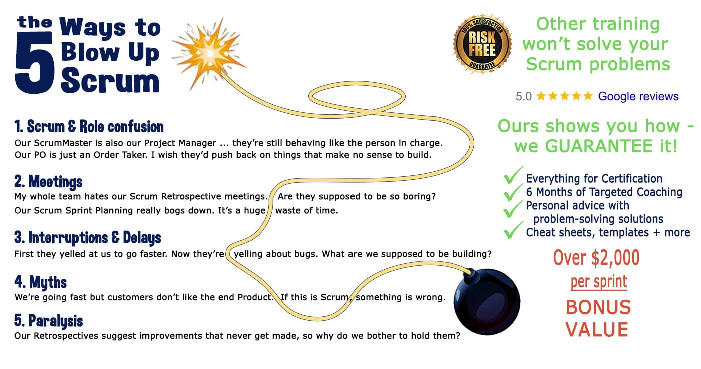
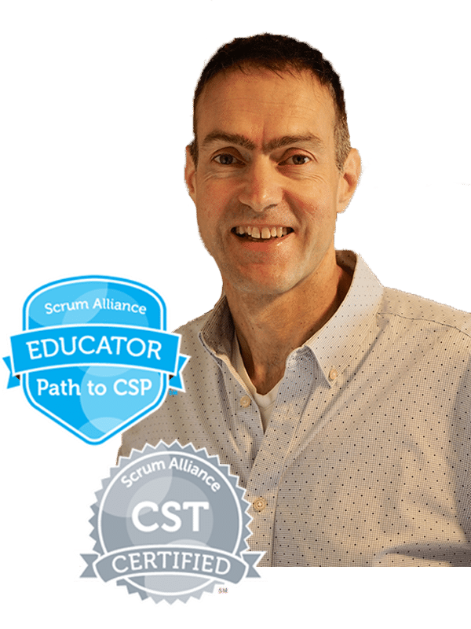
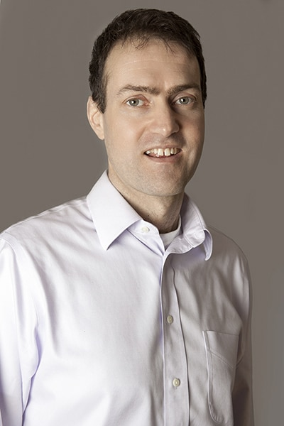

ul.dashedList > li { list-style-type: none; text-indent: -10px; } ul.dashedList > li::before { content: "– "; font-weight: bold; } .bonusBlock { width: 50%; float: left; margin-bottom: 30px; } .bonusIcon { float: left; } .bonusItem { clear: both; border: 1px solid #1f64a4; border-radius: 6px; overflow: auto; padding: 10px; margin: 15px; min-height: 175px; } .bonusText { font-size: 16px; padding-left: 15px; display: flex; } .markBioImage { float: left; width: 15%; padding: 0 0 25px 25px; } .markBioText { float: left; width: 85%; } .introPoints { float: left; width: 70%; } .markWithBadges { float: left; width: 30%; } .lookHere { background: #1f64a4; color: #ffffff; font-size: 24px; padding: 15px 50px; border: 1px solid black; margin: 15px 50px; text-align: center; } .logoContainer { float: left; width: 25%; text-align: center; } .arrowBox { overflow: hidden; } .arrowBox div { float: left; } .arrowText h2, .arrowText h3 { color: #1f64a4; font-size: 1.8rem; padding-top: 36px; } .arrowIcon { width: 110px; } .arrow-3 { padding-top: 26px!important; } .industryBlurb { color: #1f64a4; font-size: 2.8rem; text-align: center; line-height: 1.2em; padding: 15px 55px; clear: both; } @media screen and (min-width: 1023px) { .testimonialGraphic { width: 30%; float: left; } .firstQuote { width: 70%; float: left; padding-top: 15px; } .firstQuote span { display: block; } } @media screen and (max-width: 1200px) { .markBioImage { width: 22%; } .markBioText { width: 75%; } } @media screen and (max-width: 1023px) { .arrow-3 { font-size: 1.5rem!important; } .bonusIcon { width: 75px; } .bonusBlock { width: 100%; margin-bottom: 0; } .bonusItem { min-height: unset; } .markBioImage { width: 35%; } .markBioText { width: 65%; } .testimonialGraphic { text-align: center; } .firstQuote { margin-bottom: 20px; } .logoDisclaimer { padding: 20px 24px!important; } } @media screen and (max-width: 800px) { .arrow-1, .arrow-2, .arrow-4 { font-size: 1.5rem!important; } .arrow-3 { font-size: 1.2rem!important; width: 440px; } .logoDisclaimer { padding: 10px 2px!important; } } @media screen and (max-width: 500px) { .introPoints { width: 100%; } .markWithBadges { width: 100%; } .logoContainer { width: 50%; } .industryBlurb { padding: 15px 10px; } .lookHere { padding: 5px; margin: 15px 5px; } .arrowText { width: 200px; } .arrowText h2, .arrowText h3 { padding-top: 20px; } .arrow-3 { padding-top: 12px!important; width: auto!important; } .arrow-5 { padding-top: 6px!important; } .lookHere2 { font-size: 20px; } .bonusIcon { padding-right: 25px; } .bonusText { display: block; } }

# Certified Scrum Product Owner Training  
CSPO Certification Designed to Help You Succeed

## Stop wasting your team’s time. Build the product your customer needs, and get paid more, all without burning out.

During CSPO training, Mark Levison will show you how to use the Scrum framework in your role to:

- translate your customer's ideas
- into a clear vision that inspires your product team
- to build the right feature the first time
- with better quality
- and deliver products sooner
- so there is less risk
- and greater return

Bottom line: your customer will be impressed and so will your boss when you use the Scrum framework with product ownership. What’s in CSPO certification for you? More satisfaction, the joy of building a great product team, less stress, and better career options.

_"Mark is an awesome instructor... definitely the Yoda of the Scrum universe." - Ting-Yu Lin_

## At work have you ever…

-   Struggled to say 'no' to a stakeholder?
-   Been pressured to get more products delivered, faster?
-   Felt challenged on your prioritization choices?
-   Been told everything is number #1? (With each Stakeholder having a different #1.)
-   Struggled to have the team move in the same direction as each other, let alone you?
-   Cringed at inflicting a feature factory on your team?
-   Wondered why your team never builds the products you asked for?
-   Felt management didn't care (or, worse, didn’t trust you)?

Did you read the Scrum Guide, the canon law of Scrum, and realize that it says nothing useful about product ownership? It's freeing, because you're unconstrained, but also stressful and you're maybe thinking, "What should I be doing right now?"

## The problem isn’t you or your team.

Sure, it might be your stakeholders ;-), but it's more likely the system you're trying to work within. Studying Product Ownership can be like snake oil sales. Everyone claims, "My approach will solve all your problems, all of the time," but most Scrum Product Owner courses don't give you sources or anything with clear steps or evidence of results. You read about Lean Startup, Lean UX, Discovery, Product Vision, and all kinds of Maps and User Stories, but it's confusing and you're starting to question cost vs benefits.

That's because you're working in the real world, not a theoretical one. With real people: real stakeholders, customers, the team and even managers. With that reality comes pressure, unrealistic expectations, and a myriad of other problems. It's not your fault, nor your stakeholder's (most days) or the customer. The system that you're part of creates these project outcomes. Fixing the product management problems isn't easy, so you need an evidence-based plan that helps you find your path through the mess and isn't based on wild promises and opinions.

_"Came back to take my CSPO specifically with Mark for a reason. Amazing instructor." – Daniel LeGrand_

_"As a self-employed business owner with a small team, this course was helpful in understanding how to improve my company's value to clients." – Murtada Shah_

Discount Scrum product management training gets you discount results.  
You can sit through boring PowerPoint and get your Product Owner certification from a trainer who has never built a real product, never spent time on useless features, and who abandons you once the course is over, **OR...**

... you can discover for yourself why Mark Levison is considered an Agile and Scrum pioneer, and “the one to learn from” in Canada. He invests in your success and provides ongoing support and resources, above and beyond the Product Owner certification training.

_"Whether you have 0 days or 10 years of product owner experience you're guaranteed to learn a lot from this course." — Luke Natvig_

_"Mark is the real s\*\*t. He's lived through the pain points and knows where the bodies are buried." — Christian Farley_

## How to make your products suck less with a Scrum Product Owner certification training course.

We’ve been told that we shouldn’t use the word “suck” on a professional page. Maybe, but let’s be real, that’s why many people wonder about Scrum courses in the first place, in the hopes that it will solve all the problems that… well… suck.

### Are you looking for a Certified Scrum Product Owner training course?

We do that, but if certified Scrum product owner training is all you want, you’re in the wrong place. A Scrum trainer can hit all the learning objectives and get you certified at bargain basement prices, but a digital badge isn’t going to help you deal with the lack of structure and guidance that Scrum provides a new Product Owner.

Discount Scrum certification won’t take away that fear of not knowing how to handle an angry customer banging at your door. For that, you want to learn from a professional Agile and Scrum expert so you understand how to survive as a Product Owner, every working day.

Mark gives you everything you need to earn your Scrum Product Owner certification but then he takes Scrum many steps further. Because what you really want is a clear plan on how to fulfill your role as a Certified Scrum Product Owner, and then guidance and support in your Product Ownership journey. Especially as you hit snags. (Is that a stakeholder asking for a new product feature delivered tomorrow?)

That’s just one way that Mark is different as a professional Scrum and Agile instructor, and the preferred choice of many major organizations and industries including government, software, banking, finance and education, to name only a few.

Mark Levison has helped over 8000 people find success using Scrum, and is the trusted training provider for major Canadian banks, insurance companies, federal and municipal government, and more.

\*Generic images used to honour trademark laws and NDAs.

## You're going to have questions during the CSPO learning course,  
but also throughout your Scrum career after you settle into the real work.

-   What is the first thing I should do with my team and stakeholders next week?
-   How to answer when asked "When will this product feature be ready? An exact date please."
-   It feels like I'm being turned into an order taker. Is this normal?
-   What other traps are out there for me to fall into?
-   My stakeholders don't understand my customers; what do I do?

Learn how to navigate the Scrum framework as a Product Owner, from someone who will help well beyond the initial course and CSPO certification, when you have "yes, but in real life…" questions like those above. Don't settle and pay for a fast food Scrum course. Invest in healthy, full-meal training, with take-home recipes for success and ongoing support during and after the CSPO course.

_"Mark was an excellent instructor and facilitator for the certified product owner course. The content was engaging, not just a typical PowerPoint presentation. Active learning was encouraged through the use of breakout sessions where the course material was practiced; this allowed for better understanding and encouraged practical questions. I would recommend the course to anybody that wants to improve their product ownership skills and has the means to attend." – Mark Fobert_

_"Mark is a wealth of knowledge and makes agile super easy! The course is interesting, interactive, and extremely informative. I got a lot of takeaways from the course and am excited to take this back to my team. I'm looking forward to taking the \[A-CSM\] and Advanced PO \[A-CSPO training\] courses next Fall." – Jenny Cote_

[

Get Certified

](#upcomingCourses)

## Become the Scrum Whisperer – your team will thank you.

- Take one of our immersive Certified Scrum Product Owner workshops.
- No previous Scrum experience required for our training course. We provide Scrum preparation materials so you can feel comfortable right away.
- Not just for software development. We've helped many normal people learn what Product Ownership with Scrum looks like.
- Unique, hands-on approach to learning and practice. Know what it’s actually like to be a Scrum Product Owner, in a safe and supportive learning environment.
- No extra costs for the certification. Certification fees plus two years of Scrum Alliance membership are included in your Scrum Product Owner training.

We don’t leave you stranded after the Scrum training workshop.  
We provide a plan to make your product better, starting right after the Agile product owner course.  
Humans forget, so we cue up support to remind you of key content after your course, so you retain what you learned and you're challenged to take action to achieve your product goals.

## Exclusive bonuses we provide in Scrum Product Owner certification training...

A plan to guide you through your first few months in your new role and help you succeed long-term. Case study examples, evidence-based learning.

Coaching session with Mark after Scrum Product Owner training. Get input on the unique issues you’re faced with at your organization, and how to understand them, deal with them, and take risks.

A Glossary and Resource library so, when you’re confused about a Scrum or Agile topic later, you can go back and read about it. The Scrum and Agile resource library accompanies the glossary so when you need more depth in a topic area, you can study curated content so you don’t waste your time and can keep learning Scrum at your own pace and focus.

Access to our community of students, professionals, and educators where, when you run into challenges, you can ask questions and get experienced answers from not just Mark but also two other Certified Scrum Trainers.

Regular virtual coffee sessions about Scrum and Agile. Ask questions for Mark, and hear from other Certified Scrum Poduct Owners how they do Scrum in their workplace.

Money-back guarantee. If, after all of the above, you don’t feel you gained valuable skills and learning from the Scrum Product Owner certification course, we’ll refund your registration price.

**Scrum training is an investment that will benefit yourself, your team, and your organization, and the improvements can pay back the cost of the course in only a few Sprints.**

[

Get Certified

](#upcomingCourses)

## Not sure the Scrum framework and Product Owner role are for you?

We get it. You’re scared that being a Scrum Product Owner will be a daunting amount of work. Or that it will take a long time to see any benefits from the CSPO certification. And what happens if you fail as Product Owner? The mere thought is enough to turn you away and procrastinate certification training a little longer.

**Don’t put off becoming a Certified Scrum Product Owner.** All the project problems you have in your role now will still be there later, and even worse, if you delay training.

You’re fearing the unknown of [becoming a Certified Scrum Product Owner](/how-to-become-cspo-certified). Does that seem like a healthy and useful thing to do?

Mark helps take out the scary parts of training and certification to become a successful Certified Scrum Product Owner. Life doesn’t come with guarantees and all the answers, but the right training will help you anticipate the unknowns of being a CSPO and know in advance how to confidently deal with them. Our Certified Scrum Product Owner training course will equip you with the knowledge, management skills, and resources necessary to successfully complete your project.

_"Going into this training course my expectation was between boring and somewhat engaging as per my previous experience with training. I was pleasantly surprised. I found \[Mark\] entertaining and the course material laid out in a way as to keep the class engaged and interactive at all times. Well done. Will not hesitate to recommend your class(es) to anyone." – Jean-Michel Hurtubise_

_"There was not a single bit of content that wasn't helpful." - Bruno Paquette_

Invest in making things better for your product teams and organization. Learn from the Scrum expert who can coach you on exactly how to do that, so you can handle what comes your way at work, and make it more rewarding. Mark will teach you Scrum concepts and leave you with key takeaways to improve your product ownership skills.

[

Get Certified

](#upcomingCourses)

## Become a Scrum Product Owner: FAQs

### What training is needed to be a certified Scrum Product Owner?

You can be a Scrum Product Owner without any training, sadly to say. It’s a tough position to throw anyone into without support and resources, but it’s not an uncommon occurrence. Many of our CSPO students came to us for professional Scrum Product Owner training because they had no idea what was expected of them or how to do a good job with their project and teams.

To be a _Certified_ Scrum Product Owner® and obtain your CSPO certificate, **the Scrum Alliance requires that you attend and participate in at least 14 hours of CSPO training delivered by a Certified Scrum Trainer.** The CSPO training can be in an online virtual classroom or an in-person course.

None of that, including CSPO certification, guarantees that you’ll be an effective Scrum Product Owner, which should be the goal far more than just holding the title. That’s why we believe in going above and beyond so the Scrum Product Owner training course isn’t just a one-time thing. With Agile Pain Relief, after the class you get included follow-up support and resources, and access to a whole professional community who help take you beyond merely being assigned a job and getting a certificate. We invest and provide continual learning so you can be effective and excel in your Scrum Product Owner position.

### Does a Scrum Product Owner need to know coding?

No. While Scrum is used primarily in the world of software development, it’s also used successfully in many industries outside of that, including education, healthcare, and aviation, to name a few. Even in software, the Scrum Product Owner does not have to be a programmer/developer. The CSPO role is to help the team know what excellent product to build, not build it for them. Being a Scrum Product Owner requires leadership skills and the ability to support teams on product development.

### What do Scrum Product Owners do all day?

The Product Owner never lives the same day twice. Where the Certified Scrum Master focuses on taking a team beyond critical Scrum and Agile foundations and principles, and coaching them to build the best Scrum team, **Certified Scrum Product Owners focus on working with teams to build and deliver the best products possible**. Some days the CSPO spends most of the day working directly with customers, end users and other stakeholders understanding what the latest product needs are. Other days they spend their day with the Scrum Development Team sharing the knowledge of what they’ve recently learned from the customers. In terms of formal Scrum events, they’re responsible for Refining the Product Backlog. That includes deleting old items from the Product Backlog, reprioritizing, and finding new items. A couple of times every Sprint they meet with the rest of their team to conduct the Product Backlog Refinement event. In the event, a CSPO might summarize recent changes in priority (or old items deleted). A CSPO will also work with the team to understand new items, and answer questions in story splitting and estimation. And a CSPO might meet with team members to be shown the current version of features and provide feedback.

### What does scrum stand for?

Many assume that SCRUM is an acronym for something, but it’s not. You may have heard the term "scrum" before in reference to rugby, where it refers to a formation of players. A team that works together to move a ball toward a common goal. Don’t overthink it. The analogy works because of the simplicity of it in both contexts.

### What shouldn't a Certified Scrum Product Owner do?

Say "yes" to every product feature request. Micromanage. Assign. Blame. Reward. Instruct. The list goes on. But perhaps one that will surprise many people is that a Product Owner should not tell the team what products to build. Instead, **the Scrum Product Owner should help their team understand the vision for the products or projects, and let them decide how best to bring it to life**. Subtle difference, but critically important when acting as Scrum Product Owner. Live and online virtual training can help you gain the knowledge, skills, and certificate necessary to be a successful Scrum Product Owner.

### How does Certified Scrum Product Owner differ from SAFe Product Ownership?

Scrum was invented by the people who created the Scrum Alliance. The Scrum Guide defines the role of the Product Owner as being the person who has ultimate decision-making authority over the product they’re building. SAFe takes away most of the product owner’s responsibility. Instead of owning the product and working to delight customers, a SAFe Product Owner is left to serve up warmed up User Stories to an unwitting development team.

[

Get Certified

](#upcomingCourses)

## About Your Guide

Mark spent 12 years as a ScrumMaster and Coach helping teams by chance before he started to systemize it. He’s read hundreds of books, thousands of articles, and mittfuls of academic papers, all with the purpose of figuring out what helps teams succeed. Armed with research and proven results, as well as over 30 years of experience in the IT industry, he has been learning and teaching Agile since 2001, introducing Scrum, Lean, and Agile methodology to a large variety of organizations. Mark has brought Scrum to thousands of professionals and helped launch the practice throughout Canada.

We know that for some of you two full days is hard to manage, so we now also offer 4 x 1/2 day courses. We will cover the same material, so you can confidently choose the schedule that best fits your needs.

### Upcoming Workshops

\[do\_widget id=custom-ee-upcoming-events-widget-3\]
