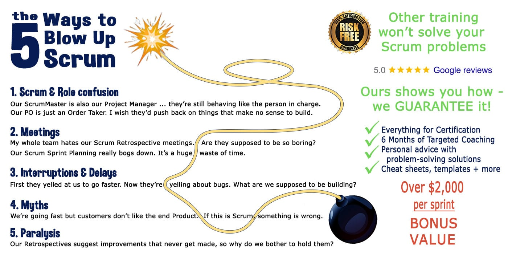

ul.dashedList > li { list-style-type: none; text-indent: -10px; } ul.dashedList > li::before { content: "– "; font-weight: bold; } .bonusBlock { width: 50%; float: left; margin-bottom: 30px; } .bonusIcon { float: left; } .bonusItem { clear: both; border: 1px solid #1f64a4; border-radius: 6px; overflow: auto; padding: 10px; margin: 15px; min-height: 175px; } .bonusText { font-size: 16px; padding-left: 15px; display: flex; } .markBioImage { float: left; width: 15%; padding: 0 0 25px 25px; } .markBioText { float: left; width: 85%; } .introPoints { float: left; width: 70%; } .markWithBadges { float: left; width: 30%; } .lookHere { background: #1f64a4; color: #ffffff; font-size: 24px; padding: 15px 50px; border: 1px solid black; margin: 15px 50px; text-align: center; } .logoContainer { float: left; width: 25%; text-align: center; } .arrowBox { overflow: hidden; } .arrowBox div { float: left; } .arrowText h2, .arrowText h3 { color: #1f64a4; font-size: 1.8rem; padding-top: 36px; } .arrowIcon { width: 110px; } .arrow-3 { padding-top: 26px!important; } .industryBlurb { color: #1f64a4; font-size: 2.8rem; text-align: center; line-height: 1.2em; padding: 15px 55px; clear: both; } @media screen and (min-width: 1023px) { .testimonialGraphic { width: 30%; float: left; } .firstQuote { width: 70%; float: left; padding-top: 15px; } .firstQuote span { display: block; } } @media screen and (max-width: 1200px) { .markBioImage { width: 22%; } .markBioText { width: 75%; } } @media screen and (max-width: 1023px) { .arrow-3 { font-size: 1.5rem!important; } .bonusIcon { width: 75px; } .bonusBlock { width: 100%; margin-bottom: 0; } .bonusItem { min-height: unset; } .markBioImage { width: 35%; } .markBioText { width: 65%; } .testimonialGraphic { text-align: center; } .firstQuote { margin-bottom: 20px; } .logoDisclaimer { padding: 20px 24px!important; } } @media screen and (max-width: 800px) { .arrow-1, .arrow-2, .arrow-4 { font-size: 1.5rem!important; } .arrow-3 { font-size: 1.2rem!important; width: 440px; } .logoDisclaimer { padding: 10px 2px!important; } } @media screen and (max-width: 500px) { .introPoints { width: 100%; } .markWithBadges { width: 100%; } .logoContainer { width: 50%; } .industryBlurb { padding: 15px 10px; } .lookHere { padding: 5px; margin: 15px 5px; } .arrowText { width: 200px; } .arrowText h2, .arrowText h3 { padding-top: 20px; } .arrow-3 { padding-top: 12px!important; width: auto!important; } .arrow-5 { padding-top: 26px!important; } .lookHere2 { font-size: 20px; } .bonusIcon { padding-right: 25px; } .bonusText { display: block; } }

# Certified Scrum Master Training  
CSM Certification for Professionals, A Blueprint for Scrum Team Success

## Use Scrum knowledge to standout at work, get paid more, and impress your customer, all without burning out.

Mark Levison will show you how to use the Scrum framework to:

- get more stuff done with your team
- with better quality
- to deliver products to your customer sooner
- with a team that can adapt easily
- and has high morale and stability
- so there is less risk
- and greater return

Bottom line: your customer will be impressed and so will your boss when you use the Scrum framework. What’s in Scrum certification for you? More satisfaction, the joy of building a great team, less stress, and better career options.

_"Mark is an awesome instructor... definitely the Yoda of the Scrum universe." - Ting-Yu Lin_

<iframe width="560" height="315" src="https://www.youtube.com/embed/XFa2qThTMTk?si=a_ULTm9xj0CaBVWu" title="YouTube video player" frameborder="0" allow="accelerometer; autoplay; clipboard-write; encrypted-media; gyroscope; picture-in-picture; web-share" referrerpolicy="strict-origin-when-cross-origin" allowfullscreen></iframe>

## At work have you ever…

-   Been pressured to deliver more, faster?
-   Had obstacle after obstacle put in your way?
-   Been frustrated at wasted time in team meetings?
-   Felt like you were part of a feature factory?
-   Been interrupted over and over, losing momentum and motivation on your project?
-   Had no idea what you were supposed to be building/doing?
-   Struggled to explain Scrum to your management team?
-   Felt management didn’t care (or, worse, didn’t trust you)?
-   Thought Scrum was a waste of time, or been told that it is?

## The problem isn’t you or your team.

You’ve read more articles and books than you can count about the Scrum framework and they contradict each other. Or just as it was getting to the key point, it became maddeningly vague. These didn’t work because most people treat Scrum as a magic formula, promising that if you follow all the theoretical steps in the spell, you will wondrously produce great product with more features, faster.

But you’re working in the real world, not a theoretical one. With real people: your team, managers, and customers. With that reality comes pressure, false urgency, and a host of other problems. It’s not your fault, nor your boss’s (most of the time) or the customer. The system that you’re part of creates these project outcomes. Fixing the problems isn’t easy; you need a plan that helps you find your path through the mess. This is where professional and high quality Scrum courses and Scrummaster certification come into play.

_"Mark Levison's teaching style is interactive and informative and really captures the essence off Scrum. I would recommend it to any company who struggles with the same issue we do - chaos!" – Philip Qumsieh_

_"As a self-employed business owner with a small team, this course was helpful in understanding how to improve my company's value to clients." – Murtada Shah_

Discount Scrum training gets you discount results.  
You can sit through boring PowerPoint and get your Scrum Master certification from a trainer who has never suffered through merge hell themselves, and who abandons you once the Scrum course is over, **OR...**

... you can discover for yourself why Mark Levison is considered an Agile and Scrum pioneer, and “the one to learn from” in Canada. He invests in your success and provides ongoing support and resources, above and beyond the Scrum Master certification training.

_"Insanely terrific. I have been bored silly at some Agile training classes. This was 100% interesting… okay, 98%. I get it now – the value of a \*real\* pro scrum master." — Simon Crum_

_"Mark is the real s\*\*t. He's lived through the pain points and knows where the bodies are buried." — Christian Farley_

## How to make work suck less with CSM certification.

We’ve been told that we shouldn’t use the word “suck” on a professional page. Maybe, but let’s be real, that’s why many people wonder about Scrum learning and certification in the first place, in the hopes that it will solve all their project problems that… well… suck.

### Are you looking for a Certified Scrum Master course?

We do certification, but if that’s all you want, you’re in the wrong place. A Scrum trainer can get you certified at bargain basement prices, but a digital badge isn’t going to help you with real world organizational problems or answering project questions. Discount Scrum certification won’t take away that fear of not knowing how to handle something. For that, **you want to learn from a professional Agile and Scrum expert so you understand Scrum at a level that is actually useful and practical to your work day.** Mark's online courses will give you a solid Scrum foundation and prepare to become Scrum master certified.

Mark gives you everything you need to earn your Scrum Master certification but then he takes Scrum many steps further. You know a project plan won’t work, so we give you a blueprint instead, and then guidance and support as you implement it and hit snags (hint: there are always snags with a project no matter how much experience or knowledge you have).

That’s just one way that Mark is different as a professional Scrum and Agile instructor, and the preferred choice of many major organizations and industries including government, software, banking, finance and education, to name only a few.

Mark Levison has helped over 8000 people find success using Scrum, and is the trusted training provider for major Canadian banks, insurance companies, federal and municipal government, and more.

\*Generic images used to honour trademark laws and NDAs.

## You're going to have questions during the learning course,  
but also throughout your Scrum career after you settle into the real work.

-   What should I prioritize during my first days/weeks as a Scrum Master?
-   Are there common mistakes or pitfalls I should watch out for and avoid as a new Scrum Master?
-   How do I help with improvements and resolve conflicts during a project, without any power?
-   What do I do when organization management is making it impossible to succeed?

Learn the Scrum framework from someone who will help well beyond the initial course, when you have "yes, but in real life…" questions like those above. Don’t settle and pay for fast food Scrum courses when becoming a Certified Scrum Master. Invest in healthy, full-meal training, with take-home recipes for success and ongoing support during and after the certification course.

_"Anyone looking to do this course...do it with Mark! His passion for all things Scrum and Agile shines through and excites his students. He’s a scrum realist with a fantastic sense of humour! The material is relevant today and Mark gives us a glimpse of what we can expect 5 years from now. The post class support is fantastic and shows how passionate and knowledgeable Mark is about learning! A true educator!" – Roberta Potocnik_

_"Great! Fun! And I learned something too! Seriously, one of the best training sessions for my personal growth." – Pierre Versailles_

[

Get Certified

](#upcomingCourses)

## Become the Scrum Whisperer – your team will thank you.

- Take one of our Certified Scrum Master workshops.
- No previous Scrum experience required for our training course. We provide Scrum preparation materials so you can feel comfortable and start learning right away.
- Not just for software development or people with a computer science degree. We’ve helped many non-software teams with Scrum.
- Unique, hands-on approach to learning and practice. Know what it’s actually like to do Scrum, in a safe and supportive place.
- No extra costs for the certification. Exam and certification fees, plus two years of Scrum Alliance membership, included in your Scrum Master training.

We don’t leave you stranded after the Scrummaster training workshop.  
We provide a Scrum expert designed blueprint with the steps to take with your team.  
Humans forget, so we cue up support to remind you of key content after your course, so you retain what you learned and you’re challenged to take action.

## Exclusive bonuses we provide in Scrum Master certification training...

A blueprint for Scrum team success, to guide you through your first few months after class and help you be effective as a Certified Scrum Master long-term.

Coaching session with Mark after training. Get input on the unique issues you’re faced with at your organization, and how to deal with them through Scrum knowledge, understanding, and activities.

A Glossary and Resource library so, when you’re confused about a Scrum or Agile topic later, you can go back and read to increase your understanding of the topic. The resource library accompanies the glossary so when you need more depth in a topic area, you can read curated content so you don’t waste your time and can keep learning Scrum at your own pace and focus.

Access to our community of students and educators where, when you run into challenges, you can ask questions and get experienced answers from not just Mark but also two other Certified Scrum Trainers. Other Scrum Masters are also happy to address any questions that you have.

Regular virtual coffee sessions about Scrum and Agile. Ask questions for Mark, and hear from others how they do Scrum in their workplace. These live online sessions can be a valuable resource when working with your Scrum Team after earning your certificate.

Money-back guarantee. If, after all of the above, you don’t feel you gained valuable skills and learning from the certification course, we’ll refund your registration price. Scrum training is an investment that will benefit yourself, your team, and your organization, and the improvements can pay back the cost in only a few Sprints.

[

Get Certified

](#upcomingCourses)

## Not sure the Scrum framework is for you?

We get it. You’re scared that being a Scrum Master will be a daunting amount of work. Or that it will take a long time to see any benefits from the certification. And what happens if you fail as Scrum Master, or on the certification exam? Don’t let these concerns turn you away and make you procrastinate about training and the exam any longer. Our blueprint for success will help you achieve your Scrum goals.

Don’t put this Scrum class off. All the project problems you have now will still be there later, and even worse, if you do.

You’re fearing the unknown of Scrum. Does that seem like a healthy and useful thing to do?

Mark helps take out the scary parts of being a Scrum Master. Life doesn't come with guarantees and all the answers, but the right training will help you anticipate unknowns within your project and know in advance how to confidently deal with them. Our Certified Scrum Master training course will equip you with the knowledge, management skills, and resources necessary to successfully complete your project.

_"I had the freedom to just listen and retain, understand and ask questions. This Scrummaster course was exactly what I needed to feel supported and reassured that I can do this! The teaching style, the small groups and the activities made a huge difference in making me feel supported and empowered to become a scrummaster. I am so grateful for this course." – Nicole Goldsmith_

_"I recommend all newbees to Agile to take Mark's class. End of the day, you will walk out with confidence." - Hema Parthasarathy_

Invest in making things better for your teams and organization. Learn from the Scrum expert who can coach you on exactly how to do that, so you can handle what comes your way at work, and make it more rewarding. From the course introduction to the certification exam, Mark will teach you Scrum concepts, and leave you with key takeaways and knowledge that you can apply to your organization.

[

Get Certified

](#upcomingCourses)

## Become a Scrum Master: FAQs

## What training is needed to be a Certified ScrumMaster?

You can be a Scrum Master without any training, sadly to say. Being a Scrum Master a tough position to throw anyone into without support and resources, but it’s not an uncommon occurrence. Many of our alumni students came to us for Scrum training because they had no idea what was expected of them or how to do a good job with their project and teams. Our students find that the online class helps prepare them for the CSM exam and to apply their Scrum knowledge to organization projects.

To be a _Certified_ ScrumMaster®, the Scrum Alliance requires that you attend and participate in at least 14 hours of CSM training delivered by a Certified Scrum Trainer and pass the certification exam.

None of that, including CSM certification, guarantees that you’ll [be an _effective_ Scrum Master](/how-to-become-a-scrum-master), which should be the goal far more than just holding the title as a Scrum professional. That’s why we believe in going above and beyond so the online training isn’t just a one-time thing. With Agile Pain Relief, you get included follow-up support and resources, and access to a whole professional community who help take you beyond merely being assigned a job and getting a CSM certificate. **We invest and provide continual learning so you can be effective and excel in your Scrum Master position.**

## Does a Scrum Master need to know coding?

No. While Scrum is popular in the world of professional software development, it’s also used successfully in many industries outside of that, including education, healthcare, and aviation, to name a few. Even in software, the Scrum Master does not have to be a programmer/developer. The Scrum expert's role is to be the coach for the team, not the coder.

## What do scrum masters do all day?

Serve their team. Not literally, like bringing coffee and running to the printer (although those are thoughtful too), but in the broad sense **a Scrum Master is a servant-leader**. They facilitate the various Scrum events and work with their team to identify obstacles, then help the team resolve them so they can perform efficiently while completing the project.

## What does scrum stand for?

Many assume that SCRUM is an acronym for something, but it’s not. You may have heard the term "scrum" before in reference to rugby, where it refers to a formation of players. A team that works together to move a ball toward a common goal. Don’t overthink it. The analogy works because of the simplicity of it in both contexts.

## What shouldn't a Scrum Master do?

Judge. Punish. Assign. Blame. Reward. Prioritize. Instruct. The list goes on. But perhaps one that will surprise many people is that **a Scrum Master should not solve problems for their team**. (Did that catch you off guard?) Instead, the Scrum Master should help their team identify issues and work together to resolve them. Subtle difference, but critically important.

[

Get Certified

](#upcomingCourses)

## About Your Guide

Mark spent 12 years as a ScrumMaster and Coach helping teams by chance before he started to systemize it. He’s read hundreds of books, thousands of articles, and mittfuls of academic papers, all with the purpose of figuring out what helps teams succeed. Armed with research and proven results, as well as over 30 years of experience in the IT industry, he has been learning and teaching Agile since 2001, introducing Scrum, Lean, and Agile methodology to a large variety of organizations. Mark has brought Scrum to thousands of professionals and helped launch the practice throughout Canada.

We know that some for of you two full days is hard to manage, so we now also offer 4 x 1/2 day courses. We will cover the same material, so you can confidently choose the schedule that best fits your needs.

### Upcoming Workshops

\[do\_widget id=custom-ee-upcoming-events-widget-2\]
