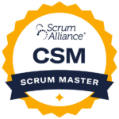
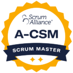
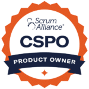

Learn Agile and Scrum techniques to guide teams, projects, and organizations to enable the rapid delivery of valuable results.

### "We help people make their work suck less."

In our Scrum Alliance [certification workshops](/certified-scrum-agile-training), students learn through practical exercises and examples to develop the knowledge, skills, and insights needed to make the shift from traditional management practices to Agile practices. Facilitated by [Certified Scrum Trainer™ Mark Levison](/about-us), an Agile expert since 2001, these workshops have a deep understanding of how people learn, and aren't a class with a bunch of words on PowerPoint slides. Local training means you also have the advantage of meeting and networking with other professionals near you to hear the challenges - and solutions - experienced by other organizations, which can be invaluable.

### Upcoming Edmonton Certified Scrum training:

\[do\_widget id=custom-ee-upcoming-events-widget-8\]

If you're not sure what training is right for you, the following pages offer more details:

#### [Certified ScrumMaster (CSM) training](/certified-scrummaster-csm-training)

#### [Advanced Certified ScrumMaster (A-CSM) training](/advanced-certified-scrummaster-acsm-training)

#### [Certified Scrum Product Owner (CSPO) training](/certified-scrum-product-owner-cspo-training)

We have thousands of quotes and testimonials from people across Canada who have taken our training, but here are a few direct comments specifically from Western Canada workshop attendees:

"I've taken many courses over the years and this was the most educational, enjoyable experiences with valuable activities and worthwhile well-researched content." ~ Ron Woodford

"Insanely terrific. I have been bored silly at some Agile training classes. This was 100% interesting… okay, 98%. Very clear, Exceptional memory! I get it now - the value of a \*real\* pro scrum master." ~ Simon Crum

"Wonderful course and instructor. Fantastic mix of theory and pragmatism. Concepts applicable to non-software development. Very valuable. Well done!" ~ Margaret Uminska

"Mark Levison's teaching style is interactive and informative and really captures the essence off Scrum. I would recommend it to any company who struggles with the same issue we do - chaos!" ~ Philip Qumsieh

Learn more about our Edmonton Scrum and Agile training through the course links above, register for an upcoming course below, or [contact us](/contact-us) with further questions.
