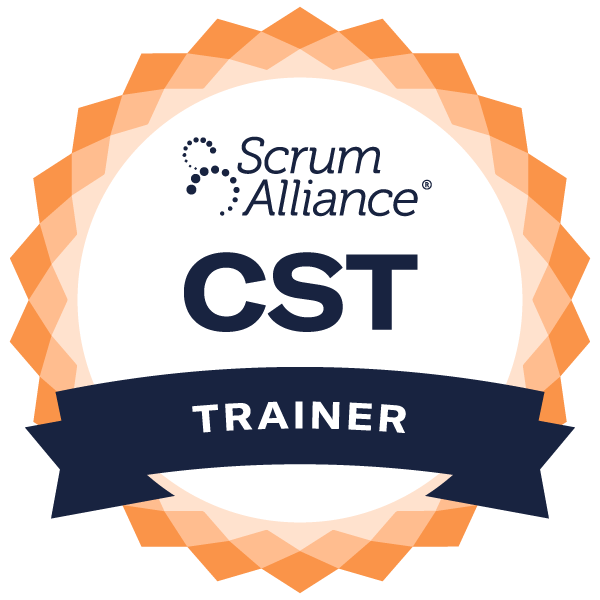

## Certified Scrum Product Owner® (CSPO) Certification Training

Improve the value of your products and career with the most popular Certified Scrum Product Owner® (CSPO) certification. This two day training workshop prepares you to become a highly demanded Certified Scrum Product Owner®.

[

Get Certified

](#upcomingCoursesFrame2)

Improve the value of your products and career with the most popular Certified Scrum Product Owner® (CSPO) certification. This two day training workshop prepares you to become a highly demanded Certified Scrum Product Owner®.

### Get Certified Today!

\[do\_widget id=custom-ee-upcoming-events-widget-15\]

### CSPO Training Workshop Features

- Gain the highly demanded CSPO certification recognized worldwide across multiple industries
- 2 days of practical interactive exercises, case studies and simulations
- Extensive post-training support to help you remember and grow
- Includes 2 years Scrum Alliance membership
- Eligible for 14 PDUs
- Virtual attendees can attend the same in-class training post-COVID for free

Taught by [Mark Levison](https://www.scrumalliance.org/community/profile/mlevison), a Certified Scrum Trainer with extensive Agile experience.

### Upcoming Workshops

\[do\_widget id=custom-ee-upcoming-events-widget-15\]

### Eligibility

#### The Scrum Product Owner® certification training course is suitable for

- Product Owners
- Scrum Masters
- Business Analysts
- Product Managers
- Project Managers
- Business Stakeholders
- Program Managers
- And those interested in pursuing a career as a professional Scrum Product Owner.

### Prerequisites

There are no prerequisites for starting this Agile Scrum Product Owner certification course.

### CSPO Certification

- Preparation material provided, so you can be comfortable and confident
- CSPO training and post-class support conducted by Scrum Alliance Certified Trainer
- Understand how to collaborate with teams, maintain productive backlog, delight clients
- No PowerPoint, learn by actually practicing Product Ownership
- Small class size, guaranteed course dates
