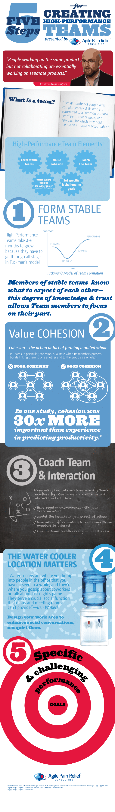

 Certified Scrum Trainer Mark Levison offers insight into the neuroscience of teams with five proven Agile methods to create teams that sizzle not fizzle. Get a FREE e-book copy of _Five Steps Towards Creating High-Performance Teams_ and put your team on the path to high-performance success.

Scrum is a tool for building high-performance teams. Some Scrum Teams achieve this goal almost by magic, while others struggle to get there. So is it magic? Or luck? Or is it far more attainable than that? There is a science to it that makes it possible.

~ Mark Levison, _Five Steps Towards Building High-Performance Teams_

### Get your free copy of the "5 Steps for Creating High-Performance Teams" e-book.

_Subscribe to the Agile Pain Relief newsletter and get the latest Agile news, tips, and advance notice of upcoming courses and promotions._

\* Email Address (required) 

\* First Name (required) 

Last Name (optional) 

Location (optional) 

Website
