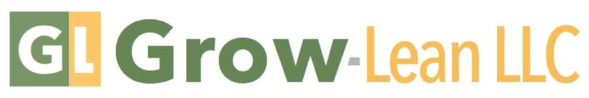
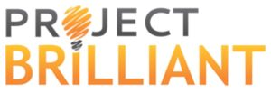
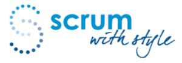
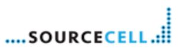

We’re pleased to partner with other consultants and companies.

[Grow-Lean LLC](https://www.grow-lean.com/) provides agile services to assist individuals, teams and organizations in their agile journey. As our company name implies, we grow your capabilities and help you stay lean. We offer training and coaching services throughout the United States.

* * *

[LeanKit](https://www.planview.com/products-solutions/products/leankit/ "LeanKit") is recognized by the Agile and Lean IT community as the most flexible and powerful tool available for implementing visual project management based on Kanban systems. The company is also making a name for itself beyond IT with customers who use their tool to manage and collaborate on projects in fields as diverse as engineering, manufacturing, marketing, customer service, technical support, etc.

Since its founding in 2009, LeanKit has grown rapidly to serve more than 170,000 users around the world at companies such as Adobe, Alcatel-Lucent, Monster, NBC Universal, Siemens and Spotify.

* * *

Founded in 2010 [Procognita](https://procognita.com/) helps companies to achieve their goals in a dynamic market by promoting Agile and Lean approaches. We are based in Poland and we share knowledge and support individuals and organizations in Central and East Europe through training, mentoring, talks and workshops.

* * *

[Project Brilliant](https://projectbrilliant.com/) is an Agile training, coaching, and consulting firm based in Indianapolis, IN. We are the beacon of agility that guides organizations in a rapidly changing marketplace.

* * *

[Scrum WithStyle](https://www.scrumwithstyle.com/) was founded in 2008 as a boutique Agile capability uplift partner by Rowan Bunning CST.

We provide Agile related training and consultancy to IT and software development professionals in Australia and New Zealand.

* * *

M. Kelley Harris, [SourceCell](https://www.sourcecell.com/), has 20+ years of software development experience, in roles including software engineer, architect, manager, director, consultant, trainer, and coach. He has developed software in the domains of scientific instrumentation, nanotechnology, semiconductors, solar energy, automotive diagnostics, investment, real estate, music, eCommerce, etc. Since embracing Extreme Programming (XP) in 2002, and Scrum in 2004, he has helped a wide variety of teams utilize Agile principles. He has helped teams develop software in a more Agile manner via refactoring, test-driven development (TDD), simple design, etc. He has led efforts to gradually rearchitect difficult legacy code bases. He has been fortunate to have worked with Ward Cunningham, Robert Martin, Joshua Kerievsky, and many other Agile thought leaders. He founded SourceCell in 2004, and currently does software development, consulting, coaching, and training, around the world. He is a certified SEI Software Architecture Professional, with a special interest in the Lean Startup perspective to quickly find out what the world really wants and needs. He holds three software patents in nanotechnology. He holds the following Scrum certifications from the Scrum Alliance: Certified ScrumMaster (CSM), Certified Scrum Product Owner (CSPO), Certified Scrum Developer (CSD), and Certified Scrum Professional (CSP). He is based in Palo Alto, California (Silicon Valley) and Santa Barbara, California (Silicon Beach)
