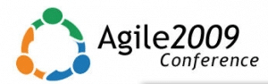

 I’ve been home for a few days and have some time to digest what I learned. More of sessions were interactive this year, so I have fewer notes and can write fewer articles than last year ([Agile 2008 Post Roundup](/blog/agile-2008-post-roundup.html)).

## **The Good**:

- I found only one bad session.
- I saw a lot of old friends and made some new ones (Kari, Mike S, Gerry, Xavier, Rachel, Liz, Doc, among many)
- The food was a bit better than [last year](/blog/agile-2008-a-personal-retrospective.html). Although, as Rachel Davies explained, it’s very difficult to get good-quality nutritious food from a hotel at a price the conference can afford.
- Open spaceI made some use of it to join random sessions, but mostly I just networked.
- Free one-on-one consulting. I managed to help one free client over the course of an hour.
- It was easy to find stuff.
- Most of the sessions were in rooms big enough to accommodate their audiences.
- The hotel bar was open and easy to get to. I spent a few hours hanging out with friends there, and its openness made it easy to survey for friends before you entered.
- The wider scope of the conference was interesting—it’s good that people are recognizing that our biggest challenges aren’t always technical/process but frequently people. To that end, I liked the Manifesting stage with its coverage of cognition, etc. _Caveat: I was a reviewer and also presented on that stage._ I also like the idea of the Frontiers stage.
- The Cyrus Innovation’s Party—good food, good drinks, great friends.
- The openness of the communityI met several of the “big” names this year and discovered they’re friendly and still have their feet firmly planted on terra firma.

## **Needs Improvement:**

- If it can be believed, wireless access was worse this year than last. Next year please give us decent access and don’t require a login, as it means phone users will have to log in again every time their phone sleeps (remember that Canadians and Europeans don’t have sanely priced data access in the US).
- Internet access in the hotel rooms was usurious.
- Coffee—I’ve got insanely high expectations here
- Overlap between three-hour and ninety-minute sessions. Many long sessions lost half their attendees after the break. Net result: the quality of the conversation suffered. _Repeat from last year—my solution: I didn’t attend any three-hour sessions this year._
- On a few occasions, rooms were not a good match for the session, and we were blocked.
- Move the “Free one-on-one consulting” to the open jam.
- It was clear to me where the stage boundaries were, but there didn’t seem to be a place for Scaling Agile, etc.

## **Suggestions**

- We need wireless access that can handle ~2,000 simultaneous connections spread through the facility (1,500 people; some people have 2 connections).
- More of the conference rooms in one area.
- Film every session and make them accessible via the web after the fact. Make access part of our conference fees. If you didn’t attend the conference, then you can buy access to the sessions for $200-$300 after the fact. _Obviously, I write for InfoQ, so I have a conflict here, but Floyd andcompany would be the ideal people to pull this off._
- Establish better boundaries between stages. Make it clear what stages which topics belong on, perhaps by providing examples.
- Don’t tie stages to rooms. Many sessions on one stage might be small, but you need to recognize that sessions will be very popular. Example: Chris Matts had a presentation that was stuck in the Toronto room; needless to say, the room’s capacity of 48 people was quickly exceeded. I and many others were turned away (> 20 people).
- Communicate, Communicate, Communicate. We’re more forgiving of problems and issues if someone tells us what’s up early on.
- Give every speaker links to some basic presentation skills material, i.e., Garr Reynolds and Bert Decker. Also provide information on the importance of interactive material. There is a lot of good information about making our teaching/training sticker, so please share with potential presenters. Even if it only sticks with a few, it will still raise the game.

**Sessions I attended**

Here are the rough notes on the sessions I attended

**Monday** The Agile Playground (Tobias Mayer) – It's tough to summarize Tobias’s sessions in a text format. For this session we used static forms (i.e. mimes/role plays) to model power and then power in relationship to teams. After modeling each we were asked how to take power away from a person. Each section was followed by a debrief. It was a great learning experience but hard to explain in a blog. _Suffice it to say that the next you have a chance to attend a session run by Tobias do._ Dave Nicolette has a longer write up.

Coaching Workshop (Rachel Davies and Liz Sedly) - I’ve written about this session previously:

Giving and receiving effective feedback (Liz Keogh) – I wrote up the session for InfoQ: [Giving and Receiving Effective Feedback](https://www.infoq.com/news/2009/08/Effective-Feedback)

**Tuesday**

I tried to attend: Risk and Risk Management – Theory and Practice – but got bounced because of the small room. After trying my one bad session I went to  Rachel and Liz’s next session: Top Ten Coaching Tips will be written up for InfoQ shortly.

Facilitation Patterns and Antipatterns (Steven “Doc” List) – Doc introduced us to a number of anti-patterns. My favorites were Gladiator, Dominator, Prima Donna and Terrible Tweeter. We did a role playing game using a deck of cards. Each participant was a given a card saying what antipattern to exhibit and then we discussed an interesting topic. After the discussion we tried to guess what roles our compatriots played. After the initial presentation I thought it would be very easy to spot the problem behaviours, but once I was part of the discussion I realized just how tough it was. I think that we could have some fun with this game at [Agile Ottawa](https://agileottawa.wordpress.com/).

How to Develop Your Leadership Power Daily: An Agile Approach to Growth (Christopher Avery). It was a good session. For me, it was mostly a reminder of Amr’s “[Touchy Feely Impediments to Agile Adoption](https://www.infoq.com/news/2008/08/agile_impediments),” yet, nonetheless, it was a timely reminder.

**Wednesday** the day for our presentation—net result: I wasn’t as focused as I would have liked to have been.

The Elephant in the Room: Using Brain Science to Enhance Working Relationships (Sharon Buckmaster, Diana Larsen)—examined some of the differences between the brains of men and women. They explained how these differences might manifest in terms of perception and behaviour. I anticipate that InfoQ will have their paper up shortly.

Help me to see… corporate culture (Tobias Mayer, Lyssa Adkins). Trying to describe Tobias’s games is tough. I’m hoping he gives me a better description.

- Sit in a circle
- The first person asks a question (open ended): Describe an ideal Agile Developer; …
- Each successive person adds something else to it
- At any time if someone else in the group doesn’t see how it fits, they say, “Help me see that.” _Notice how it’s not confrontational and saying no. Instead, it’s constructive and allows bridges to be built._
- Every time the question is asked the next person in the circle tries to explain how it fits in.
- If the question has still not been satisfied after three tries, then start again at the beginning.

[Learning: the Best Approaches for Your Brain](/blog/learning-best-approaches-for-your-brain-slide-deck.html) (Linda Rising and I). I was surprised at how well this session went. We managed to attract an audience of 65–75 people, and most seemed engaged. We asked the audience to produce a play that represented something they learned. The idea was that planning and acting out a play would help integrate the information and make this the attendees’ own. According to the feedback forms, at least two people were intimidated and didn’t understand the intent. Most of the rest of the audience got into the game so much so that we had two very good skits performed at the end, including JR Jenks playing on a banjo.

**Thursday**

The Agile CTO (James Shore, Diana Larsen). This was a workshop for finding patterns for Agile Executives to use. Since it was a workshop, there is little to say except that I look forward to seeing the results published.

Logical Levels and Statistical Games: A Powerful Strategy for Agile Adoption (Luiz Claudio Parzianello, Rafael Prikladnicki)

Set-Based Design: Anti-Agile or Agile’s Future? (Bill Wake, Jean Tabaka). This was an interesting look at what set-based design is, what its benefits are, and how it should be applied. I always make a point of attending at least one of Jean’s sessions at each conference, and this was another solid one.
