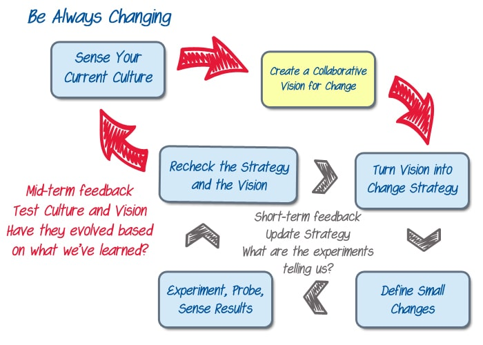

(Continued from _Agile Change or Adoption Always Starts with Why_: [Part 1](/blog/agile-change-or-adoption-always-starts-with-why.html), [Part 2](/blog/agile-change-or-adoption-the-steps-to-go-from-why-to-how.html), [Part 3](/blog/agile-change-or-adoption-sense-your-current-culture.html))

Most organizational change effort starts with a vision. But problems arise if the vision was created by a few executives who went off-site, as that can result in a vision that doesn’t address the problems felt by the doers at the team level, and it isn’t articulated in a way that makes sense to them.

Instead of inviting just the senior executive team, we need a workshop that involves senior management, middle management, and a fair representation of the doers (e.g. developers, testers, support staff).

Then we need to define our vision collaboratively. Any of the familiar Agile approaches for creating vision (e.g. Innovation Games: [Product Box](https://stormz.me/en/blog/stormz-games-product-box1) or [Prune the Product Tree](https://lucidspark.com/templates/prune-the-product-tree#:~:text=Prune%20the%20Product%20Tree%20is,which%20ones%20to%20let%20go.), or Roman Pichler’s [Vision Board](https://www.romanpichler.com/blog/the-product-vision-board/)) are effective choices. The goal is to create an initial vision with buy-in from all, and that can be easily explained/understood by even those who weren’t present.

But after you create the vision, you have to communicate clearly about it, otherwise the change you hope to generate is at risk.

Traditionally a town hall style event is used to announce a change. The CEO gives a speech, followed by several other executives, and then questions are invited from the floor. But few real questions follow, since attendees haven’t had time to digest or discuss the implications of the change. This isn’t collaborative and doesn’t even qualify as dialogue. It is purely a control and communications mechanism.

Catchball from Hoshin Kanri management (Japanese name for Toyota’s Strategic planning technique) is one collaborative approach to be considered as an alternative. Catchball is a fact-based strategic discussion process that gets Senior Management to sit down with Team Members. Senior Management show their vision, then they metaphorically “throw the ball” – i.e. pass the information back to the Team for their response. Team Members “catch the ball” and break down the vision into smaller digestible parts. They throw the figurative ball back to Senior Management, who review the approach to see if it will meet their needs. The ball is bounced back and forth until both groups are satisfied.[\[1\]](#footnotes)

The key point here is that the vision wasn’t just explained – much like creating an effective user story, the vision was treated as an invitation to a conversation. Also like effective User Story conversations, they’re best tested by creating specific concrete examples that reveal whether all parties are describing the same thing.

#### Case Study

At the WorldsSmallestOnlineBookStore, [Steve, our intrepid former ScrumMaster](/blog/the-scrummaster-tales.html) and now Agile Coach, organizes a Vision Workshop. The goal is to decide as a group what they’re trying to achieve with the significant organizational change they’ve taken on.

Steve has invited 20 people to the event and asks them to self-organize into three to four teams. Each must have at least one executive, one middle manager, and two doers. Beyond that, he lets people choose which group they want to work with.

His framing question: “In two years and one day we’re part of a better organization, how did we improve? Did we:

- become more resilient?
- improve quality?
- create faster time to market?
- have better employee retention?

Each team is challenged to create a “[Product Box](https://stormz.me/en/blog/stormz-games-product-box1)” that illustrates the organizational changes they would like to see. -           One team creates a box that shows a customer abandoning a purchase, and then a bigger picture of many happier customers. An arrow indicates the change from unhappy to happy. -           Another team shows quality changing from a rubber stamp, to being built into every brick in a structure. -           The last team shows a box with images on two sides. On the first side there is a solid brick wall with moss grown all over it. Many of the bricks are old and chipped. At the bottom of the box is a tiny clean section of the wall where the bricks have been repaired. It says “Agile”. On the other side of the box the team shows a wall largely cleaned of moss and with many repaired bricks. They explain that the moss was the past practices that were holding all the teams back. Once cleaned, the teams - both product development and operational - were able to repair many of the bricks.

After an hour of work, each team shares their vision with the others and explains what each element represents. They return to their tables and update their own vision based on what they discovered from their peers.

Finally, they come back together at the end to select a box that best represents their overall vision. (This is done by consensus and occasionally a consensus can’t be reached). In our case, they decide that a combination of the first two boxes best represents their vision.  The team that created the last box hasn’t done bad work, they just didn’t sell their peers on selecting it and the idea it represented. Sometimes you can have a great idea but others can’t see it and buy into it.

Next, we'll explore how to [turn Vision into Strategy](/blog/agile-change-or-adoption-turn-vision-into-strategy.html).

\[1\] [Use the Catchball Process to Reduce Ambiguity – Tim McMahon](https://www.aleanjourney.com/2011/12/use-catchball-process-to-reduce.html)

Image attribution: Agile Pain Relief Consulting
