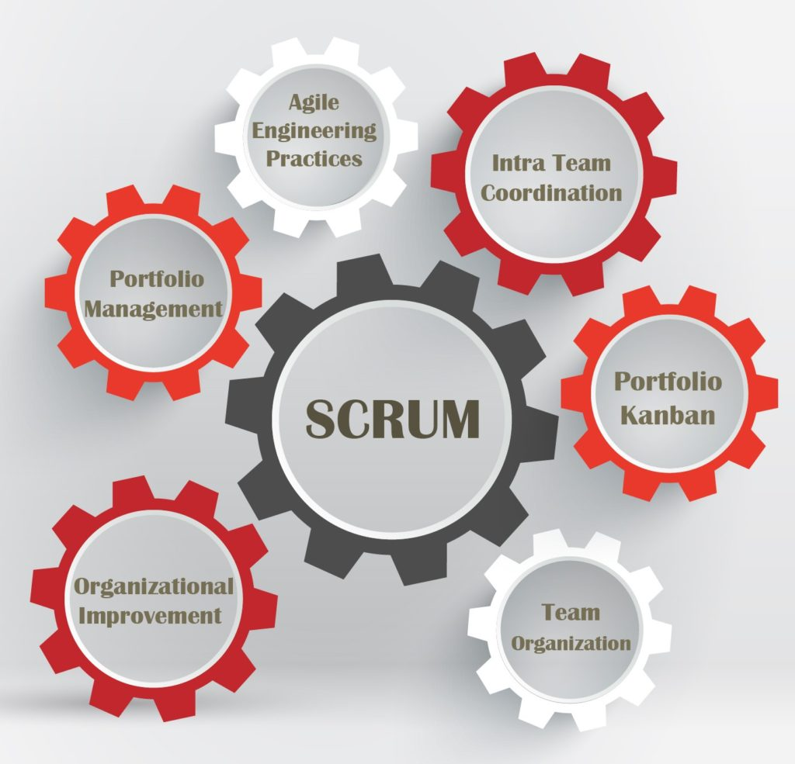

We've had requests for a single page that lists all the ongoing [Beyond Scrum blog posts](/blog/category/beyond-scrum) in one handy spot, and we're happy to oblige! The below list will be updated as new posts are added.

[Scrum Alone is Not Enough](/blog/scrum-alone-is-not-enough.html)

[Simplicity](/blog/simplicity.html)

[Scrum Development Team – Who’s In It?](/blog/scrum-development-team-whos-in-it.html)

[What is the Recommended Scrum Team Size?](/blog/scrum-team-size.html)

[Specialists Are Overrated](/blog/specialists-are-overrated.html)

[How to Cross-Skill and Grow T-shaped Team Members](/blog/how-to-cross-skill-and-grow-t-shaped-team-members.html)

["Because Our Competitors Are" is No Reason to Become an Agile Organization](/blog/because-our-competitors-are-is-no-reason-to-become-an-agile-organization.html)

[What Are the Limits of the Scrum Framework?](/blog/what-are-the-limits-of-the-scrum-framework.html)

[Don’t Inflict Scrum or Kanban on Teams](/blog/dont-inflict-scrum-or-kanban-on-teams.html)

[Taking Organizational Improvement with Scrum Seriously](/blog/taking-organizational-improvement-with-scrum-seriously.html)

[Taking Organizational Improvement Seriously – Case Study](/blog/taking-organizational-improvement-seriously-case-study.html)

[Agile Change or Adoption Always Starts With "Why"](/blog/agile-change-or-adoption-always-starts-with-why.html)

[Agile Change or Adoption: the Steps to Go from "Why" to "How"](/blog/agile-change-or-adoption-the-steps-to-go-from-why-to-how.html)

[Agile Change or Adoption: Sense Your Current Culture](/blog/agile-change-or-adoption-sense-your-current-culture.html)

[Agile Change or Adoption: Create a Vision](/blog/agile-change-or-adoption-create-a-vision.html)

[Agile Change or Adoption: Turn Vision into Strategy](/blog/agile-change-or-adoption-turn-vision-into-strategy.html)

[Agile Change or Adoption: Define Small Organizational Changes](/blog/agile-change-or-adoption-define-small-organizational-changes.html)

[How to Be an Effective Manager in Scrum](/blog/how-to-be-an-effective-manager-in-scrum.html)

[The Role of Agile Managers: Why Job Titles Are Dangerous](/blog/the-role-of-agile-managers-why-job-titles-are-dangerous.html)

[Kanban Portfolio View](/blog/kanban-portfolio-view.html)

[Portfolio Management](/blog/portfolio-management.html)

[Red-Yellow-Green Status Reports and Other Models – How They Should and Shouldn’t Be Used](/blog/red-yellow-green-or-rygrag-reports-how-they-hide-the-truth.html)

[Bell Curves and Measuring Badly](/blog/bell-curves-and-measuring-badly.html)

[Measurement for Scrum - What are Appropriate Measures?](/blog/measurement-for-scrum-what-are-appropriate-measures.html)

 

(Original background vector elements designed by Freepik.com. Adaptation by Agile Pain Relief Consulting.)
