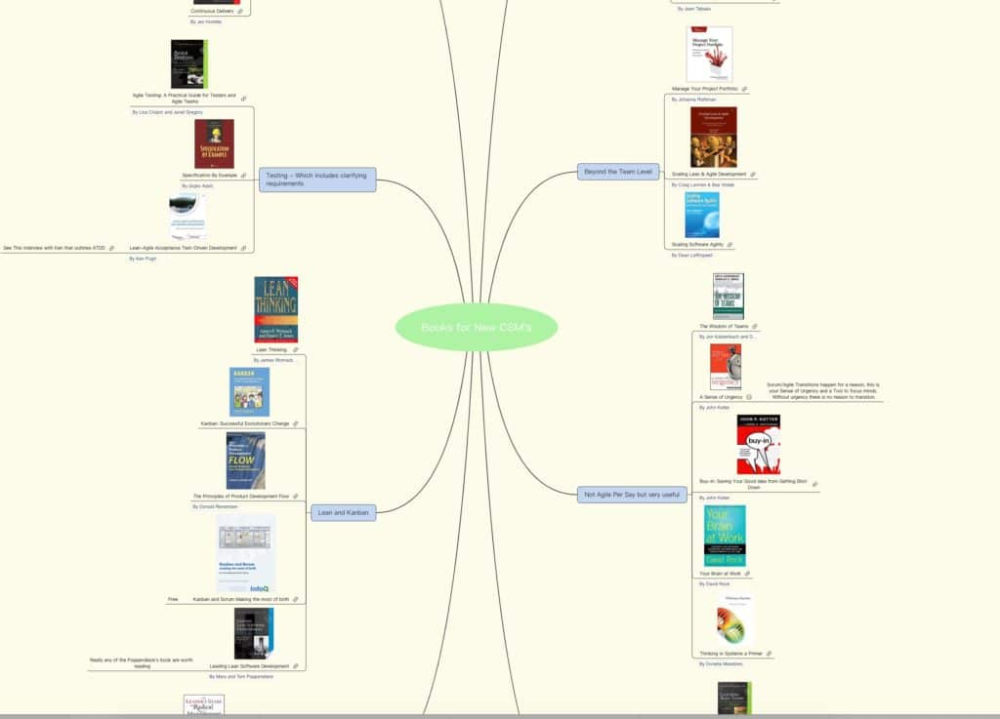

You’ve just finished your [Scrum Master training](/certified-scrummaster-csm-training) and you want to start exploring some issues we didn’t have time to cover? I spent the afternoon putting together a list of 29 books that I think you will find interesting. As part of the process I decided to experiment with doing the list as a [mind map](https://www.xmind.net/share/mlevison/books-for-new-csm-s/).

Let me know if this was helpful or if there was a key book I missed. In addition give some ideas of how you might have presented this.
