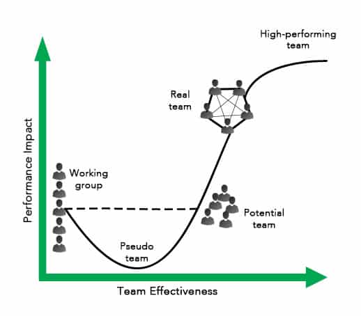

Grouping individuals together doesn’t make them a team. It takes more than just a label to turn a collection of people into an Effective Team.

In 1993, Jon Katzenbach and Douglas Smith published, _The Wisdom of Teams_\[[1](#footnotes)\], which highlighted the difference between Working Groups and Real Teams. In this article, we summarize Katzenbach and Smith’s work and then offer a modern example of what is required for Effective Scrum Teams.

Katzenbach and Douglas described teams as needing open interaction, fact-based problem-solving, open communication, and a way to improve. This is a simplified list from their book of how a real team is distinguishable from a working group:

## Characteristics of High-Performing Teams

- Small number of people
- Complementary skills
- Common purpose
- Have a specific and challenging performance goal
- Mutual accountability
- Common approach

When Katzenbach and Smith published their work, Scrum didn't yet exist. So their description is a good start, but too abstract for Scrum Teams. I’ve created a more focused list of Characteristics of Effective Scrum Teams, and it would also apply to those using other Agile approaches (e.g. Kanban, XP, etc).

## Characteristics of Effective Scrum Teams

1. **Psychological Safety**: This is being part of a team and knowing you can share ideas and information without fear. Psychological safety isn't the avoidance of conflict, rather it is knowing that we can share information inside a team instead of focusing on protecting ourselves.
2. **Collaboration**: [Collaboration over coordination or cooperation](/blog/collaboration-over-work-in-isolation.html). Coordination is synchronizing the independent work among a group people. The work isn’t necessarily working towards a common goal. Cooperation is to act or work together for a shared purpose, however, many tasks will still be completed independently. Collaboration is working together in a joint effort towards a common goal.
3. **Self-organization**: Teams are empowered to manage their own work and make decisions independently.
4. **Clear goals**: Specific and well-understood objectives that align with the overall product vision.
5. **Cross-functionality**: Ensuring that team members have the necessary skills to complete tasks end-to-end, reducing (or eliminating) dependencies on other teams.
6. **Continuous improvement**: Regular reflection on processes and practices to identify areas for improvement and make adjustments as needed.
7. **Short Sprint Cycles & Adaptability**: [Short sprint cycles](/blog/choosing-scrum-sprint-length.html) focus on specific goals, adapt product work based on client feedback, and improve the team itself.
8. **Customer Focus**: Prioritized work based on value delivery to customers and stakeholders.
9. **Quality over Quantity**: Emphasis on delivering high-quality work rather than rushing through tasks for quick completion.
10. **Respect for Craftsmanship**: Team members who are encouraged to take pride in their work, strive for excellence, and continuously learn and grow.
11. **Embraced Change**: Being Agile means adapting to new requirements as they arise, even late in the game.
12. **Willing to Ask for Help**: For example, to clarify end user needs, or when you've spent more than an hour on the same problem, etc.

Think about the best team you have ever worked on. Which of these characteristics did it have? If you’re lucky, most of them. The above list was created to help teams identify where they can improve.

Too many teams struggle with Fake Agile and Bad Scrum. They know about velocity, tickets and pressure to deliver more story points faster, but they aren’t able to reach high-performance. This list is designed to get us out of that trap so we can start thinking – and functioning – as a real team, and reaping all the benefits that come from Effective Scrum.

\[1\] Thanks to Mishkin Berteig, who introduced that book to me in ~2006
