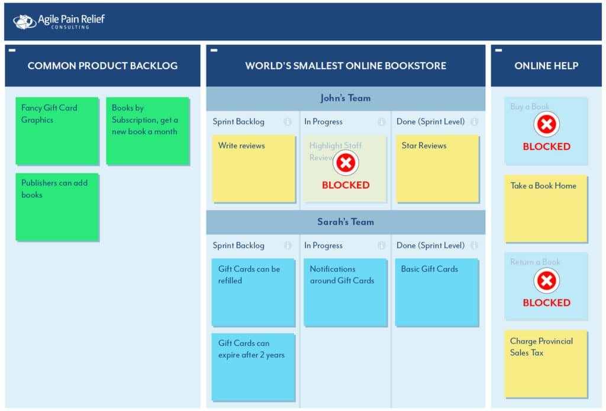
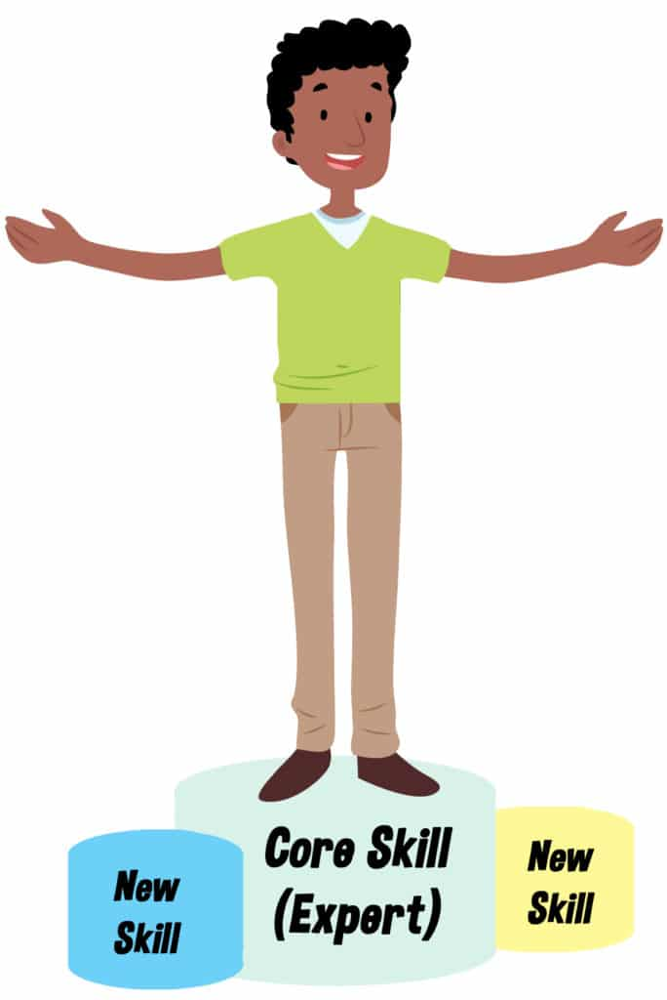

As we discussed in “[Specialists Are Overrated](/blog/specialists-are-overrated.html),” developing cross-skills and “T-Shaped" people in a team has many benefits – for the team/organization itself, the customer, and the individual. That’s all fine and good to say, but how do you figure out where to start?

There are two major ways to discover opportunities for cross-skilling:

1. Kanban/Scrum Team Board
2. Skills Matrix

## Kanban/Scrum Team Board

The Team Board is a rich source of information as to where missing skills exist among a team’s members. If you’re unfamiliar with how a Team Board works or what it looks like, I posted an [example of a Kanban Board](/blog/kanban-portfolio-view.html) previously on this blog. Walk along the board every few days, look to see which column work items use up the most time. The board should also help you spot any item that gets blocked or is waiting for outside work. Every time an item is blocked because of an external dependency, record the reason. Over a few months, it will become clear which external dependencies impede work getting done the most. Any of these areas discovered are now opportunities for the team to cross-skill into. Once there is enough evidence to start (perhaps after 3-4 Sprints of collecting), share the data in a retrospective and ask the team two key questions:

### Theory of Constraints

Demonstrates that in any system where there is a bottleneck, the rest of the system should be subordinated to the bottleneck until the bottleneck is cleared. Goldratt’s work is, in part, the basis for Kanban and also shows why, in a constrained situation, moving a Developer or Writer from their primary work to the constraint (e.g. Quality Assurance or Editing) is so effective

- “What area would we like to put energy into learning?”
- “Who has the interest and energy to learn about these areas in the next few Sprints?”

If they do this well, the Team should rarely find itself stuck waiting for an external dependency because it will have grown the skills to handle many previously external dependencies inside the team. In addition, many bottlenecks, like a lack of Quality Assurance or editing skills, will have been resolved when those activities become a constraint \[[1](#footnotes)\] for getting work done; the [team easily adapts to changing needs](/blog/scrum-by-example-scrum-anti-patterns-unplanned-work-disrupting-the-sprint.html).

Using the board as a source of data will also help reveal issues that the team has faced in the recent past. However, it only works as long as the future work looks similar to previous work. So it’s a necessary tool, but one with limitations.

## Skills Matrix

While the Kanban/Scrum Board helps the team understand current and recent challenges, it doesn’t do anything to address where the team will likely need new skills going forward, nor where team members would like to grow in their skills.

A Skills Matrix is a self-reporting system where team members provide their own estimate of their skill in a specific area. To create a skills matrix, get the team to set aside a couple of hours and run a workshop with the following steps:

1. On a large piece of paper, write down all of the skills you personally have that are relevant to the work. Include your superhero skill (or anything else that will provoke a smile).
2. Pass your page to the next person. They review your list and add any skills for you that they feel you missed.
3. Repeat until people aren’t adding any new skills to the lists. Typically this will happen after about three people.
4. Compile all of the personal lists into a single long list that everyone can see. In skill areas that are of greater value or importance to the team, go into greater detail. For example, inside of Java Development, we might write down specific libraries or tools that team members use.
5. Team members’ names are written down on one axis, skill areas on the other.
6. Team members self-rate their skill level in each area. Any scale can be used; for example, mine typically goes from: Blank – don’t want to learn about this and 0 – knows nothing but open to learning, through 2 – can complete small tasks unaided by an adult; up to 4 – expert in the area and others can learn from me.
7. If we compute the average for each skill area, we rapidly get a picture of where the team is strong and experienced, and where it’s weaker.

### Sample Skills Matrix

I like to create a Skills Matrix whenever I start working with a new team. If we haven’t started work yet, then I do it at the same time as we [create the initial Definition of “Done”](/blog/definition-of-done-user-stories-acceptance-criteria.html), before the first Sprint. Once the Skills Matrix has been created, I recommend teams revisit it every few retrospectives to answer two questions:

- “Where have we learned new skills that would cause us to update our self ratings?”; and,
- “Where would we next like to put our learning energy?”

An important thing to remember with the Skills Matrix is that it can only be used for the team by the team. If it is used outside of the team, members will game their numbers to look good, and that destroys the only value of the tool. All too often, I hear of organizations where Skills Matrices are a function of Human Resources and the information is used to poach team members for other projects —this approach is 180 degrees from the Agile use of the tool. I’ve also seen it misused by management to pressure team members or in the Performance Review process. If this happens, all value will be destroyed. It is a tool for the team to understand itself.

In an organization that is sufficiently mature that it won’t get misused, I like to put the Skills Matrix up on the Team Room wall as a reminder of the importance of ongoing learning.

### Growing Knowledge

Skills Matrices and Scrum/Kanban Team Boards will only get you to the point where you know there is a need for growth, and where. Using that information in Sprint Planning helps remind you to set aside time for skills growth, but we still haven’t grown a skill yet.

T-Shaped people don’t grow on trees.

Cross-skilling is important in every industry, and in each one there will obviously be different approaches to grow these skills. If you are in an IT environment, here are tools that you can use right now to help you grow skills related to software development and design:

**Pair Programming** – two people work with one computer to produce one work item. Its primary benefit is to reduce the complexity of the system being built, thereby reducing defects. However, another benefit is the rapid spread of knowledge it engenders.  "_Pair programing \[sic\] rocks. Taught other developer something last week, he taught to his partner, and I just heard it spread to a 4th team member_"\[[2](#footnotes)\]. This technique can just as easily be used in non-technical/non-software-related work - Pair Writing\[[3](#footnotes)\] is just one example, Pair Learning\[[4](#footnotes)\] another.

**Coding Dojo**\[[5](#footnotes)\] – a safe place to practice, where the team can [learn how to learn](/blog/scrummaster-tales-the-team-learn-how-to-learn.html). A group of team members get together to practice with a programming challenge. The challenge can be any simple programming problem that gives people the opportunity to practice a desired skill (e.g. Test Driven Development, Behaviour Driven Development). Good sources of problems: [https://codingdojo.org/kata/](https://codingdojo.org/kata/) and [https://codekata.com/](https://codekata.com/).

**Learning Time** – related to a Coding Dojo, this pattern formalizes the importance and value of learning. Many organizations expect their people to do professional reading on their own time, however, that sends a signal that work is more important than family or socializing with friends. Consider instead having the team set aside a block of a couple of hours to work on learning. There is a preference for group work, for example a Coding Dojo over personal coding practice; a Book Discussion workshop over individual reading time. Sometimes, instead of reading, it can be a presentation by someone with a different background or skill area for the rest of the team. Learning Time works best when it’s interactive and there is limited formal presentation.

When a team member needs time to read a book, consider asking them to write a short summary of each chapter they’ve read, as a way of sharing their learning back with the team.

**Community of Practice** – a way of spreading knowledge and skills outside the team. Pick an area that will be of interest to many people outside of one team (e.g. Testing in an Agile world; Use of Scrum Outside of Software). Establish a meeting frequency (e.g. every 4-6 weeks) and time. For the first couple of times, seed the agenda, polling the group to find out what their needs are. By the third event, ideally we want the audience taking control of the community of practice themselves with the goal to make it a self-sustaining entity.

### A Final Note

Even with all the cross-skilling in the world, some tasks will always require experts. But cross-skilling still helps in those instances, because the non-experts can help by relieving the expert of simpler tasks so they can tackle the bottleneck.

In the short term, perceived productivity will go down, because learning and growth always slow us down initially. But in the medium term, it improves quality, which increases throughput going forward.

The most important point to remember is that cross-skilling and skills matrixes only work when people don’t feel coerced. We can create the space where people choose to grow and cross-skill, but we can’t force them to learn.

If you want to go faster, stop focusing on the speed. Slow down. Take the time to learn. Focus on the work item and not the worker.

#### Other References

Jason Yip – “Why T-Shaped People”[https://medium.com/@jchyip/why-t-shaped-people-e8706198e437](https://jchyip.medium.com/why-t-shaped-people-e8706198e437) Andrew Fuqua on the “Theory of Constraints” [https://www.leadingagile.com/2018/03/the-real-first-step-in-the-theory-of-constraints/](https://www.leadingagile.com/2018/03/the-real-first-step-in-the-theory-of-constraints/)

\[1\] See the Theory of Constraints: [https://en.wikipedia.org/wiki/Theory\_of\_constraints](https://en.wikipedia.org/wiki/Theory_of_constraints) from Eli Goldratt. \[2\] Matt Cholick - [https://twitter.com/cholick/status/384816643370532864](https://twitter.com/cholick/status/384816643370532864) \[3\] Pair Writing: [https://pds.blog.parliament.uk/2017/03/29/pair-writing/](https://pds.blog.parliament.uk/2017/03/29/pair-writing/) and [https://gathercontent.com/blog/use-pair-writing-to-collaborate-with-subject-matter-experts](https://gathercontent.com/blog/use-pair-writing-to-collaborate-with-subject-matter-experts) \[4\] Pair Learning: [https://www.infoq.com/news/2018/02/pairing-learning](https://www.infoq.com/news/2018/02/pairing-learning/) \[5\] The original source for Coding Katas is Dave Thomas and Andy Hunts – Pragmatic Programmer. Our own work on Randori workshops is here: [TDD Randori Session](/blog/tdd-randori-session.html) and [TDD Randori Workshop](/blog/tdd-randori-workshop.html), with another example here: [The Team Learn How to Learn](/blog/scrummaster-tales-the-team-learn-how-to-learn.html)

Image attribution: Agile Pain Relief Consulting
