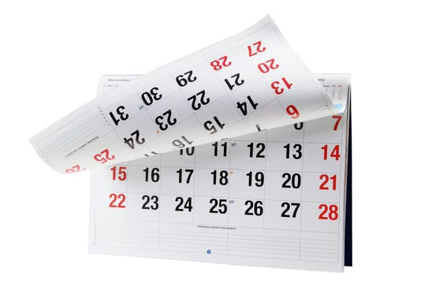

No, of course not. So when should your Team start and end Sprints? The usual rules of Scrum apply – ask the Team. Run an experiment.

There is an instinctive tendency to want to wrap up things at the end of the work week so we can unplug our brains for the weekend, and start things at the beginning of a new week. This is the biggest reason people cite for choosing Monday to Friday for Sprint cycles. But this doesn’t take into account some factors that your Team may want to consider:

- Long weekends force changes to your schedule, and will take out either your Sprint Review and Retrospective, or your Sprint Planning, if that’s how your Sprint cycle lines up.
- Friday afternoons are when people tend to be mentally checked out, thinking about weekend plans. Effective Retrospectives require attention and engagement, but holding them on Friday afternoons are more likely to lead to hurried and half-hearted participation.
- Monday mornings blues are a real thing. We’re either half asleep, reliving the weekend, or sad that we’re back at work. Putting Sprint Planning on a Monday leads to low energy input.

So, my personal preference is to start and end Sprints somewhere in the middle of the week. But your team should run experiments and discover what works for it! You’ll make better discoveries that way than by just taking my word for it.

(Image attribution: photodune)
