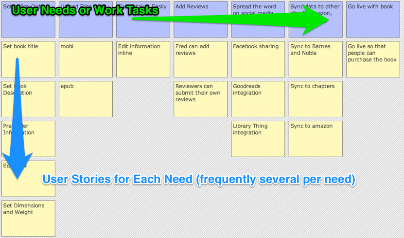

\[caption id="attachment\_3055" align="alignright" width="300"\] Attendees in Kitchener Waterloo - collaborating on building their Story Maps.\[/caption\]

Story Mapping is a simple tool to help you visualize your Product Backlog. The traditional Product Backlog in Scrum is a real improvement over traditional methods for tracking and understanding the work ahead. However it's still a long To Do List which has some issues:

- It’s hard to see the forest for the trees.
- It’s easy to miss important items in the morass of detail.
- It’s hard to prioritize well since we can’t see the big picture.
- It’s not explicitly focused on the user needs.

In other words, flat lists become confusing as the Product grows in size and complexity.

Story Mapping is a tool to help overcome these issues by helping the team visualize the needs of the end-users. Along the top we write out all the “User Needs”. On the Y-axis we create the Stories for each “Need” or task. Some “User Needs” aren’t of interest in the current release – so they might get no Stories. Other needs have a number of things that need to be done for them – so they get many Stories. In addition, each user gets their own map.

The key here is that the map acts as a tool to help organize the Stories. The map helps us spot gaps in our product and helps us discover the priorities. However, most importantly Story Maps help start conversations among team members about what we’re building.

The files below are from a series of Story Mapping workshops that I have facilitated in Montreal, Toronto and Kitchener-Waterloo this past year. If you would like to bring me into your company to facilitate a Story Mapping Workshop or teach a [Product Owner course](/certified-scrum-product-owner-cspo-training) please [contact us](/contact-us).

The files make the most sense if you’ve attended the workshop.

- [StoryMappingWalkThrough](/wp-content/uploads/2020/01/StoryMappingWalkThrough.pdf) - the keynote presentation I run in the background.
- [Story Mapping Basics](/wp-content/uploads/2020/01/Story-Mapping-Basics.pdf) - the basic introductory handout that all attendees get. It outlines some of the basic ideas behind Story Mapping and provides the core scenario for the exercises
- [Julia Persona](/wp-content/uploads/2020/01/Julia-Persona.pdf) and [Rob Persona](/wp-content/uploads/2020/01/Rob-Persona.pdf) - the personas that the audience gets to use for their exercises.

Photo by Mark Levison. Image by Agile Pain Relief.
