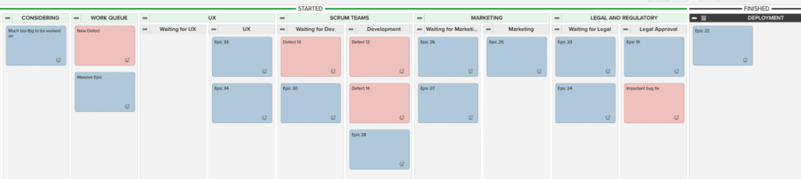
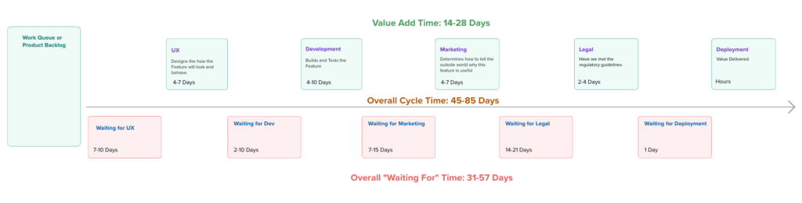

In our Scrum Alone is Not Enough discussion on [Portfolio Management](/blog/portfolio-management.html), we talked about what it is, and how the use of a Portfolio Kanban Board can help visualize challenges that are inhibiting work, including with parallel teams. That was tricky enough, but now let's tackle an even bigger challenge: managing work that happens before and after Scrum development teams. We work with many government departments and large organizations and some, for structural or regulatory reasons, have systems that operate in this way with upstream and downstream teams.

This article will focus on visualizing the flow of work from beginning to end, through all of the moving parts and teams. Once we establish a flow, we will learn to monitor it. Most importantly, we will start to make improvements. After all, there is little value in monitoring an existing process if it takes most of a Quarter to deliver value to the customer.

Let's look at how this works by using an example. Imagine an organization or department with two User Experience people, four Scrum Development Teams, a Documentation and Marketing group of five people, part-time access to one lawyer and access to a Deployment group. (_The makeup of this department and the data is fictional; any resemblance to a real organization is just luck.)_

Their Portfolio Kanban board might look like this:

All of the same challenges we visualized on the simpler board before still apply and some of them will get worse. Much worse. Before showing how,  we will study a fictional value stream map for this organization.

Assuming items never wait (which is unrealistic), it will take from two weeks to a month to get a Feature/Epic/Large PBI deployed. Worse, a system designed like this has a big failure risk built in. What happens if an item is rejected or requires rework after it goes through the legal/regulatory process? Depending on the problem, its UX may need to be redesigned or parts rewritten. Once the rework happens, it must then take another trip through the system. This will exacerbate all of the other problems illustrated on their kanban board.

Let's break down where time actually goes in this process:

<table class="has-fixed-layout"><tbody><tr><td><strong>Team</strong></td><td><strong>Waiting Time</strong></td><td><strong>Active Time</strong></td><td><strong>What's Happening</strong></td></tr><tr><td>UX</td><td>7-10 days</td><td>4-7 days</td><td>There are only 2 UX team members working for all 4 development teams. Some items need a few rounds of conversation with customers and stakeholders to make the key decisions.</td></tr><tr><td>Development</td><td>2-10 days</td><td>4-10 days</td><td>Work waits, at most, one two-week Sprint before a Development Team picks it up. Once started, items never take longer than a Sprint.</td></tr><tr><td>Documentation and Marketing</td><td>7-15 days</td><td>4-7 days</td><td>Many of the features that are worked on have a customer facing impact. They need documentation to be usable, and marketing for people to find them in the first place. This is complex work, and the whole department has only 5 people to do all of this work for all teams.</td></tr><tr><td>Legal and Regulatory</td><td>14-21 days</td><td>2-4 days</td><td>There is only one lawyer who can review the work, check legals, and approve regulatory compliance. They only support this department part-time. They do large batches of work and only do approvals when the entire batch is completed.</td></tr><tr><td>Deployment</td><td>1 day</td><td>2-4 hours</td><td>The Deployment team have embraced a DevOps type approach. They’ve automated most of the deployment work and so they spend only hours for most deployments.</td></tr></tbody></table>

These numbers tell a clear story: work spends more time waiting than being worked on. Think of this like a relay race. Even if each runner is quick, most of the time is spent waiting for the baton handoff. In our case, work spends more time waiting (31-57 days!) than being worked on (14-28 days).

As Agile Coaches, Scrum Masters and Managers, we usually look first at our development teams to improve the process. In this example, the developers only effect the 2-10 days of waiting time and additional 4-10 days to do the work. If we wave a magic wand that instantly does the work and optimizes for the throughput of the development, it would, at best, affect 20 days of time. Not even as long as the wait for the lawyer alone.

## Quick Wins: Monitor and Tune

Let's start with some immediate improvements. These won't transform your organization overnight, but they'll create momentum.

First, monitor the board regularly. Review it with Product Owners, ScrumMasters and representative team members from the upstream and downstream teams a couple of times a week.

As with our [Kanban Portfolio View](/blog/kanban-portfolio-view.html) post, the same strategies for visualizing challenges and resolving dependencies still apply to begin making improvements.

- Start with the items closest to being finished. What can be done to help them get to Done?
- Also, look for the oldest items since, as items age, there is a greater chance that they’re no longer valuable.
- See where items are stuck waiting most often or for the longest period of time. In our fictional example, it’s the lawyer and then marketing.
- Look for Blocked items and see what it will take to unblock them. At the level of a kanban board like this, blockages often relate to approvals (our board doesn’t model an approval process).

All of our efforts to this point have been steady state. Monitoring the flow of work through an existing system and playing the role of a jockey to get things unstuck. These initial improvements that we get here will help deliver the quick wins that are often asked for.

However, a steady diet of quick wins is like eating ice cream or chocolates all day long. They taste good at first, but too much focus on quick wins is unhealthy. Living within the limits of the existing system will ensure only adequate results for years to come. There will be challenges with both quality, and customer feedback that is so late as to be useless.

## Gather Data

Getting beyond quick wins, we need to make real improvements. To do this, we must study the workflow to see where to make change. If there isn’t already a value stream map for your organization, this would be a good time to create one so everyone has a visual representation of all the steps that work items take through the process.

Then start gathering Cycle Time data to understand how long the average item takes and, more importantly, how long the worst items take. This data provides a baseline for the improvement process. Many Agile teams pay attention to velocity, i.e. the number of PBIs completed per Sprint. Velocity (properly called Throughput) is far less important than Cycle Time. Optimizing for Cycle Time is about ensuring the value is delivered sooner. The sooner we deliver value, the sooner it gets used, and the sooner we will get real customer feedback. Remember the principle from earlier in the series: watch the work item, not the workers.

Look for cases where work late in the process (in our example, Legal or Marketing) finds a problem that forces work to return to earlier on the board (e.g. User Experience or Development). Items sent back are a sign of either not understanding the downstream needs (especially legal/regulatory) or defective creative/development work. In addition, items that get reworked are more likely to be a source of defects at a later date. Finally, items that get sent back for rework will have a much longer Cycle Time.

## Transform the System

Now it's time to make deeper improvements. Our goal is to improve the parts of the system that have the largest effect on delivery time. However, we may need more influence to make changes that far upstream or downstream in the organization. There might be issues of organizational politics and resistance to change—which is beyond the scope of what we will cover in this article—but we’ll share strategies that are within general reach.

Here are proven approaches, grouped by type of change and ordered by degree of difficulty:

### Help Other Teams

_These will be the smallest wins but the easiest to start with._

- Using our example for these, ask Marketing and Legal, "What could development teams learn to make your work easier?" Small tasks learned by development can reduce the downstream teams’ workload.
- If the legal review process finds problems, it tells us that teams don't understand the legal requirements. Start by ensuring all team members understand the legal/regulatory issues relevant to their work.
- Improve the Definition of Done so teams review their work against legal or other requirements before calling it finished. Yes, this reduces velocity, but it improves quality and reduces overall delivery time.

### Reduce Wait Times

- Create Work in Progress (WiP) Limits for each "Waiting For" queue. Yes, this means some teams might be idle, so use that time for cross-skilling.
- Work with downstream teams to reduce batch sizes. For legal reviews, this might mean more frequent, shorter reviews rather than big batch approvals.
- Look for automation opportunities. For example, automate the first pass of legal review so lawyers only spend time on complex issues.

### Cross-Skill Teams

- Take ideas from LeanUX and bring UX work into the Scrum Team. Over 6+ months, UX people can move from being the only ones who can do the detailed work to being consultants and advisors. Development teams learn basic UI design and experimentation, while UX focuses on higher-level work. This eliminates 7-10 days of waiting and 4-7 days of active work.
- Some organizations move marketing team members into development teams. Like the LeanUX approach, this eliminates 7-15 days of waiting and 4-7 days of active work. The trade-off? Again, lower velocity but faster delivery to customers.  
    If this much cross-skilling seems alien, it is the norm in the world of Lean Manufacturing. Many organizations pay more for people who can work across stations.

### Bring Work Earlier (Shift Left)

_These changes will be the hardest but have the deepest impact._

- Move legal considerations to the start of the work, not the end. As we learned to write tests before code, we can consider legal requirements during design. When features are being designed, legal considerations are brought up front to smooth the latter part of the journey. This is the same thing that the Agile community has learned about testing. Move testing to the start of the Sprint, not at the end. Instead of finding bugs after the code is written, we get better quality by co-creating the tests and a test plan before we start the work. (See Example Mapping](/blog/example-mapping-your-secret-weapon-for-effective-acceptance-criteria.html), [Behaviour Driven Development and Agile Testing for more).
- Apply this same "shift left" thinking to any part of the process that risks rejection.

The ideal end state? Upstream and downstream work happens inside development teams. While this takes years to achieve, each step in this direction reduces cycle time, improves quality, and gets customer feedback faster. Remember why Agile started - long development processes led to poor quality and late feedback. When work takes 47-89 days to deliver value, we face the same problems that sparked the Agile movement.

As long as we work in this environment, we need a board and process to track and manage the flow. Just as our teams inspect and adapt using the Scrum process, we inspect and adapt how we manage the portfolio itself.

### Continue the Improvement Cycle

We need to keep asking how we can improve flow in the entire department and how to improve the Portfolio process as well. The Product Owners, ScrumMasters, Development Team members and others who use this board and approach outlined here, should all participate in a Retrospective. They should use the retrospective process to shine a light on how work is flowing through the system.

### Measuring Success

Success isn't just about monitoring metrics - it's about delivering value faster. Look for:

- Reduced average cycle time
- Fewer outliers (no more "stuck" items)
- Less rework from marketing/legal
- Higher quality
- Faster customer feedback

## Start Small

In some organizations the steps outlined here might take two to three years. Start small.

\-              Find willing partners  
\-              Map and measure what you can  
\-              Gather data  
\-              Make some small improvements  
\-              Use the leverage this gives you to go further

 Your customers are waiting - what's the first step you’re going to take?
