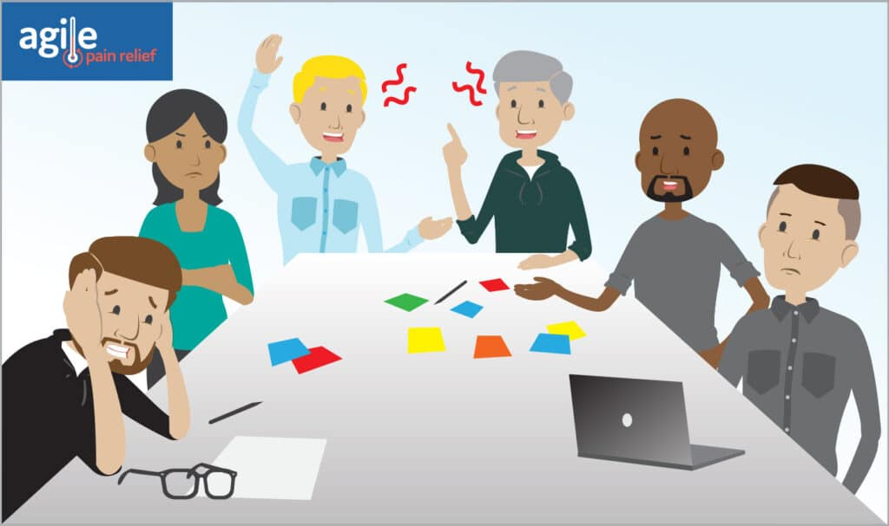

The World’s Smallest Online Bookstore team has just come out of their Sprint Review](/blog/dont-let-sprint-review-be-a-missed-opportunity.html). For those who’re keeping score, the team committed to a Sprint Goal: Have basic reader review system in place so book buyers can see a variety of opinions about a book. Their plan included completing seven Product Backlog Items and fixing two bugs as part of that Goal. By Sprint Review time they’d completed five of the seven. They walked into the Sprint Review with heads held high and, with the pummelling they took over not mitigating for fraud reviews, they left with their heads down. ScrumMaster Steve suggests they all go to lunch and reconvene for the [Sprint Retrospective in an hour and a half.

Steve knows they need a great Retrospective to turn this experience around. He has heard from others that you should mix up your retrospective style every few Sprints to avoid boredom and complacency. However, this time around he just wants to stick with a retrospective that he knows well. His agenda:

- Welcome
- Read the retrospective minutes from the last retrospective
- What went well?
- What didn’t go well?
- What can we improve next time?

Before the Retrospective starts, Don – the Director of Development and Steve’s boss – asks to join the Retrospective. Don explains that it was a bit of a bad Sprint and the team need to understand just how important it is to turn things around.

Steve has to think fast. He knows that if Don shows up at the Retrospective, even if he stays silent, his presence will cause the team to stop talking openly. Steve decides to take a chance. “Don, the team really appreciate the support you give them,” Steve begins, “but I’m concerned that if you attend the Retrospective, the team will say a great deal less. The less they say, the longer our problems will continue. So if you want us to improve more rapidly, please don’t attend the Retrospective.”

After a bit more discussion, Don gives in and says maybe he will address the team later in the week. _Whew_. Steve just dodged a tough problem.

The team return from lunch and the Retrospective starts. Steve welcomes the group and makes a few lame jokes to lighten the mood after the Sprint Review. He starts off by reading the minutes from the last Sprint Retrospective. He then asks the team, “What went well in the last Sprint? I will give people a few minutes to write at least three items on Post-it® notes.”

The team dutifully pull out their pens and start listing what they felt went well. It takes five minutes.

Steve asks the team to group together notes that are similar. Once that is completed, he asks what patterns they see. Tonia says, “There are a lot of notes highlighting how well we handled Quality this time round.”

“Several of us felt that we did a good job Limiting Work in Progress,” Brad remarks.

Jasmine noticed, “Looks like team members were happier with the code itself this Sprint. Most of the new code was easily readable.”

Doug and Ian are silent.

Steve asks the team to repeat the process to answer: What didn’t go well?  This time, the five minutes results in over forty sticky notes. Like the first round, they group them and Steve asks his killer question, “Looking over our notes, what is the biggest area for improvement in the next Sprint?”

At this point Kirby and Martin start talking animatedly. Kirby is really interested in tidying some of their technical debt. He thinks simplifying the worst of their code will make it easier to add the new features that Paula is asking for. Martin, who keeps talking over top of Kirby, says the database is a bit of a mess and he wants help from his teammates. Jasmine and Brad struggle to get a word in, but they do at least try.

Doug and Ian are silent.

In the final portion of the Retrospective - What can we improve next time? - Ian speaks up for the first time and complains that the responses given on the sticky notes are almost exactly the same problems the team faced last time, and the time before that as well. He quips, “Nothing ever gets better around here.” You can feel the overall morale in the room shrivel, as many silently agree.

Steve digs around in his notes and finds a few things that the team has improved in the past few months, and offers them as reminders that help keep things in perspective.

Once they refocus, the team agree to tackle two problems from the last Sprint:

- Features rejected by stakeholders in the Sprint Review
- Unit Tests that were few and far between during the Sprint

They turn these problems into two improvements:

- Paula will consult more with the Stakeholders prior to Sprint Planning.
- The Team will write more Unit Tests.

Steve adjourns the Retrospective, confident that these improvements will help avoid another bad Sprint.

### Analysis

Credit where credit is due. For a ScrumMaster early in his journey, Steve is well-prepared. He has a plan for the Retrospective. He knows that if their manager is present, psychological safety will go out the window. He uses a silent listing activity (the Post-it® notes) to ensure that the quieter team members have voice. _Hint: quieter people have just as much to contribute as the rest of the team. Their quietness is usually a sign that they don’t yet feel safe speaking up in front of the group and taking risks (this is at the core of psychological safety)._

#### Challenges:

\-        Like many first-time ScrumMasters, Steve is using the same agenda for his Retrospective each and every time: Went Well? Went Poorly? Improve Next Time? This leads to a couple of problems: 1) asking the same questions over and over means that we tend to get the same answers, 2) worse, using the same format constantly puts people to sleep. Before they even enter the room, they know what questions will be asked.

\-        Even worse, each activity has the same basic format: list ideas on Post-Itâ Notes and then have group discussion. I bet 3M is the only one enjoying this repetitive format.

\-        Steve took minutes from the last retro and read them out at the start, which is something he saw recommended by many sources on running effective meetings. In the right meeting context, this can save time rehashing past decisions and help a group see that they’re moving forward. But in a Retrospective specifically, this will violate the team’s sense of safety. They will wonder what will get recorded and, as result, they’ll speak less and keep their comments are mostly positive.

\-        Improvements like “consult more with Stakeholders” and “write more Unit Tests” aren’t action items, they’re vague goals. What is “more”? When should “consult” happen? What is the outcome we expect of these actions?

\-        When you’re talking with your friends over coffee, a discussion that wanders all over the map is fun. In a Retrospective it can become frustrating and lead to team members feeling like the whole event is a waste of time.

\-        The team don’t have real data from which to work. Lacking data, all the challenges observed, and the improvements claimed, are nothing more than opinion and conjecture.

\-        The rounds of open discussion are off-putting for quieter team members, especially in a team new to Scrum. These team members haven’t yet found their place of safety. Steve did a good job using a silent listing activity to start garnering ideas, however, that benefit was lost in the open discussion that followed when two team members who are quite vocal dominated the discussion.

### What could they do differently next time?

**Add variety with the agenda and activities.** Steve really needs to start mixing up his approach to Sprint Retrospectives. Ideally he would never use the same agenda twice. He would be better off if he could facilitate five to six different Retrospectives, and never used the same approach twice in a row. Our free eBook _[The Guide to Effective Agile Retrospectives](/guide-to-effective-agile-retrospectives)_ has a good start, and the [Retromat](https://retromat.org/en/) has more (>100 activities). Doing this will avoid Retrospective boredom. Done well, Steve will also select activities that promote more focused discussion, saving the pain of wandering all over the map.

**Note action items, not conversations.** Instead of taking minutes, Steve should really only record the Retrospective action items. A _good_ ScrumMaster would take those items and make them front and centre in the next Sprint Planning. A _great_ ScrumMaster would ensure that the same items are checked for progress in the next Retrospective.

When adding action items in the next Sprint Planning, include Improvements in the Sprint Backlog. Otherwise they’re too easily forgotten during Sprint, and you end up with a “Why bother with retrospectives when nothing ever gets better around here” attitude from team members.

**Avoid vagueness.** Speaking of action items, we need to turn vague statements into concrete, actionable steps. The simplest way is to call the vague action a goal, and then ask: what is the first step towards that goal?  For example:

- “Paula will consult more with the Stakeholders prior to Sprint Planning” becomes “Paula will schedule a one-hour StoryMapping exercise with key stakeholders (Director of Support, Eric, and Marketing Director, Jan) before each Product Backlog Refinement session with the team.”
- “The Team will write more Unit Tests” becomes “When writing a new Object/Class/Function, Team members will attempt to create at least three new Unit Tests.”

These actions can be raised in Sprint Planning, then tracked during the Sprint and reviewed for progress in the next Retrospective. If you want more tools to turn vague statements into actions, see The Guide to Effective Agile Retrospectives linked above.

**Use data.** The questions “What went well?” etc. lead to vague discussions that wander all over the map. More structured activities like Mad, Sad, Glad\[[1](#footnotes)\] or Sailboat\[[2](#footnotes)\] will help focus discussion but are still just opinions. Even better, have data that was tracked during the Sprint that can be shared in the Retrospective. Data can move the initial discussion from opinion to fact-based.

The simplest metric to track might be how long each individual story took to complete (fancy name: cycle time). Discussing why some Product Backlog Items took longer than others can lead to the team discovering things such as: some items were sliced small and were completed quickly (a good thing); some had dependency problems with an outside team; some items were poorly understood and took longer to complete. Discussion around why an item took longer might also shine light on an area of codebase that is harder to work in and needs improvement.

From one small set of data, many discoveries can be made. With a few more observations, deeper and more focused conversations can happen. Consider “Team Morale, Defects that Escape a Sprint and the use of Cumulative Flow Diagram”.\[[3](#footnotes)\]

Make it safe for all. Not only are open-ended discussions less productive, they’re also challenging for quieter team members to participate in. Remember, quieter people need to feel safe to share ideas. A good ScrumMaster will want to select activities that gives everyone a voice. For example, “Mad, Sad, Glad” invites the team members to share their thoughts on Post-it® notes. Since everyone gets the same number of Post-its®, they all have equal voice.

Other strategies might include: giving the team members a specific order to speak in for an activity. Where a quiet person needs more help communicating, some teams find them a partner/advocate to help explain the quiet person’s position. The goal in all of these cases should be to improve the psychological safety situation inside the team so that no one is afraid to give voice to ideas.

### _If your Retrospectives aren't yet fun and effective…_

Retrospectives are more engaging when they’re not repetitive, and they result in meaningful improvements. Improvements are more likely when we have data to act on, and everyone has an equal say. The role of ScrumMaster is to create a retrospective where this all comes together. If you want more depth on Retrospectives, grab a copy of our eBook – _[The Guide to Effective Agile Retrospectives](/guide-to-effective-agile-retrospectives)_. We'd also love to have you join us in our [Certified ScrumMaster training](/certified-scrummaster-csm-training).

\[1\] Original source – Agile Retrospectives Book – Diana Larsen and Esther Derby. Online description: [https://retromat.org/en/?id=7](https://retromat.org/en/?id=7) \[2\] Original source – Innovation Games - Luke Hohmann. Online description: [http://www.retrospectivewiki.org/index.php?title=Sailboat](http://www.retrospectivewiki.org/index.php?title=Sailboat) \[3\] All of these are covered in much greater depth in our free eBook – _[The Guide to Effective Agile Retrospectives](/guide-to-effective-agile-retrospectives)_

_Image attribution: Agile Pain Relief Consulting_
