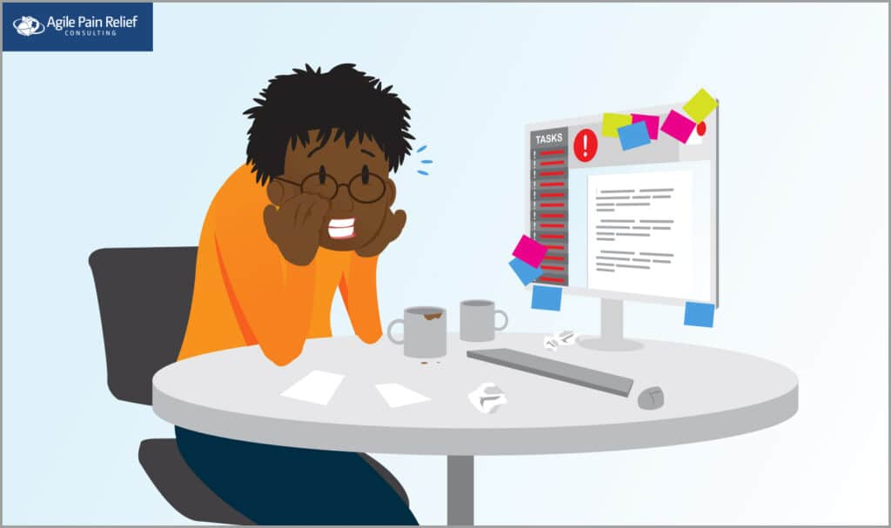
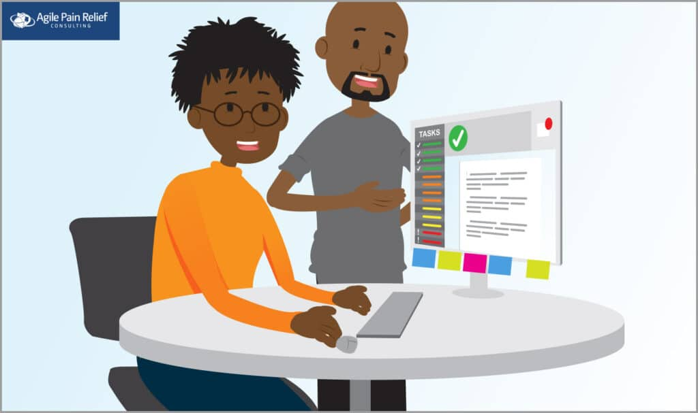

_A Scrum Sprint is incomplete when the Team can't deliver the working features they committed to. We cover the reasons for this and how you can help your Team._

#### Dramatis Personae

- Steve – a ScrumMaster and the hero of our story
- Paula – the Product Owner of Steve’s Team
- Tonia – the Team’s Quality Assurance specialist
- Brad – the Team’s Business Analyst
- Ian – the Team’s Business Logic programming specialist

Last time we met [Steve](/blog/scrum-by-example.html), he had discovered that the Product Backlog had not been discussed and estimated by the Product Owner and the Team. At Steve’s suggestion, the Team delayed the Sprint to have a [Product Backlog Refinement meeting](/blog/scrum-product-backlog-refinement.html).

The result was that all User Stories at the top of the Product Backlog were properly discussed with the Product Owner, Stories that were too large were split into smaller ones, and all the Stories now have estimates. They have now completed Sprint Planning and started their Sprint on developing features for the World’s Smallest Online Bookstore.

### The Sprint starts out looking okay…

Coming out of the Sprint planning meeting, the Team has committed to five Stories. Their overall Sprint Goal is to get the customer’s book home:

- As a book buyer, I want to add my book(s) to my shopping cart so that I can purchase it – Story Points: 13
- As a book buyer, I want to tell Amazon where I want my book(s) shipped so that I can receive it from a convenient location – Story Points: 8
- As a book buyer, I want to see the price for my book(s) with shipping and tax so I can see whether I’m okay with the price – Story Points: 3
- As a book buyer, I want to choose my payment type (MasterCard, Visa, Amex, or Paypal) so that I can pay for my book(s) – Story Points: 3
- As a book buyer, I want to pay for my book(s) quickly so I can get my purchase home – Story Points: 13
- As a book buyer, I want a confirmation message so I can see that the purchase was successful – Story Points: 2

The Team starts work on the first four Stories right away. Tonia (Quality Assurance specialist), spends the first few days working with Brad (Business Analyst). They clarify the [acceptance criteria](/blog/definition-of-done-user-stories-acceptance-criteria.html) and she designs her test cases or test plan. When the acceptance criteria are unclear, they circle back with Paula (Product Owner) to get the best answers.

### ... but then it became clear these were big problems they were tackling.

By Monday, the fifth day of the Sprint,  Tonia had completed all of this work and was hungry for an application to test. In fact, she was wondering why she hadn’t seen anything yet. Lacking an application to test she found other things to do outside the team.\[[1](#footnotes)\] It wasn’t until Wednesday (Day 7) that she finally had the first story (add my book to my shopping cart) to test. Because it was such a big story and technically complex, it took much of the day just to get everything set up to run the test. By the end of the day though, she had found a dozen issues and shared them with Ian, the Team’s Business Logic programmer.

“Add my book to my shopping cart” was clearly not ready. In the meantime, the other, smaller User Stories were piling up in front of Tonia, leaving her unable to keep up with testing.

By the end of the Sprint, the Product Owner, Paula, had accepted only two User Stories as complete: “see the price for my books with shipping and tax” and “choose my payment type;”  a total of five Story Points out of the 42 they had committed to. Everything else was incomplete.

### What went wrong with the Sprint?

Most teams will struggle when they start working with a new approach. The heroes of our story created three problems for themselves: Too Much Work in Progress; Overcommitment; and Pipelining

## 1) Too Much Work in Progress

On the first day of the Sprint, the Team started work on four items at once. This divided the attention of the Team members and slowed work down on all of the items. At first, this result seems counter-intuitive – we expect that by starting more items, we will get them all done sooner. Yet, the experience of Toyota with its Lean Production System,\[[2](#footnotes)\] and repeated in the study “[The Impact of Lean and Agile Quantified](https://www.infoq.com/presentations/agile-quantify/)”, more Work In Progress (WIP) decreases the number of items that a team completes and increases the defect rate.

Since the data we can gather is correlative (e.g. more WIP happens at the same time as the team gets less done), we have to speculate as to the reasons why. More WIP leads to: more [Multitasking,](/scrummaster-resources-and-references#multi-tasking-and-interruptions) reduced Focus time, more handoffs, and limits on collaboration. These combine to harm both throughput and quality.

[Does your grocery store limit Work in Progress?](/blog/does-your-grocery-store-limit-work-in-progress.html)

## 2) Overcommitment

Each Team comes up with its own sense of what a Story Point\[[3](#footnotes)\] represents, so there won’t be common numbers. When helping people with estimation, I offer a guideline to help calibrate: for a size ‘2,’ or small story, the Team should select something that they believe represents 1/5th to 1/10th of the whole Team’s capacity to do work. I also suggest that the Team select a larger item that might take the whole Team an entire Sprint to complete and call that a ’13.’ Items that are larger than a ‘5’ typically have enough ambiguity within them that the Team is better off splitting the item before attempting work on it so they have a truer sense of the time that will be needed.

If the heroes of our story had followed this guideline, they would have known that their over-commitment was quite large, and were realistically never going to be able to complete the Sprint.

## 3) Pipelining

The final problem is a more advanced concept and it is unlikely that a Team in their first few Sprints will be ready to solve this, but it is something they should be aware of as time goes by. This Team is still using a conventional, traditional-style approach to work, where every task is done sequentially by specialist roles. This might work for a problem where the outcome is predetermined and everything can be sequenced, but it often doesn’t work well in software development or any other realm of knowledge work.\[[4](#footnotes)\]

In Scrum, [Teams are cross-functional](/blog/how-to-cross-skill-and-grow-t-shaped-team-members.html) to better learn and adapt to constantly changing circumstances.

However, Steve’s Team is still learning this. Tonia, Brad, and Ian all have their specializations and, during the Sprint, do little work that falls outside their areas of expertise. This is also known as [Scrummerfall](/blog/scrummaster-tales-cascades-team-discover-scrummerfall.html), and is common for organizations starting with Scrum to do, as it is usually one of the biggest shifts in the way they do work, and it takes time to make this transition.

The consequence of this is that Tonia is the only one doing QA testing, while the rest of the Team occupies themselves with other things, despite QA clearly needing focus and help. In the long-term, it will mean that the Team has to wait even longer to get feedback on a given User Story, impeding their ability to learn and integrate feedback into future Sprints, ultimately making change costlier for the entire project.

_**[Scrum by Example](/blog/category/scrum-by-example) is a narrative-style blog series designed to help people new to Scrum, especially new ScrumMasters. If you are new to the series, we recommend you [check out the introduction](/blog/scrum-by-example.html) to learn more about the series and discover other helpful articles.**_

### Does your Team struggle with these kinds of challenges?

Like so many Teams that are still learning to practice Scrum, Steve’s team didn’t get everything right in an early Sprint. However, they committed to learning from it and, doing so, took themselves one step closer to [becoming a high-performing team](/high-performance-teams). If you are finding these kinds of impediments with your teams or organization, and want to learn how to handle them better, [consider attending one of our workshops](/certified-scrum-agile-training), where you’ll receive hands-on learning of the challenges – and solutions – and tips on how to help your Team learn and grow to realize their potential.

\[1\] Mark’s note: This is not a good thing – having Team members doing work outside of the boundaries of the Team is usually a sign of some kind of dysfunction or larger problem in how Scrum has been implemented, as is the case here. \[2\] Lean calls Work In Progress “Excess Inventory” - [https://en.wikipedia.org/wiki/The\_Toyota\_Way](https://en.wikipedia.org/wiki/The_Toyota_Way) \[3\] Caveat – Planning Poker and Story Point estimation aren’t part of Scrum but they’re often useful techniques that are used in conjunction with Scrum. \[4\] Knowledge work is where thinking is the largest part of the work: [https://en.wikipedia.org/wiki/Knowledge\_worker](https://en.wikipedia.org/wiki/Knowledge_worker)

Image attributes: Agile Pain Relief Consulting
