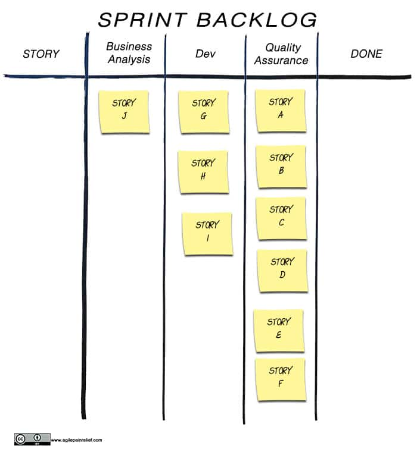
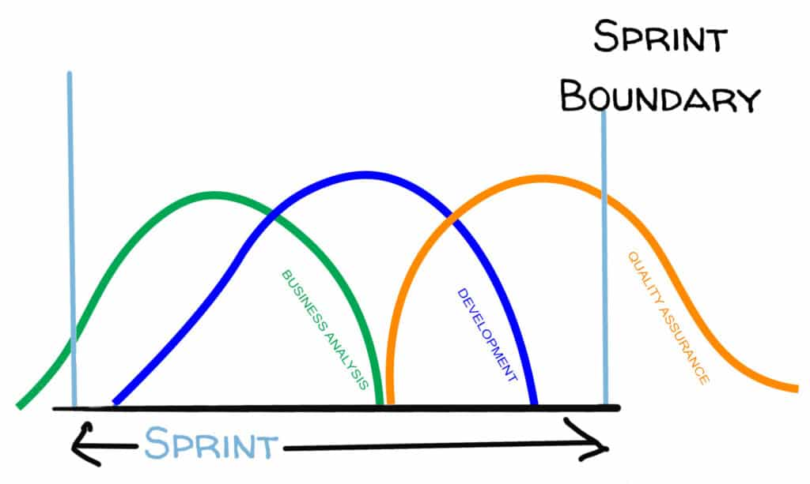

Is your Scrum team struggling with questions about who owns quality? Is testing way behind development? Are team members claiming no time for retrospective because they’re focused on delivery? They might be victims of what some call Scrummerfall, or Mini Waterfall. _Let’s use our fictional [World’s Smallest Online Bookstore (WSOBS) Scrum team](/blog/scrum-by-example.html) to explore what this Scrum anti-pattern is and the damage is causes._

**Dramatis Personae:** Steve – a ScrumMaster and the hero of our story Paula – Product Owner of Steve’s Team Tonia – Quality Assurance specialist Brad – Business Analyst Martin – Database Developer Doug - Front End Developer Ian – Business Logic programming specialist

Martin, Doug and Ian approach ScrumMaster Steve two days before the end of the Sprint and say, “We won’t be attending the Retrospective this week. We’re working fast, we’ve finished this Sprint’s work and have already started work on the next Sprint. We just don’t have time for the retro, but we’re getting stuff done, so that’s okay.”

If half his team is going to be absent, is there any point in Steve holding a Sprint Retrospective? Yes, however, that isn’t the focus for this post. Scenarios like I’ve just described are a proverbial canary in the mineshaft.  When Scrum team members lack time or interest in the Retrospective, that tells us there is a problem somewhere else in the system. Rather than find a band-aid or quick fix, a Scrum Master is better off trying to understand what is happening that leaves their team in this position.

A general working assumption when we see good people doing something strange is that  we should examine the system to understand what it is telling us. In this case, why are our developers working a Sprint ahead?

When we see a team struggling, if we take the time to review the [Sprint Backlog](/blog/the-humble-sprint-backlog.html) it will often tell us a good story. So let’s dive into the recent flow of work of the World’s Smallest Online Bookstore team, through the lens of their Sprint Backlog.

It’s day 8 of a 10 day Sprint and their board looks like this:

From this we can see that:

- the Sprint’s work is still untested
- our Business Analyst and Developers have raced ahead and picked out work that might happen in the next Sprint

Steve sits down with the impatient threesome and asks, “What is up that you’ve already started work on stories for the next Sprint?”

Martin answers, “Well, we handed off all our stories to QA, so we had nothing to do. Instead of twiddling our thumbs, we grabbed more work. Isn’t Scrum about giving us autonomy and getting stuff done? In any case, Retros aren’t that important. They just take up time and the real pressure is to get more work done, faster.”

**Not understanding the value of Sprint Retrospectives is, sadly, not a new issue with these team members. Read also: [Same Old Song in Sprint Retrospective](/blog/same-old-song-in-sprint-retrospective.html).**

## Analysis

Some team members have completed their work for this Sprint so they are working ahead on the next Sprint. Great, right? No idle workers, and all that. The organization is all about speed, and the team all need to be seen being busy.

Except it’s the exact opposite of great. Because while our developers moved on, the testers can’t get everything tested by the end of the Sprint. So starting the next Sprint, they’re still testing the last Sprint's work. The Product Owner is scrambling to stay ahead of the devs and still keep up with the rest of their responsibilities. On top of all this, the team is being pressured to "maintain" velocity. Even worse, the Sprint Review becomes a fiction because, instead of reviewing completed work that can be delivered to stakeholders, the review is of partially completed work that will have unknown defects.

The simplest thing to say is that this resembles a mini waterfall. However, that doesn't help our team. In practice, **the team have created what’s called Scrummerfall**.

## Why is Scrummerfall (or Mini Waterfall) in Scrum a problem?

First and foremost, because quality suffers in Scrummerfall. The longer the time span between finding a problem and fixing it, the harder it is to fix well. When a defect is found with work done in a previous Sprint, the developers might be reluctant to go back and fix it right away, claiming this is slowing them down. This is especially bad in an environment where teams are focused on velocity. The bug was already hard to fix because it was found later, and delays in fixing it just make the problem worse.

Handoffs harm quality (e.g. from BA -> Dev -> Test). Every handoff from one person to another causes a loss of information, which increases the likelihood of a bug.

Working ahead of the rest of the team also affects cycle time. Cycle time is the time from when work is started on an item to when the customer gets the value. In the case of our Bookstore Team, this is going to be at least two Sprints (4 weeks), because items are delayed waiting for testing and aren’t truly ‘Done’ and deliverable.

And that’s even assuming that deployment is instantaneous and there are no defects - neither of which is likely to be true. Cycle time matters because it is what the customer sees. They see the team has started work on the item and they see when they get the item. They don't care what order the work was done in or who did which part. They care whether or not they waited an eternity and if their feature works as expected on delivery.

## What Causes Scrummerfall?

How did our team end up doing this Scrummerfall version of Scrum to begin with? This is where, if you dig down, you’ll find the underlying issues (Hint: this is the Start of Systems Thinking which we cover in our A-CSM). In this case it often stems from a mindset issue within the organization:

- An assumption that Scrum is like the traditional approach, only faster.
- An adversarial relationship between development and test.
- A focus on throughput or velocity above all else.

Assuming we agree that Scrum isn't just the traditional process done faster, we need a better approach. What is a more effective way of working?

## Better Ways to Work Than Scrummerfall

- **Introduce Cycle Time as a measure** so we can see what we're improving. In the short term I would expect the Bookstore Team to focus on reducing their cycle from 4 weeks to 2 weeks. This is guaranteed to reduce their velocity. Since [velocity is a dangerous measure](/blog/measurement-for-scrum-what-are-appropriate-measures.html) and often not even a good forecasting tool, we need to wean people from its use. _Cycle time is a better measure because it challenges us to optimize getting the value to the customer sooner._
- **Consider another measure like "Defects that Escape the Sprint"** as being a proxy for quality. _This will help us understand what happens to our quality over time. Our eventual goal is zero defects that escape the Sprint. Even if we never get there, it challenges the team to focus on quality over nominal speed._
- **Reset the relationship between Dev and QA**. QA isn't trying to find bugs, so their performance shouldn't be measured by the number they find. QA is trying to _prevent_ bugs. _Many teams have an adversarial relationship between Dev and QA because they see it as critiquing and looking over the shoulder of each other’s work._
- [**Encourage collaboration**](/blog/collaboration-over-work-in-isolation.html). Since QA, Dev and BAs are all attempting to build the best quality, they should start the Sprint by collaborating on getting the detailed [acceptance criteria](/blog/scrummaster-tales-team-collaborate-acceptance-criteria.html) for the User Stories, with a strong preference for examples (aka Behavior Driven Development). They might even pair-program with the Devs to create automated tests for the acceptance criteria. Collaboration on acceptance tests, BDD, and test automation are all longer term steps that increase quality. As collaboration becomes more natural, it would be a good opportunity to run a cross-skilling workshop.
- **[Encourage cross-skilling](/blog/how-to-cross-skill-and-grow-t-shaped-team-members.html)**. As team members start to collaborate more, some cross-skilling will start to happen naturally. You can't help but learn more about other disciplines when you spend time working together every Sprint. Cross-skilling strengthens relationships and morale, and significantly reduces bottlenecks.
- **Support the team to grow** into Pair-Programming and the whole host of other Agile Engineering Practices.

Scrummerfall happens when team members stay stuck in traditional patterns and roles. Scrum (and all flavours of Agile), expects us to continually reconsider how we work and ask what small changes we can make next.

When some or all of a Scrum team goes to the Scrum Master and resists the basic framework of Scrum, don’t force the issue. Instead, use it as an opportunity to look deeper for what’s really happening. If you find problems like the team feeling they have no time for a retrospective or no interest in holding one, don't solve the surface problem by canceling or replacing the retrospective or, much worse, forcing them to attend. Instead, dig into the why to find the deeper problem.

The Scrum framework leaves a lot of wiggle room to adapt it in unique ways to best suit your own team’s needs. But don’t abandon the basic structure (like retrospectives) when something isn’t convenient. All of the Scrum events serve a critical role in the overall effectiveness of Scrum.

**Related:**  [Scrum by Example – The Story of an Incomplete Sprint](/blog/scrum-by-example-the-story-of-an-incomplete-sprint.html) [Quality Assurance in Scrum](/glossary/quality-assurance-in-scrum)
