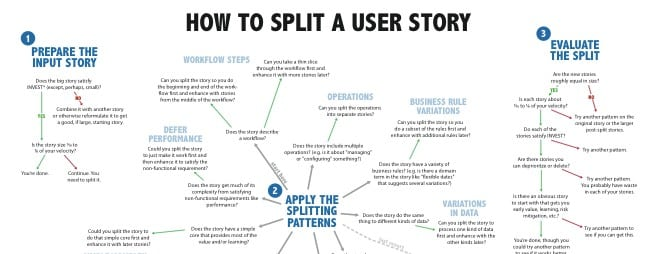

User Stories are a common tool used by Agile Teams to capture the spirit of a requirement without too much detail. Sometimes User Stories are too large for the team to complete safely in one Sprint. In fact, I recommend that you [split the Stories](/blog/scrummaster-tales-story-splitting-fun.html) into small enough sections so that you’re completing 5-10 Stories per Sprint; it improves the flow and makes it easier to deliver complete chunks of value at the of the Sprint.

[In my classes](/certified-scrum-agile-training) I frequently ask teams to present what they’ve learned to their peers. At UBC they took it one step further. The teams were challenged to summarize Richard Lawrence’s Story Splitting Flowchart:

They created a play, “Spike Sherman”. Our story opens with Diane preparing the original User Story, “Cong + Sherman”.

Clearly too large – so the team’s splitter, Jason, applied the patterns from the handout and broke the Story into its constituent pieces: Cong and Sherman. Once split, the Story was sent to Yurika to be checked against **INVEST**:

(Original idea from Bill Wake: [https://xp123.com/articles/invest-in-good-stories-and-smart-tasks/](https://xp123.com/articles/invest-in-good-stories-and-smart-tasks/)):

**Independent** - dependencies between Stories limit the flexibility of both the Product Owner and development team. The Product Owner should be able to ask for Stories in whatever order makes sense.

**Negotiable** - the elegance of a User Story is that the precise details are left until later. It gives the Product Owner and team a chance to delay unnecessary decision-making until implementation begins. It allows the team to discover new options right up until they're done.

**Valuable** - Each Story needs to deliver some small sliver of value all on its own. In other words, the customer has to be able to see the value. This pushes us towards slicing our work into vertical chunks; and not technological layers.

**Estimable** - If the team, through lack of experience, can't estimate a Story, they shouldn't fake it. Instead, they should run a short experiment to gain that experience. These experiments are called Spikes.

**Sized Appropriately** \- Stories at the top (approximately the next 3 Sprints) should be small; so small that the team should be able to get 5-10 similar-sized Stories completed every Sprint. Stories in the middle of the Backlog (between 4 -10 Sprints out) should be larger. The team might only complete 1-2 of these in a Sprint. Stories of this size are often called Epics. Further out and the Stories are very large.

**Testable** - It is clear how you will test this.

Cong was tested against INVEST and was found to meet all of the criteria. He was returned to the Product Backlog for estimation and implementation in an upcoming Sprint.

Sherman was also brought before the INVEST checker; unfortunately, it was discovered that he couldn’t be Estimated. He was immediately taken out into the hallway, and a Spike was conducted by Jack.

**Spike**: a special User Story the team uses when there is some special risk involved. Usually the team don't have enough information to give an estimate.

Spikes are:

- Timeboxed usually 1-2 days work for one pair
- Experimental solutions that touch all relevant layers
- Are always throwaway code

The purpose of the Spike is to give the team enough information to do an estimate later. It’s written quite rapidly without any real concern for code quality.

Eventually Sherman was returned, and now it was clear a split was required. He was returned to Jason who applied the splitting patterns again. Once he was split, the two halves of Sherman were appropriately sized.

All’s well that ends well. No harm came to Sherman.

Thanks to Cong, Sherman, Diane, Yurika, Jason and Jack for the most entertaining presentation I’ve seen in a long time.

"How to Split a User Story" image by Richard Lawrence. Photos by Mark Levison.
