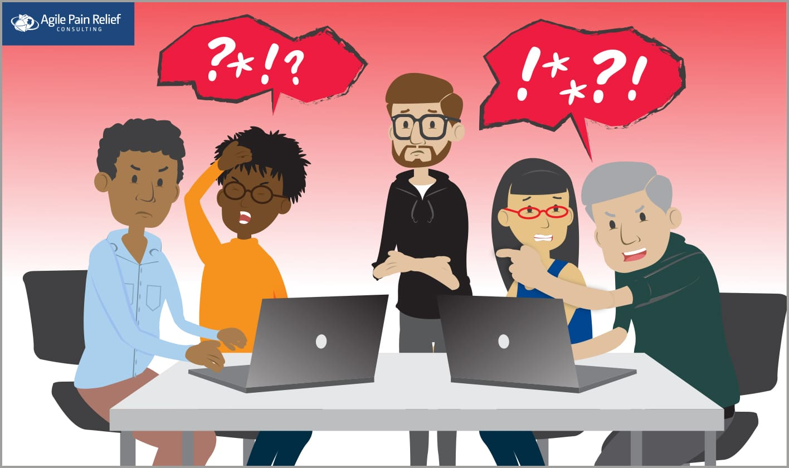

_Scrum team [**Working Agreements**](/glossary/working-agreements) are a simple, powerful way of creating explicit guidelines for what kind of work culture you want for your Team. They are a reminder for everyone about how they can commit to respectful behaviour and communication. In this post we’ll see how the fictional World’s Smallest Online Bookstore (WSOBS) Scrum team struggles without a Working Agreement, and why having one would be useful._

**Dramatis Personae**

- Steve – a ScrumMaster and the hero of our story
- Paula – the Product Owner of Steve’s Team
- Kirby – one of the Team’s software developers
- Tonia – the Team’s Quality Assurance specialist
- Doug – another of the Team’s software developers
- Ian – the Team’s Business Logic programming specialist

In the past few Sprints, there have been moments of social friction noticed by both Steve and the rest of the WSOBS Team. They included:

Kirby was blunt when discussing a defect with both Tonia and Ian.

Some discussions with the whole Team became so heated that the quieter team members stopped speaking up for several days.

Doug was late for Daily Scrum on several days.

On multiple occasions, Team members needed to ask Paula some questions, but she wasn’t available by email, and they often didn’t know how to find her.

None of these individual issues was truly bad, however, taken together and left unchecked, they harm the Team’s cohesion. When that happens, people opt to stay silent when there is an opportunity to share an opinion, and events like Daily Scrum becomes less useful when Team members signal their disrespect by frequently being late.

During the next Retrospective, Steve mentions a few of these issues and says that he wants to talk about making their environment better. Tonia shares that she knows another one of their peer teams has created their own Working Agreement to reduce some of the friction and improve respect.

Before we see how Steve helps his team in this episode, let’s make sure we understand what a Working Agreement is, and should be.

## What is a Working Agreement?

A Working Agreement is a short set of guidelines created by the Scrum Team, that establishes what the expectations of the team members are for one another. A well-written Agreement should help establish and reinforce a clear, shared understanding about what team members agree is good behaviour and communication.

## Why do Working Agreements Matter?

Working Agreements help make implicit social expectations explicit. (Whoa, that’s a mouthful.) They invite team members to tell each other what matters to them on a whole host of topics. This leads to a shared understanding and, in return, a reduction in friction. Done well, they also invite open and honest communication which helps create psychological safety.

## Characteristics of an Effective Scrum Team Working Agreement

A Working Agreement doesn’t have a police force to ensure that it’s followed. Its effectiveness comes from being:

- **Public and Visible** – preferably written in a large font and posted in a prominent space (perhaps where Daily Stand-up takes place)
- **Collaborative** – created by all, not imposed by others
- **Short** – a small list of agreements that are easily remembered and lived up to trumps a big list that overwhelms people and gets forgotten
- **Updated Frequently** – [Taiichi Ohno](https://blog.gembaacademy.com/2010/02/16/excerpts_from_an_interview_with_taiichi_ohno_july_1/) once said: "If the kanbans do not change for one month, you are salary thieves"
- **Consequential** – when the agreements are violated, Team members call out the violation with respectful reminders

### Working Agreements Should be Unique to Team Needs

Each Scrum Team will create its own Working Agreement based on the context of its work. Elements of an Agreement might include some of these examples:

- Core hours – times during the day that all Team members agree to be present and available for collaboration.
- Daily Standup – the time that it happens.
- Attendance for meetings or events – whether or not you agree to support decisions made. in your absence, whether you will let your team know in advance if you can’t attend.
- Product Owner – availability and contact information.
- Definition of ‘Done’
- How the Team limits Work in Progress.
- How the Team ensures everyone has an equal voice and feels respected. For example, use of a talking stick, where the person who has the stick has the opportunity to talk and everyone else focuses on them. My favorite tool is a bean bag or ball that can easily be tossed from person to person, rather than a stick.
- Decision-Making Process and Rules - establish a clear process for making decisions: consensus-based decision-making or voting mechanisms as needed.
- Skill development – maybe it’s agreed that during each Sprint at least one Team Member will work on growing a skill outside of their core strengths.
- Technical Debt - in the case of software development, maybe there’s an element that states every Sprint the Team will make an effort to improve some part of their codebase.
- Guidelines for handling impediments.
- An understanding of how to resolve conflict – for example, ask for a facilitator, or echo back your understanding of the other person’s viewpoint, etc.
- Handling Outside Interruptions - define procedures for managing interruptions during the Sprint itself, such as setting expectations with stakeholders and limiting distractions within the team.
- Sustainable Pace - how can the team ensure that they're committing to work that is realistically achievable in the Sprint?
- Team Values - review the Scrum Values and decide how they apply in your world. As a reminder, the Scrum Values are "Focus, Commitment, Courage, Openness and Respect". Many teams also discuss topics that include collaboration, continuous learning, and customer focus.
- Communication Channels - agree on preferred communication channels (e.g. Slack, Microsoft Teams) for day-to-day interactions and set expectations around response times. (_Hint: instant response is unhealthy._)
- Collaboration Tools - choose appropriate tools (e.g. Mural, Miro) to facilitate team collaboration and ensure everyone has access to them.
- Celebrating Successes - how will the team celebrate successes?
- Handling Disagreements - establish protocols for addressing disagreements within the team.
- Violations of Working Agreements - define a simple rule on how to point out when someone breaks the working agreements.

#### Co-located teams might have working agreements for:

- Cell phones – if or when it is appropriate to use them during Team events.
- Headphones – when it is fine to use headphones, versus when Team members will not use them so they’re available to communicate and collaborate with others.

#### Remote teams might consider:

- Use of cameras in online meetings - establish guidelines around camera usage. (_Hint: collaboration is more effective when our cameras are on where possible._)
- Commitment not to use other tools (email, chat, phone, …) during team events.

#### Hybrid teams:

- The day(s) of the Sprint that all team members commit to being in the office (_Hint: where practical, Sprint Planning, Review and Retrospective are more effective in person_.)
- How to include remote team members in a meeting when half the team is in the office and the other half is online.

## Working Agreements and Scrum Values

As part of a team coming up with their own list of elements to have in their Working Agreement, it is worth considering the Scrum Values as a source of guidance:

- **Focus**: Because we focus on only a few things at a time, we work well together and produce excellent work. We deliver valuable items sooner.
- **Courage**: Because we are not alone, we feel supported and have more resources at our disposal. This gives us the courage to undertake greater challenges.
- **Openness**: As we work together, we practice expressing how we’re doing, and what’s in our way. We learn that it is good to express concerns so that they can be addressed.
- **Commitment**: Because we have great control over our own destiny, we become more committed to success.
- **Respect**: As we work together, sharing successes and failures, we come to respect each other, and to help each other become worthy of respect.

Teams normally create a Working Agreement before their first Sprint by setting aside an hour or two beforehand. In the case of our fictional World’s Smallest Online Bookstore (WSOB) Team, they haven’t yet. No time like the present!

### How To Build a Scrum Team Working Agreement - How Can a ScrumMaster Help?

Sensing the atmosphere of the Team, Steve starts by helping them learn about Working Agreements. He first ensures that the Team understands what Working Agreements are, and how they will personally benefit from having them.

_Mark’s note: Spending some time on a good setup will reduce cynicism among Team members. Giving people some categories or areas in which Working Agreements will help, gives them a framework. For instance, [in our workshops](/certified-scrum-agile-training), categories are cell phones, laptops, break times, and punctuality. In the context of a Team, you might use some of the areas mentioned above, and perhaps draw on the Scrum Values, but ultimately the Team chooses what works best for them._

Steve then facilitates a Retrospective to help the Team and Product Owner come together to sort out some of their problems. During the process, they discuss the friction they have felt over the previous few Sprints. They agree to create a Working Agreement and, since it will likely take over an hour, they elect to make it an action item for the next Sprint Retrospective.

_There isn’t an official or correct way to create Working Agreements, so Steve uses the approach that I share in my workshops. As usual for a ScrumMaster, good preparation pays dividends. Consider canvassing the Team beforehand about categories/areas for agreement._

### Facilitating the Creation of a Working Agreement

#### Check-In

As with Retrospectives, asking check-in questions helps to give team members an opportunity to engage with the purpose (in this case, create a Working Agreement) and to understand what might have your teammates worried or preoccupied. Try using a round-robin format, where each person speaks one-on-one with everyone else, in turn.

Some opening questions you might use:

- What has your attention today?
- What keeps you up at night?
- How would you describe where your head is? And your heart?
- What are you grateful for?
- How are you feeling today?

Once we’ve established where our teammates are at as people, we can move on to crafting the working agreements proper.

#### Coach, But Don’t Lead

Use prompt questions such as the following examples to help the group craft their Working Agreement:

- “What are the decisions that, if made now, could help us in the future when the pressure is on, or things haven’t gone our way?\[[1](#footnotes)\]
- How do we envision our interactions and behaviours?
- What are our shared values and principles?
- How do we handle conflict and challenges?
- How do we hold each other accountable?
- How do we uphold these working agreements?

Get everyone to answer. Explain the format you will use and any ground rules that you have in place.  For example, you might have ground rules:

- Assume positive intent
- If you say ‘no’ to a proposed item, you’re expected to try to make it better.
- Use the Decider Protocol:\[[2](#footnotes)\] Thumbs Up – I’m good; Sideways – I can live with it; Thumbs down – I will block this proposal.

Break groups larger than five people into sub-groups. _In my experience, it’s easier to get small group agreement first, then bring it back to the whole._

Invite the small groups to create a potential Working Agreement in each area or category. Invite them to create any additional Working Agreements they feel are needed to address concerns or conflicts.

At the end of 5-10 minutes, get the groups back together and review the proposed items.

After a couple of rounds of proposals, if there isn’t any consensus on a particular item, move on —they can’t establish an agreement in that area for now. Consider revisiting the item the next time Working Agreements get deliberated.

Every few Sprints, the Working Agreement should be updated, often by checking it in Retrospective and asking a question like, “Are these still our working agreements? What would we like to update? What areas need new agreements?”

After talking to Team members, Steve selects “Daily Scrum Start Time,” “Respect,” “Phone usage in Team Events,” and “How to give everyone equal voice for discussion” as elements to include in the Working Agreement. He explains that if there are other categories that the Team would like to consider including in the Working Agreement, they’re welcome to add them as they go.

Given the previous friction between some Team members, he opts for a 1-2-4 model\[[3](#footnotes)\] for discussing possible agreements. This model is designed to ensure that everyone has a voice in the process:

- Each Team member (1) takes a few minutes to share to the whole group their ideas for potential agreements in each category.
- They then work in pairs (2) to record the best ideas from each person. As facilitator, Steve is paying attention to the conversations and outcomes. It should be a red flag if one person is dominating their partner during this step.
- Next, they move to groups of four (4) to further consolidate their ideas and present them to the group for discussion. In the case of Steve’s Team, there are only six people, so they skip this step and move straight to final group consensus.

Steve starts asking for proposed agreements in their first area of focus: Daily Scrum Start Time. After each potential working agreement, he uses the Decider Protocol\[2\] to check for consensus rapidly. When there isn’t immediate consensus, the person who said ‘no’ to an idea suggests what they think is a better one. If multiple people have an issue, then each is expected to offer a better idea. If too many people say no, then the proposer should consider withdrawing the proposal.

In the case of Steve’s World’s Smallest Online Book Store Team, after 20 minutes, the team have their first set of Working Agreements:

\- Respect – when another Team member is talking, don’t interrupt. When they’ve finished, pause, reflect, and share back your understanding of their idea.\[[4](#footnotes)\]

\- Make sure everyone has a voice – more vocal Team members volunteer to speak last to give quieter Team members an opportunity to speak up.

\- Daily Scrum is 9:20 am, allowing all Team members to get their kids to school before coming in to work.

\- Cellphones in Team Events – they stay outside the room.

\- To improve the quality of all ideas, we encourage respectful dissent. At least one Team member volunteers to be the dissenter. Even if they think the original idea is good, they’re expected to find criticisms of the idea with the goal of making it stronger.\[[5](#footnotes)\]

\- Focus – during the Sprint, the Team is focused on the Sprint Goal. If something comes up that doesn’t fit the goal, Team Members are expected to say no.

_Notice that the last two items weren’t among those previously suggested by Steve, instead, they appeared organically._

Steve then offers a suggestion of his own: “If you miss a meeting/event it is expected that you will support the decisions made there.” Kirby, who has previous experience facilitating, reminded Steve that if he truly is playing the role of facilitator as part of his ScrumMaster duties, then he is expected to remain neutral and not inject his own ideas.

The Team compiles all the individual agreements in the Working Agreement and posts it on the Team room wall. In the months afterwards, Team members slowly get used to the idea of reminding their peers of behaviours that don’t honour the Agreement. Every few Sprints, Steve asks in a Retrospective “Is this still our Working Agreement? Is there anything you would like to change?” The list evolves as Team members find more areas where they see benefits. After six months, they find themselves much better able to deal with tense problems within the Team, or when the outside pressure increases on them.

_**[Scrum by Example](/blog/category/scrum-by-example) is a narrative-style blog series designed to help people new to Scrum, especially new ScrumMasters. If you are new to the series, we recommend you [check out the introduction](/blog/scrum-by-example.html) to learn more about the series and discover other helpful articles.**_

**Want to learn how to put together really effective Working Agreements?** If there is one idea at the heart of Scrum and Agile that is most important, it is respecting the people you work with. When you empower teams to make decisions about how they work, you use one of the most powerful methods to help them be more effective and become high-performing. Working Agreements are a great step toward that improvement. In our Certified ScrumMaster workshops, attendees discover how to support and facilitate these kinds of agreements. If you are committed to helping create a respectful environment for your team, we invite you to [join us to learn how and to gain practical, hands-on experience](/certified-scrummaster-csm-training).

\[1\] [https://nomad8.com/articles/creating-working-agreements-that-are-actually-useful](https://nomad8.com/articles/creating-working-agreements-that-are-actually-useful) \[2\] [https://www.mccarthyshow.com/online/](https://mccarthyshow.com) \[3\] [https://www.liberatingstructures.com/1-1-2-4-all/](https://www.liberatingstructures.com/1-1-2-4-all/) \[4\] [https://www.agilelearninglabs.com/2008/03/active-listening-techniques/](https://agilelearninglabs.com/2008/03/active-listening-techniques/) \[5\] Ritual Dissent – a technique to formalize dissent: [https://whatsthepont.com/2011/08/14/ritual-dissent-getting-better-proposals-and-dealing-with-saboteurs/](https://whatsthepont.blog/2011/08/14/ritual-dissent-getting-better-proposals-and-dealing-with-saboteurs/)

Image attribution: Agile Pain Relief Consulting

(Updated November 2023)
