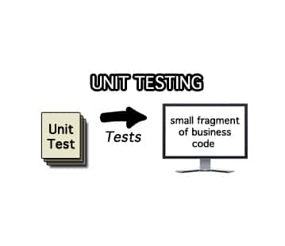
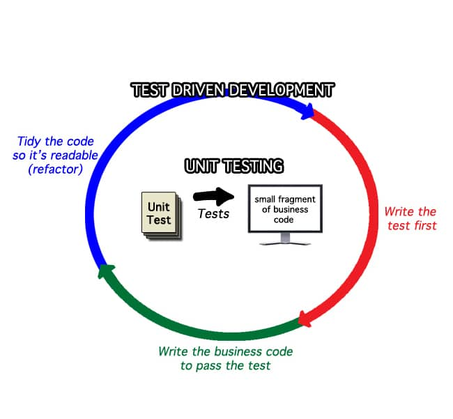
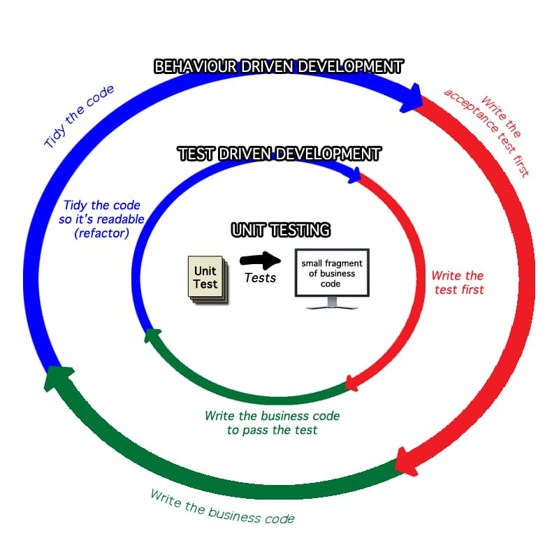

Effective testing should be done to ensure that a Product solves the business problem, in the way it was intended. It also seeks to prove that no change to the Product harms an existing working system. (It’s a much deeper topic than we can cover here.) These are the goals of Quality Assurance.

So I frequently get asked the question: “Should my testers learn Test Driven Development?” The answer is that, usually, this is not the right technique for them. Because Test Driven Development is not a Quality Assurance technique. Nor is Unit Testing. These are techniques to help shape a Team member's understanding of a problem, but they do not ensure quality itself. So let’s explore the difference, and common confusion, between these things.

**Unit Testing** is low level development technique where a developer tests one path through a method, in a single class. The goal of a Unit Test is to prove that the developer wrote the code they intended to write and, after writing it, subsequent changes don’t harm that intent.

Unit Testing does reduce bugs by finding **some** unintended side effects of change, but it doesn’t actually test whether the code solves a business problem, only if it was written as intended. Although it’s useful, one weakness is that unnecessary cohesion and coupling can cause Unit Tests to eventually become brittle.

**Test Driven Development (TDD)** is Unit Testing where the test cases are written _before_ the code is developed. Again, TDD only proves that the Team Member is writing the code that they intended to write, and it doesn’t test against the business needs themselves. Since the tests are written first, it’s more accurate to say it’s a coding design technique, rather than a quality assurance technique. It is a way for someone with coding skills to ensure that the code they’re writing is a simple solution to the problem they currently have at hand. The benefits are design simplification and refactoring safety net. It reduces bugs mainly by forcing us to write simpler, more readable code, and by finding **more** unintended side effects of change.

TDD is generally more effective than simple Unit Testing because it forces the person writing the code to think about the problem they’re attempting to solve before any code is written, but it still doesn’t test against acceptance criteria.

**Behaviour Driven Development (BDD) – also known as Specification by Example and Acceptance Test Driven Development –** is where Team Members with coding, testing and analysis skills work in a small group to write tests together. Since many people with testing/analysis skills don’t think in Java/C#/JavaScript/etc, these tests need to be expressed in a simpler language. The most effective approach (from my experience) is to write the tests in a manner that is readable by someone who understands the product but not the code. Even if you don’t have the tools to automate these tests, the act of collaborating to agree on the precise ensures that:

- Team members have a common understanding of what is being built
- development can move faster because most product-related questions are settled before the work is started
- there is less Team conflict when a Product Backlog Item is tested, because all parties have the acceptance criteria they agreed to
- clear acceptance criteria encourage Team Members to write the simplest code possible, which reduces defects
- defects are reduced even further when you have running automated tests, as they’ll continue to show whether or not the acceptance criteria are still being met

But an important note: even BDD, for all of its value, doesn’t replace manual testing.

So what should Team members with test background learn? I get them to learn BDD collaboratively with their peers, so that everyone understands that it is primarily a “Team member agreement tool” and only secondarily a “test automation tool”. I might even give them a very small taste of expressing tests collaboratively, with simple examples in a tool like Cucumber (or FitNesse or even RobotFramework).

In all [Product Owner](/certified-scrum-product-owner-cspo-training) trainings and many [ScrumMaster](/certified-scrummaster-csm-training) trainings, we practice a simple version of this technique. My goal would be to simply hint to them what is possible, and then open the door.

If this intrigued you and you want to learn more, see: [Behaviour Driven Development](/glossary/behaviour-driven-development) in our glossary.

(Image attribution: Agile Pain Relief Consulting)
