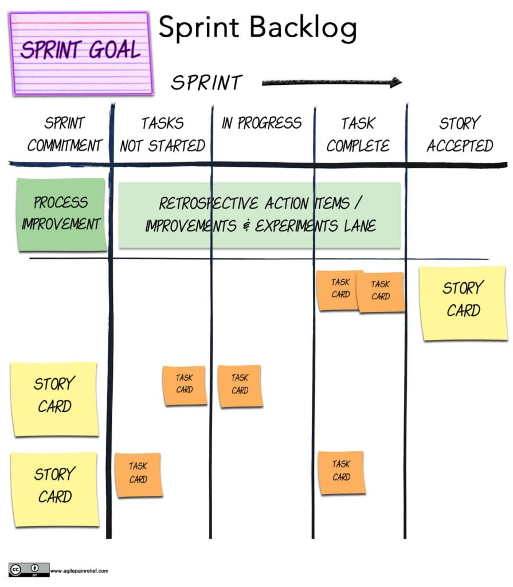
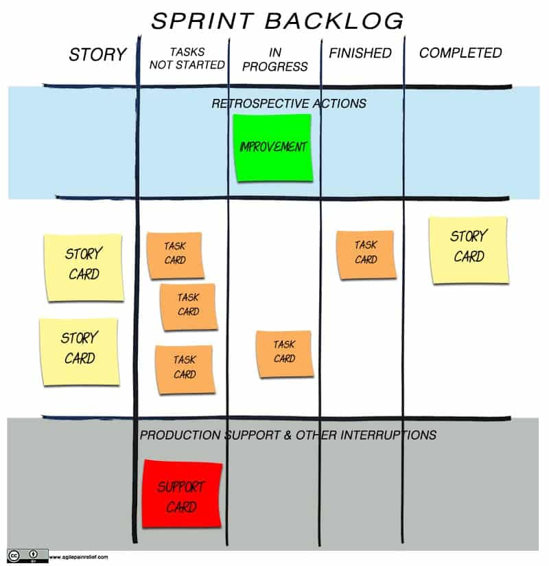
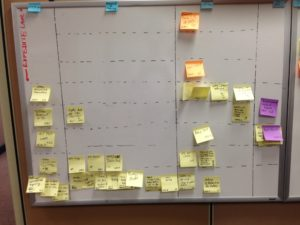
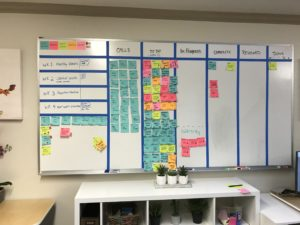
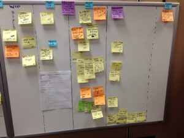

We might not be able to make [Sprint Backlogs](/glossary/sprint-backlog) exciting, but we can make them more effective. Let’s look at what a Sprint Backlog is, what purpose it serves, and how to create, manage, and improve it.

## What is a Sprint Backlog?

A Sprint Backlog is a list of Product Backlog Items (PBIs) that the Developers think they can complete during the Sprint, along with the work needed, described in small enough chunks (e.g. User Stories) that progress can be tracked throughout the Sprint. These items are selected from the Product Backlog by the Scrum Team during Sprint Planning.

The Sprint Backlog is essential because it is the Team’s clear plan for how to achieve the Sprint Goal that they committed to for the Sprint. The team’s work is visible and updated on a daily basis to encourage transparency and collaboration within the team itself. By having a clear plan for the Sprint, it allows the team to focus and bring the highest value work to completion.

## Who creates the Sprint Backlog?

The Scrum Team is responsible for creating the Sprint Backlog. Sadly, many Scrum Teams simply use whatever their online Scrum tool feeds them for their Sprint Backlog. This harms the Team’s capacity for engagement because it reinforces the sense that Scrum is _happening to them_, not something that _they choose_.

Since the Sprint Backlog is solely for the use of the Scrum Team to organize their own work during a Sprint, they are the only ones who create, change, and manage it — not a tool, and not an outsider.

### When is the Sprint Backlog created?

The Sprint Backlog is created in the Sprint Planning session at the beginning of each Sprint. Prior to the start of the Sprint the Product Owner has prioritized the items and discussed them with the team (this is called Product Backlog Refinement). By doing it before Sprint Planning, the whole team better understand what they’re committing to. This collaborative effort ensures shared understanding and ownership of the Sprint Backlog. During the Sprint, the Sprint Backlog is updated by the Scrum Team when something changes, a task or Product backlog Item (PBI) is completed, or a new item is started.

## How does a Sprint Backlog work?

After the Scrum Team creates the Sprint Backlog, the Developers (Scrum’s poor way of saying all the people who do work) break down the Product Backlog Items (PBI) into smaller size and estimating the work needed, the team works through the Sprint Backlog with each individual team member selecting PBIs to work on. This promotes autonomy and allows Developers to work on things they feel most comfortable with or have the necessary expertise in. As a PBI is completed, the Scrum Team updates the Sprint Backlog to reflect that. There is no required work order for items. Since the Scrum Team is truly self-organizing, they could work on the Sprint Backlog in whatever order they see fit, but effective teams usually work from highest to lowest priority.

### How should the Sprint Backlog be managed?

Since we look at the Sprint Backlog during Daily Scrum, most Scrum teams update it there. The frequent visibility and review are intended to improve transparency and collaboration among team members. No one is assigned work in Scrum, instead, team members have the freedom to choose what they want to work on themselves, so any team member may update a Sprint Backlog item. They might mark it as done, or as needing feedback from the Product Owner, etc. If a particular item in the Sprint Backlog is confusing:

1. it should not be brought into the Sprint and, instead, turned into a conversation at the next refinement session, or
2. it can be turned into a Spike – a timeboxed investigative effort to better understand the problem, or
3. t can be committed pending further clarification right after Sprint Planning. (This is a common practice and is almost always a bad idea. Options 1 and 2 are better choices).

A Sprint is dynamic and evolves so the Sprint Backlog changes as the Sprint moves along. The Sprint plan that helped you start the Sprint often doesn’t last the whole Sprint. Did the team realize that a User Story (aka PBI) won’t be completed this Sprint? Remove it and tell the Product Owner. Hit by a product support defect mid-Sprint? Add the emergency fix to the Sprint Backlog, or put an existing item on hold and swarm the defect. (_Hint: if this is a frequent problem, we’ve covered reducing the Production Support burden in this [Scrum By Example entry](/blog/scrum-production-support.html)_).

#### Fixed Scope or Variable Scope?

People get themselves tied up in endless knots on this subject – are the contents of the Sprint fixed (i.e. Fixed Scope) or can they change (Variable Scope)? These notes won’t settle all debates, but they should help reduce them.

- [Sprint Goal](/blog/sprint-goals-provide-purpose.html) – This shouldn’t change during the Sprint.
- Product Items committed to the Sprint – If the Sprint isn’t going well, the team might drop an item. On rare occasions when something important is discovered by the PO, the Scrum Team might accept a new PBI mid-Sprint. _My normal recommendation is that they remove a larger existing item to accommodate the new item. I would expect the Team to discuss in their subsequent retrospective what happened and how to ensure that it doesn’t happen again._
- Task Items – Any amount of change is fine here since tasks aren’t officially part of Scrum and the task list can change on a daily basis.

If change is made to the work in Sprint, it needs to come through the shared agreement and collaborative understanding of the team, not as something imposed from the outside.

## What are the characteristics of a Sprint Backlog?

The _Scrum Guide_ doesn’t provide any guidance on the structure or format of a Sprint Backlog: “The Sprint Backlog is a plan by and for the Developers. It is a highly visible, real-time picture of the work that the Developers plan to accomplish during the Sprint in order to achieve the Sprint Goal.”\[[1](#footnotes)\]

**Since Teams are unique, there is no single correct practice that they all should follow when creating a Sprint Backlog.** Teams choose and experiment with whatever helps them most to stay focused and self-organize, creating the Sprint Backlog with whatever methods work best for them, such as index cards, whiteboards, or, yes, even electronic tool.

The Sprint Backlog is created by the Team, for the Team, so there are no set-in-stone rules. If your Team wants it to include a XKCD comic, go for it. That said, there are some things that people have found to be effective, so they’re worthwhile considering.

### Swim Lanes and Columns

To keep the board organized visually, Teams use horizontal swim lanes and vertical columns to create a rough grid. At the front of a swim lane is their Product Backlog Item (e.g. User Story or task). Then there is a series of columns moving left to right (instinctive to how we read English text), indicating progress of that Backlog Item through the Sprint.

When teams transition from traditional project management methods, they might be tempted to use the Sprint Backlog to recreate familiar phases such as Analysis, Design, Development, and Test. Teams do this, but it misses the collaborative nature of Scrum and introduces unnecessary handoffs between team members.

#### **Example Sprint Backlog 1:**

To someone new to the Agile world the picture above may look a bit alien. Let’s break it down further and make sense of it.

### Does a Sprint Backlog have tasks – yes or no?

Tasks are not a required element of the Sprint Backlog. If tasks are included, it’s recommended that they’re decomposed into parts small enough to be completed in a day or less, so that Team members can share tangible progress on a daily basis. If the PBIs are already very small – perhaps completed by two people in a couple of days – then breaking them down further into tasks is probably not productive.

### “Finished” or “Complete” vs “Story Accepted”

If a Team does put tasks on the Sprint Backlog, they might find it helpful to create a boundary between tasks that the Team members themselves declare finished, and the User Story/PBI being accepted by the Product Owner.

### Work in Progress

Many Teams benefit by stealing a page from the Kanban playbook and limiting Work in Progress, then including that in their Sprint Backlog structure. To sense whether they’re on track to meet the Sprint Goal, they simply look at the number of completed PBIs. If by the third or fourth day of a ten-day Sprint there isn’t at least one item finished, then it’s unlikely that the Team will get everything completed by Sprint end. By the sixth or seventh day, we would expect a Team to have at least half the items complete.\[[3](#footnotes)\]

Teams that limit Work in Progress to only two or three Product Backlog Items at one time, tend to:

- collaborate more. They often discover practices like Behaviour Driven Development (or BDD) and Pair Programming. In the long run, these teams improve their throughput.
- cross-skill faster, since the bottlenecks become self-evident.
- eventually eliminate the problem of having unfinished work at the end of Sprint. If you limit WIP and you’re only a few days away from the end of the Sprint, then the team could swarm the remaining work one chunk at a time, making it likely that there will be no unfinished work at the end of Sprint.

So, used well, a Sprint Backlog combined with the Kanban WIP limit can solve challenges that many teams face.

### Bringing [Retrospective](/glossary/sprint-retrospective) into the Sprint Backlog

The example Team has also put a swim lane at the top for their actions or improvements that they committed to in the [Sprint Retrospective](/guide-to-effective-agile-retrospectives). It’s at the top of the picture to act as a visual reminder that continually improving their process and Team is important. It’s recommended that the Developers include at least one action item from their previous Sprint’s Retrospective.

### Adding the Sprint Goal

Finally, the Team in our above example has placed their Sprint Goal atop the Sprint Backlog as a visual reminder that it is the overarching goal of the Sprint, rather than just finishing individual tasks.

These additions encourage the Team to focus on more than just delivering a collection of User Stories. Instead, they’re achieving the Sprint Goal while making improvements that, in the mid-term, help increase their work quality and effectiveness.

This next Team has a slightly different view of the world, so it’s appropriate that their Sprint Backlog looks different as well.

#### **Example Sprint Backlog 2:** 

The Team above has a product live in the field. They have added a swim lane to visualize Production Support work as a separate activity in their Sprint Backlog.

#### Real Life Examples of a Sprint Backlog

The above two examples are obviously graphics created to illustrate common Sprint Backlog structure. Here are some photos of actual Sprint Backlogs, and you can click on the smaller photos to open full-size images.

\[caption id="attachment\_12749" align="alignleft" width="300"\] Image courtesy of Sameer Bendre.\[/caption\]

**Sprint Backlog Example 3:** This Team has Expedite Lanes at the top, and column headings include “Challenge”, “Analysis and Planning” and “Unit Test”.

\[caption id="attachment\_12751" align="alignleft" width="300"\] Image courtesy of [David Koontz](https://t.co/TsWPt6402B?amp=1).\[/caption\]

**Sprint Backlog Example 4:** This is the Sprint Backlog of a marketing company, and they’ve elected to have a “Calls” Column to keep those separate from other Backlog Items. Other Columns are “To Do”, “In Progress” (with a “Waiting” section), “Complete”, “Reviewed”, and “Done”.

\[caption id="attachment\_12752" align="alignleft" width="300"\] Image courtesy of Sameer Bendre.\[/caption\]

**Sprint Backlog Example 5:** This Team has chosen columns for “WIP” (Work in Progress), “Ready for CR” and “In CR”, “Validate in Prod”, and “Closed in TFS”.

_Some of these examples might have contents that make no sense to you, or your environment, and that’s okay. They don’t have to, because a Sprint Backlog has to only make sense for the Team that created it._

### More Ideas for Your Sprint Backlog

Here are other things you might try for the structure and contents of your Sprint Backlog, based on what some Scrum Teams have found effective for them. Remember, your mileage may vary, so experiment and make it your own.

- Put **tick marks** on a card for every day it has been worked on and a ‘B’ for everyday it was blocked/stuck. _This helps the team by providing information on how long individual work items took to complete, or how long they got delayed. Most teams discover that work items often spend longer waiting for something (approvals,  another team, etc …) than they do getting worked on._
- Create a separate column for items that are **Stuck/Waiting For/Blocked** and make a note of the why. _A separate “Waiting For” column visualizes the blockages in the system. Visualization makes them easier to measure, and attracts greater attention to resolve them sooner. After all, our teams don’t want to measure blockages, rather we want blocked items unblocked as soon as possible._
- Track **Interruptions** (e.g. management requests), requests for help from another Team... basically, track anything that causes the Team to lose focus on the Sprint Goal. _These are usually tracked in their own lane. By tracking them, it highlights opportunities to work to reduce them._
- Create an **Impediments** area to track open and resolved impediments. _This helps the team see where their problems are. During the retrospective, these impediments can make fodder for good discussion._
- Have a visual reminder of the **Definition of Done** on the boundary between Finished (for a task) and Accepted (for a User Story). _This helps the team by making them think about the meaning of Done and therefore what level of quality is expected._
- Some teams that use **Tasks** find it useful to create task items that correspond to the Definition of Done. Other teams find that keeping the Definition visible at all times is a sufficient reminder.
- **Hidden or Ghost work**\[[2](#footnotes)\] – Sometimes we discover that team members are working on things outside of the Sprint Backlog. On discovery in Daily Scrum (or any other time), make it visible. Many teams use the interruptions lane above, since this work from outside the Sprint Backlog is an interruption.
- Include a **Calendar** to note vacations, birthdays, special events, etc – anything that might affect the time available for work, as well as morale. _Being reminded of our peers’ schedules and lives makes them more relatable. On a simple practical level, seeing a teammate’s upcoming vacation plans reminds us to address questions before they disappear, minimizing the number of items that get blocked by their absence._
- Consider noting any other **events** that affect the Team during the Sprint, _e.g. an all hands meeting, other meetings,\[[4](#footnotes)\]  server outage, Zoom or MS Teams outage._
- Track **mood, energy, etc** using something as a simple as a spreadsheet view with people’s names in rows, calendar/weekdays across the top. _On a daily basis, they mark happiness, satisfaction, engagement or some other simple measure, which will help document whether the Team’s energy or focus was negatively impacted.\[[5](#footnotes)\]_

All of the information that the Team tracks via the Sprint Backlog becomes data that should be brought into the Sprint Retrospective.

When your Sprint Backlog is designed and prepopulated by an outsider (or an electronic tool), it’s unlikely to contain any of these improvements that can help make the Backlog – and what it tells you – more effective and informative. But at the end of the day, if a tool helps the team improve collaboration and focus, then it is useful.

(Note, if having to maintain a tool for the Sprint Backlog slows down the Team, that is an impediment and it’s up to the ScrumMaster to help find a better solution.)

## Sprint Backlog: End of Sprint

The Sprint Backlog is reviewed during Sprint Review at the end of the Sprint. The Sprint Backlog is finished and completed work is deployed. The Sprint Backlog cards can now be disposed. (One team I worked with archived them in a shoebox and put a rubber band around each Sprint’s worth. Honestly, I don’t think anyone ever looked at them again.)

What happens to incomplete work in a Sprint Backlog? It is returned to the Product Backlog wherever the Product Owner deems it belongs. In the next Sprint Planning session, a new Sprint Backlog is created.

## Sprint Backlog Anti-Patterns

(aka Avoid Doing These)

#### Pre-assignment

When the Sprint Backlog is created during Sprint Planning, some teams decide who will work on which PBI or task. When it’s kept to only one item, this isn’t bad, however when all items are pre-assigned to team members, we have just planned for the first bottleneck.

#### One Person Doing Many Things

This happens when Team Members are signed up for one than one task or PBI at the same time. We can’t multitask like we think we can because our brains just haven’t evolved to do this. The more we multitask, the less we get done overall. So when Team Members sign up for more than one task at a time, they’re promising to get less done. _Exception: if a team member has one item stuck in Blocked (or Waiting for), they might start work on another. If it happens again, the team should look into why one person’s work is so frequently blocked. Alternative: when a team member has a item blocked, they might pair with another team member to help that person through the item._

#### Reporting

The Sprint Backlog loses its value if used for external purposes like reporting, or for [micro-management](/blog/scrum-anti-patterns-micromanagement.html). When leadership uses it to look over the shoulders of the people doing the work — even if it’s not to direct the Development Team’s actions — it often leads to overloading the Sprint Backlog with details that undermine and eliminate transparency. The Sprint Backlog is used only by the Scrum team, and is not intended to be viewed by anyone else.

#### Multiple Sprints

Since Scrum is about adapting to the evolving work, it is pointless to plan which items will go into the Sprint Backlog beyond the current Sprint, so we shouldn’t try to create Sprint Backlogs in advance. _I think this happens because some of the popular electronic tools make it possible and people assume, based on the tool, that this is a good practice._ Planning future Sprints before they happen reduces flexibility and increases workload for all involved.

#### Phases

When people come from a traditional world into Scrum, some try to use the Sprint Backlog as a tool to recreate the phases they’re used to. For example, they create columns in their Sprint Backlog for Analysis; Design; Development; Test. _While strictly speaking legal, they’re recreating the boundaries between traditional roles, making collaboration less likely and ensuring handoffs between team members. As mentioned in the Limiting WIP segment, effective Teams work collaboratively through the Sprint to get a PBI to complete before moving onto the next. These phases tend to lead to another Scrum sin – Staggered Sprints._

## Forecasting with the Sprint Backlog

The Sprint Backlog is also the Developers’ forecasting tool. Each day during Daily Scrum, they replan their work and update the Sprint Backlog , using it to help them assess whether they’re on track to meet their Sprint Goal. If they realize that their Sprint Goal is in jeopardy, they work with the Product Owner on replanning.

In the past, Teams used to use a [Sprint Burndown Chart](/blog/scrummaster-tales-the-trouble-with-sprint-burndowns.html) that tracked task hours remaining to be done. Now, most of us would suggest that the focus on Tasks, versus focusing on User Stories/PBIs, is anti-pattern so we don’t recommend Sprint Burndowns.

## Sprint Backlog vs Kanban Wall vs Product Backlog

While the Sprint Backlog is the Team’s plan for the Sprint, the Product Backlog is the Teams queue of work. So the funny thing is that the Sprint Backlog and Product Backlog have easily confused names, but vastly different meanings. In my [workshops](/certified-scrum-agile-training), whenever an attendee answers a question with, “Backlog”, my instant response is, “Which one?”

A Sprint Backlog is far more like the (better-named) [Kanban](/glossary/kanban) board. A Kanban board is a visual control system from the world of Kanban. It combines the Product Backlog with the Sprint Backlog. The key difference between Scrum’s Sprint backlog and Kanban’s board is that Kanban has a Work In Progess Limit. As you’ve already seen, I strongly recommend Scrum Teams steal a leaf from the Kanban world and do this.

## Key Points on Sprint Backlogs:

- Created by the Scrum Team
- An output of Sprint Planning
- Updated by the Scrum Team often during Daily Scrum
- Is better at progress tracking and forecasting than the Sprint Burndown
- Is used by team members to foster collaboration
- Contains whatever the team find useful - often includes the Sprint Goal and Improvements
- Tracks impediments, blockages, interruptions, production support issues and hidden work
- A great data source to use for your next retrospective

Good Scrum teams know that they own the Sprint Backlog. _Great_ teams experiment every few Sprints to find what they can do to make their Sprint Backlog even better.Bottom of Form

#### See Also: [Sprint Backlogs](/glossary/sprint-backlog)

### Still Unsure How to Create an Effective Sprint Backlog?

Consider attending one of our [Certified ScrumMaster workshops](/certified-scrummaster-csm-training), where we discuss the _how_ and _why_ of Scrum, not just the _what_.  You'll get hands-on practical experience, and learn about some of the challenges – and solutions – along with tips on how to help your Team learn and grow to realize their potential.

\[1\] [https://scrumguides.org/scrum-guide.html#sprint-backlog](https://scrumguides.org/scrum-guide.html#sprint-backlog) \[2\] This term describes work done out of sight of the team. It is also sometimes referred to as “dark work” (as in done in the dark), but “Hidden” or “Ghost” work is more culturally sensitive. \[3\] This isn’t a hard and fast rule. Instead, it’s a pattern. As ScrumMaster or Agile Coach, if you see that the board is hinting at a problem, use that hint and look further to understand what is going on. \[4\] Github did a [Developer Good Day survey](https://github.blog/2021-05-25-octoverse-spotlight-good-day-project/) and discovered that the more meetings someone is involved with, the less work they get done. My strong recommendation is that your only meeting most days should be Daily Scrum. \[5\] These are called [Niko Niko boards](/glossary/niko-niko) and not everyone thinks that they’re a good idea.

Image attributes: Agile Pain Relief Consulting

(Updated November 2023)
