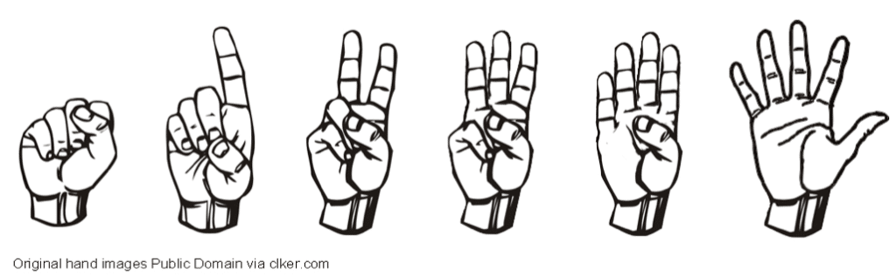

Whether we’re facilitating Retrospectives, Sprint Planning, or a Strategy session, there are always decisions needed. How you approach those decisions should vary depending on the degree of cost and whether the decision is easily reversible or not.

Given the speed at which Agile moves, we can’t afford a lot of time spent waiting for simple decisions to be made. So for low cost, simple, or reversible decisions, we need mechanisms to make decisions quickly and with a minimum of overhead. For more expensive, complex, or risky decisions, we need approaches that explore the problem in more depth and then create experiments that we can run to quickly see which path is a clearer choice before too much investment is made.

Another reason good techniques are needed is because of cognitive biases.\[[1](#footnotes)\] Hopefully we’re all aware of them and we’ve started to spot them throughout our lives. Decision making, like everything else, is made more difficult because of these biases, so we’ll also address how those should be factored into your choice of technique.

### Establish Decision-making Policies

The first thing to decide is how your group is going to handle decisions. Once that’s determined, add it to your [Working Agreements](/blog/team-friction-inspires-working-agreements.html). A defined policy will help people feel that their ideas got the same reception as anyone else’s ideas. When a team doesn’t have an agreement on their decision-making rule, then a team member might feel blindsided if, for example, a majority vote is called for and they were not expecting that. There should be no surprises.

### Techniques for Low Cost or Reversible Decisions

With low cost or reversible decisions the cost of minimizing cognitive biases may be more expensive than the decision itself. There are several options for techniques in these situations, but be warned that some of the most common methods have unexpected traps.

In evaluating different tools, I want to know: Does this help the group decide quickly? Does it help ensure quieter voices are heard? Does it avoid endless rounds of debate? If the proposer’s idea loses, will they feel that it got a fair hearing?

Here are some popular tools and how they work.

#### _Majority vote_

This can be used as a group decision-making technique and it’s probably the default of most teams, however, there is a significant risk. When we have quieter people on the team and they take the risk to vote against the group, they may easily see a majority vote against them as silencing their opinion. Also, when someone who is powerful votes early, other people may fall into line, either because they assume they know best or because they feel the safest following authority. _I strongly recommend against using this in Agile teams; it tends to disenfranchise the voices we need to hear more from._

#### _Consensus_

This approach seeks to ensure the support of all members of the group for the decision. This doesn’t require complete agreement, only no disagreement. Usually when seeking consensus, the facilitator asks a question like “Can we all live with and support this decision?”\[[2](#footnotes)\]

Consensus decision-making is remarkably inclusive and does a good a job of inviting participation from all. With this approach, there are still a couple of risks:

- Endless debate – a team can get stuck revisiting the same options over and over from different angles\[[3](#footnotes)\]
- False consensus – a team member may disagree with a decision, but not voice it to avoid rocking the boat

After reaching consensus, the facilitator might ask the group to commit to helping to implement it.

#### _Fist-to-Five rapid voting technique_

This should be done blind – everyone makes their decision and votes are revealed simultaneously using one hand per person. This improves on majority voting because it invites more subtle opinions than just yes/no from a majority vote. It also invites further discussion where it is warranted. Where it would save time, it also signals an idea that has rough agreement.

<table style="width: 1024px; border-collapse: collapse; text-align: center;" border="1" cellpadding="2"><tbody><tr><td style="text-align: center;" width="150px">A “no” vote, will block consensus</td><td style="text-align: center;" width="170px">No support, but won’t block. Will discuss and suggest changes</td><td style="text-align: center;" width="160px">Moderately comfortable, Discuss minor issues</td><td style="text-align: center;" width="180px">Not in total agreement but comfortable to let the decision pass</td><td style="text-align: center;" width="184px">Good idea, will work for it</td><td style="text-align: center;" width="180px">Great idea, complete agreement, support it fully</td></tr><tr><td colspan="6"></td></tr></tbody></table>

#### _Decider Protocol_

From the [Core Protocols](https://thecoreprotocols.org/) – a set of Protocols to help teams go about their work, minimizing the time wasted in meetings. The protocols are designed to help focus discussion and decision making.

One actionable idea is proposed.

Participants ask questions to gain clarity.

A vote is performed using hands again, but this time just a thumb, to indicate a choice.

- Thumb up = yes: full support
- Thumb sideways = yes: support the idea but may still have to think it through
- Thumb down = no: do not support, provide a counter-proposal

The proposer counts the number of votes. If the number of yes votes (either thumbs up or sideways) is too low (usually below 70%) it is a weak proposal and should be withdrawn.

If there are a small number of “no” votes, use the Resolution Protocol to see what it would take to get them on board with a question like: “What will it take to get you in?”

(This is a brief summary – see all the Core Protocols\[[4](#footnotes)\] including the Decider section\[[5](#footnotes)\] and Resolution sections\[[6](#footnotes)\] for more depth.)

#### _Dot Voting_

This is a tool for selecting the top few options among many.

Before using dot voting, take a few minutes to group or eliminate similar items. Then each voter gets the same number of dots to vote with. The dots can be stickers or simply a dot written in pen.

- A voter places all dots on one idea or spreads them out – it’s their choice.
- The idea, or ideas, with the most dots wins.
- How many votes per person? Five to seven has worked well for me in the past, but it’s up to you.
- In remote teams, some of the tools build dot voting in. In others, I’ve seen attendees edit the titles of sticky notes to add a “#” per vote.

The above example was used by a group at an organizational retrospective to decide what items they should address.

Dot voting is the Agile community’s poster child for decision-making techniques but it, too, has some weakness. Since dot voting is usually done with people walking up to a poster or wall to place their votes, everyone can see which items you voted for. Seeing other people’s votes will influence you and, of course, seeing a leader’s vote will influence everyone. This weakness can be overcome if all the votes are placed blindly, i.e. voting decisions are made without seeing the votes of others.

The other challenge is that you can see that people voted for an item, but not why they voted _against_ another, missing an opportunity to improve it.

It’s worth noting that dot voting is a popular tool for online interactions and distributed teams. The online tools typically cost money, but whiteboard tools such as [https://www.mural.co/](https://www.mural.co/), [https://miro.com](https://miro.com) and [https://stormboard.com/](https://stormboard.com/) all allow the facilitator to create a dot voting session. They also have the advantage of being blind. Tools like [https://www.groupmap.com/](https://www.groupmap.com/), [https://consider.it/](https://consider.it/) and [https://stormz.me/en](https://stormz.me/en) have a richer set of tools to generate, organize, and vote on ideas. While these aren’t designed for retrospectives, they might be useful.

### Techniques for Expensive or Irreversible Decisions

When the cost of the decision is higher or there is an element of risk or uncertainty, then we want to find decision-making tools that mitigate against those, as well as against cognitive bias, and take more time and ask better questions so we can have better information to make decisions with stronger odds of success.

When the cost and/or uncertainty is high, we should not look for an immediate decision. Rather, we should be looking for an experiment that we can run that will get us closer to a clear choice later. In designing our experiments we need to combat cognitive biases such as the following.

- We often start our problem by thinking in too narrow of a frame of choices. This is often coupled with Blind Spot Bias, where we can see other people’s biases more easily than our own.
- Confirmation Bias leads us to look for information that reinforces our existing thinking, and Motivated Reasoning causes us to see new information in a way that supports our existing beliefs.
- Short-term emotions can paralyze us or shut down good choices via fear, sunk cost fallacy\[[7](#footnotes)\] and more
- Overconfidence when we are certain about our guesses for the future is often coupled with Hindsight Bias where, once something happens, we see it as if it was the only thing that could have happened.

No single magic technique will overcome all of these biases, but we can take steps to minimize their effect.

- Use Systems Thinking tools like change perspective (What happen if we take another person’s point of view?) or change time frame (What will the effects be in 5 days? 5 months? 5 years? This is also known as 10/10/10 Analysis – 10 days, months and years.) This ties back to the Future Perspective approach\[[8](#footnotes)\] of stepping mentally into the future and imagining afresh where we want to arrive.
- Explore other sources of data or information. (From outside the team? From outside our organization? Who else has made similar decisions before?)
- Use the Rule of Three.\[[9](#footnotes)\] If you don’t have at least three options, you don’t have enough.
- Ask what assumptions are being made and test if those assumptions are valid.
- Discuss the longer term unintended consequences of this decision. (How could someone game the system to exploit this decision?)
- Ask whether there are any time-delayed effects that might show up down the road. _This is an especially important question, as a lot of solutions that seem good on the surface cause deeper problems down the road._
- Ask for someone to take a dissenting position and treat the dissenting view as important and not just an empty gesture.  Getting an opinion from someone who would make a different decision forces us to consider our own approach from another angle. If you can’t find a dissenting view within your team, ask outside your team.
- Admit uncertainty.
- Consider what would happen if you made the opposite decision. This broadens thinking and can uncover advantages or pitfalls that help make the choice easier.

### After the Decision

Whatever the outcome, we need to be careful of “Resulting”\[[10](#footnotes)\], where we judge the quality of the decision based on the results. Luck plays a big role in work. Sometimes good decisions result in bad outcomes and sometimes bad decisions still get the result we wanted. The common example used comes from poker where, despite using logic and weighing odds, sometimes luck tips the scales. It’s important to acknowledge that good decisions can have bad outcomes despite a team’s best efforts, otherwise fear will make future decision-making even more difficult.

**For additional practical tips and strategies on how you can help your team be more effective,** we'd love to have you join one of our [Advanced Certified ScrumMaster programs](/advanced-certified-scrummaster-acsm-training), where instead of dying from boredom sitting in a 2-3 day theory class, you will learn new material and be coached over an extended period how to build a sustainable improvement process.

* * *

\[1\] There are several book length treatments of this subject. [_Decisive: How to Make Better Choices in Life and Work_](https://www.amazon.ca/Decisive-Make-Better-Choices-Life/dp/0307361136/&tag=notesfromatoo-20) by Chip and Dan Heath and [_Thinking in Bets_](https://www.amazon.ca/Thinking-Bets-Making-Smarter-Decisions/dp/0735216371/&tag=notesfromatoo-20) by Annie Duke are a good start. We will touch only lightly on the challenges.

\[2\] [https://www.lucidmeetings.com/glossary/consensus-decision-making](https://www.lucidmeetings.com/glossary/consensus-decision-making)

\[3\] Curiously, Planning Poker was originally invented as a tool to cut through endless debate in estimation meetings.

\[4\] [https://thecoreprotocols.org/](https://thecoreprotocols.org/)

\[5\] [https://thecoreprotocols.org/protocols/decider.html](https://thecoreprotocols.org/protocols/decider.html)

\[6\] [https://thecoreprotocols.org/protocols/resolution.html](https://thecoreprotocols.org/protocols/resolution.html)

\[7\] [https://thedecisionlab.com/biases/the-sunk-cost-fallacy](https://thedecisionlab.com/biases/the-sunk-cost-fallacy) – commonly known as “throwing good money after bad”

\[8\] [https://agilepainrelief.com/blog/future-perspective-for-organizational-change.html](/blog/future-perspective-for-organizational-change.html)

\[9\] Attributed to Gerald Weinberg: [https://en.wikipedia.org/wiki/Gerald\_Weinberg](https://en.wikipedia.org/wiki/Gerald_Weinberg)

\[10\] Courtesy of Annie Duke
