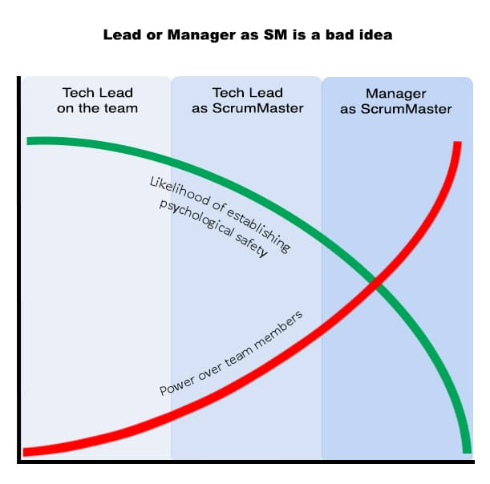

Have you ever had friends or family ask, “I know you’re called a scrum master, but what does that mean? What do you actually _do_?”  Go ahead. Tell them that the role of ScrumMaster is as a servant-leader, coach, and facilitator, navigating the dynamics of the team to ensure Scrum practices are followed and value is delivered effectively.

Then watch their eyes glaze over.

Being a ScrumMaster is an incredibly rewarding job, but it’s not likely to be accused of being thrilling or sexy. Since educating is in my blood, my party answer to “What is a ScrumMaster?” is considerably more dry than yours will hopefully be.

1. **Servant Leadership:** prioritizing the needs of the team and helping others to perform as highly as possible. The ScrumMaster doesn’t command or control but serves by removing impediments to progress, facilitating meetings, and helping the team measure their progress. This aspect of servant leadership also entails fostering an environment where the team can be self-organizing and efficient.
2. **Coaching:** helps the team improve by ensuring that Scrum principles, values and practices are understood and enacted. This involves mentoring the team, promoting continuous learning and improvement, and addressing any issues that hinder team collaboration and productivity. The ScrumMaster also assists the Product Owner with effective backlog management, and helps them learn in any other areas that help them deliver better quality products (ex. Pair Programming, Behaviour Driven Development, Lean U/X, Example Mapping and many more).
3. **Facilitation:** of all Scrum events, such as Daily Scrum, Sprint Planning, Sprint Review, and Sprint Retrospective. This involves ensuring that discussions are effective and decisions are made, without taking a dominant role in the conversation. This also includes fostering an environment where all voices can be heard and creating a safe space for open and transparent communication.

The ScrumMaster’s role is crucially performed without authority. There are several reasons for this:

- When the ScrumMaster works without authority, it empowers the development team to take ownership of their work, which is key to self-organization and promotes a sense of responsibility and commitment.
- A non-authoritative role fosters a more collaborative atmosphere, where each team member’s opinion is valued. It encourages open communication and transparency.
- Scrum embraces a flat team structure (no hierarchy) where everyone has an equal say in decision-making. A ScrumMaster wielding authority would contradict this principle.
- When the ScrumMaster does not dictate solutions, it enables the team to problem-solve and learn from their experiences, thereby fostering growth and improvement.

By being a servant leader, facilitator, and coach, without exercising authority, the ScrumMaster plays the role of creating an environment where the team thrives and delivers values. Their primary focus should be on helping them grow their skills at doing the work.

Contrary to popular belief, the ScrumMaster is no more overhead than the coach of the Toronto Maple Leafs or Manchester United (that one was hard to type :-)). In our workshops, we emphasize that the job of ScrumMaster is to coach the team to better performance. For example, if you achieve 3% better per Sprint, you get 2.03 times better in a year. Even if it's only 3% better per month, that's still ~42% better year over year. If that’s overhead, then it’s a good overhead worth more than one salary. _(Massive hint: there are no meaningful measures of team productivity.)_

## So what about having a Tech Lead or Manager fill the role of ScrumMaster?

As we test this question, let’s make some core statements:

- Scrum/Agile only matter to helping teams do better work.
- Scrum specifically works by building high-performance teams.
- High-performance teams require psychological safety and self-organization.

Therefore we should reject, or at least acknowledge, things that get in the way of teams doing their best work. The more power a team member has, the harder it is to achieve psychological safety.

### Tech Lead as ScrumMaster

Tech Leads are a more traditional hierarchical role. They have authority and decision-making power. Ideally in a Scrum Team, we wouldn’t have one person with this kind of authority as it undermines the collaborative, self-organizing aspects of Scrum.

Having a Tech Lead as ScrumMaster is a much bigger problem. Over a few months, it will hollow out the Scrum process. While the Scrum practices are still followed, the greater sense of the team will be lost along the way.

**Specifically, the following problems will occur:**

- **Role Conflict**. The Tech Lead is expected to make decisions related to technical aspects of the product. The ScrumMaster is attempting to coach the team to be more effective.
- **Different Skills:** Tech Leads need to be deeply immersed in the technical side of the project, with most of their growth oriented towards technical work. The ScrumMaster is focused on understanding and coaching human behaviour. Much of their personal growth should be focused on areas like understanding behaviour, and facilitation skills. So the ScrumMaster focuses on allegedly soft skills and the Tech Lead on hard skills.
- **Decision Making:** When the ScrumMaster is also a key decision maker in the Scrum team, it makes it harder for them to facilitate from a position of neutrality. In many cases where Scrum would expect an effective ScrumMaster to facilitate, they will instead need to advocate.
- **Team Improvement:** With Team Lead/ScrumMaster as a shared role, where will the individual put their energy? On technical improvements or team improvements? Scrum expects the ScrumMaster to be putting in continuous effort on Team improvement. At best this will be diluted. From bitter past experiences, this will get lost.
- **Team Dynamics:** With someone of power as the ScrumMaster, this will lead to a power imbalance. Some team members, usually the quiet ones, will be reluctant to speak up. As a result, the team will be diminished because it is getting fewer perspectives.

As we can see, Tech Lead as ScrumMaster is a poor choice. Even worse, I think that we just demonstrated that Tech Leads harm self-organizing teams. Instead of making Tech Leads power players, why not consider the opposite possibility? Scrum teams are intended to be self-organizing - they don’t need formal tech leads. At any moment, different people on the team can step up and provide technical leadership. **This is called Shared Leadership.** When a team works this way, the product is generally of higher quality because diverse technical perspectives were brought to bear. As soon as we appoint someone the "Tech Lead", we destroyed the ebb and flow, and we've said that someone else (management?), knows what is best for the team.

Scrum teams are intended to be self-organizing, they **don’t** need formal tech leads.

In addition, the ScrumMaster need not be a full-time role. While a full-time ScrumMaster is often more effective at coaching the team, what matters is that we have someone playing that role who team members consider a peer.

### Manager as ScrumMaster

If it was a bad idea for the Technical Lead to be a ScrumMaster, a line manager faces even bigger challenges. The line manager has power over the team. This power inevitably affects team dynamics and self-organization. When the Manager becomes the ScrumMaster, the essence of Scrum will rapidly disappear.

**The many problems this creates:**

- **Psychological Safety:** Nearly 10 years ago, Google discovered that the single biggest factor affecting team performance wasn’t the quality of the manager, nor the skill level of individual team members. Instead, it was psychological safety. Psychological safety is about being part of a team and knowing that you can share ideas and information without fear. It isn’t the avoidance of conflict, rather it is knowing that we can share information inside a team instead of focusing on protecting ourselves. When the Manager is the team’s ScrumMaster, it is much more challenging to create safety.
- **Performance Reviews:** The Manager owns individual team members' performance reviews. This power changes their relationship and would harm self-organization. Self-organization in Scrum is intended to allow Team members to have the freedom to make the best decisions they can for the team, product, and organization. When a Manager is the team’s ScrumMaster, team members will self-organize, in part, to ensure that they get a good performance review.
- **Individual over Team Performance:** A manager handling individual performance reviews naturally leads the manager to focus on individual performance. Scrum (and therefore the ScrumMaster) is focused on the performance of the team as a whole. In a good team, some of the best performers aren’t focusing on their contribution, but helping raise the performance of the group. Traditional performance reviews rarely focus on efforts to help the team.
- **Impediment to Self-organization:** In addition to performance reviews, if a line manager is also the ScrumMaster, the team may become overly reliant on their direction and less likely to self-organize.
- **Protect the Team:** The ScrumMaster is expected to protect the team from pressure and outside interference. I can tell you from personal experience, much of the pressure they need to protect the team from comes directly from their line manager (who themselves are being pressured from elsewhere). Pressure on a team to go faster, or meet a deadline, never has the positive benefits people expect. When the ScrumMaster is the team’s manager, one safety mechanism gets removed.
- **Power Dynamics:** The ScrumMaster has no authority over the team. They’re there to coach, not to manage. If the ScrumMaster is also a line manager, the power dynamic changes, stifling open communication, creativity, and risk-taking within the team. Team members may feel they cannot express disagreements or concerns for fear of retribution during performance reviews. Further, it takes all coaching advice and turns it into orders for the
- **Focus on Team Growth:** The ScrumMaster’s core focus is, helping the team become more effective. Most managers don’t have the time to spend on fostering team growth.
- **Micro Management:** A manager acting as the team’s ScrumMaster will see the day-to-day details of the work. They will get sucked into the action. As a result, they will naturally start making decisions about the low-level Sprint work. This is the wrong focus for a manager.
- **Decision Making:** A ScrumMaster is a facilitator and coach. Even when a manager is attempting to act in the facilitator role, the team will see a decision maker, not a neutral party.
- **Facilitation Skills:** Most managers are not trained in facilitation skills. When the manager attempts to facilitate, their efforts will often be viewed with the question of whether they are attempting to advance their own agenda.
- **Conflict Resolution:** The ScrumMaster resolves conflicts by creating an environment where we learn to have open dialogue around problems without judgment. When the ScrumMaster has worked on improving psychological safety, teams are better able to deal with and resolve conflict. Having the Manager as ScrumMaster will impede that, for all the above reasons.

When organizations talk about merging the ScrumMaster and Manager/Tech Lead roles, it often stems from a fundamental misunderstanding of Scrum itself and the role of the ScrumMaster. Scrum isn’t a traditional project management tool, instead, it is a human and team-oriented work system. The ScrumMaster isn’t a manager or leader with authority, they’re the team’s coach. Scrum works by building teams. By giving the team’s coach power, it inhibits psychological safety, damages self-organization, and eliminates most of the benefits of Scrum. Please don’t make tech leads, line managers and other people with power the team’s ScrumMaster. Instead, why not help the team understand the role (especially the human aspects) and then allow them to select their own ScrumMaster, possibly from within their ranks?

Scrum isn’t a traditional project management tool, instead, it is a human and team-oriented work system.

_P.s. There will always be exceptions to the rule, as people are quick to point out. On occasion some tech leads and even line managers manage to create the environment for psychological safety and a high-performing team. But contrary to what you might think, doing so may have set their team up for a future failure. Using their influence to create that, rather than allowing the team the autonomy to build it themselves, risks that when the lead or manager is no longer present, the team won’t continue with the same principles and behaviours that made it work._
