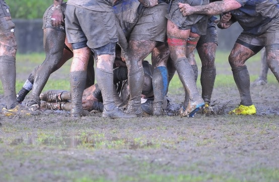

 The first of my three part series "Why Scrum Works?" has been posted on Miskin Berteig's blog: Agile Advice. The last two parts will be published here on Wednesday and next Tuesday (Monday's a holiday in Canada).

Why Does Scrum work? Why do any of the Agile methodologies work? How does Scrum help teams deliver value? How does it help high performance teams form?

This series of posts that will look at why Scrum works on three levels:

- Scrum delivers value to the business
- Scrum helps form high performing teams
- Scrum helps motivate and focus team members

Continue on Agile Advice...

Part Two: [Does Scrum Work? Hell Yes!!! Why?](/blog/does-scrum-work.html) has been posted

Image via: [https://photodune.net/](https://photodune.net/)
