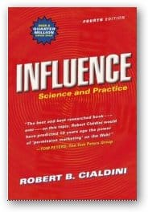

Do you ever walk into a clothing store just to buy a suit and walk out having bought the suit, tie, belt and several shirts? This chapter will explain what just happened.

This is the third posting in an ongoing series of notes from Robert Caildini's " [Influence: Science and Practice](https://www.amazon.com/gp/product/0321011473/&tag=notesfromatoo-20)". This posting covers Chapter 2 "Weapons of Influence" Other postings in this series: [Introduction](/blog/influence_why_a.html), [Other Sources](/blog/influence_scien.html) coming soon: Reciprocation, Commitment/Consistency, Authority, Social Validation, Scarcity, Liking/Friendship

"Weapons of Influence" introduces the concept of fixed-action patterns or automatic responses.

What are automatic responses? They're preprogrammed behaviours that are fired in response to one or more triggers. For example a mother turkey will nurture anything in its nest that makes the "cheep, cheep" noise of a chick (even a mortal enemy as demonstrated with a stuffed polecat and tape recorder). However as soon as the cheep sound goes away the mother turkey will recognize the intruder for what it is (attacking the polecat). Cialdini explains how and why these responses work and why they're necessary for our day to day sanity.

For example one jewelry store owner (a friend of Cialdini's) was having trouble moving some turquoise jewelry in her store. Frustrated she with the sales she left a note to the sales staff to reduce the price by 1/2. However the staff misread the note and doubled the price. Over the weekend the jewelry sold out. What happened? The buyers assumed Expensive = good. Why does an automatic response work like this? Short-cuts: automatic stereotyped responses that help us navigate through the thousands of choices we have to make every day. We have so many decisions to make that we can't afford to do a proper analysis of each one. Instead we really on shortcuts like expensive = good or an experts opinion.

Even an experts opinion can be dangerous, do we listen with a critical ear or just accept it without question. As aircraft accident investigators have found too often we listen to the voice of authority (captain) even when the instructions are clearly wrong and might have fatal results. In another example (drawn from the book Crucial Conversations) in one hospital a patient showed up for a tonsillectomy and had a foot operated on instead. At least seven other people in the operating room wondered why the doctor was working on the foot but didn't question his authority.

The chapter also introduces the contrast principle, a favourite of profiteers everywhere. The idea: sell or show the customer the most expensive item first and afterwards everything will seem cheap by comparison. For example when a customer comes in to buy a suit, sell them the thousand dollar suit first. After that even a two hundred dollars in accessories will seem cheap by comparison. In another example Cialdini mentions a real estate firm that maintained several rough properties that realtors could show clients first. Once the client had seen the rough property, normal properties seemed good by comparison.

This post introduced the importance and use of automatic triggers, the next post will discuss the Reciprocity principle. Or why we return automatically return favours.

Other reading Marshall Soules Media studies 205: promotion, persuasion and propaganda. [Janin's Surrounded by Weapons of influence](https://happening-here.blogspot.com/2006/01/surrounded-by-weapons-of-influence.html)

Image via Amazon
